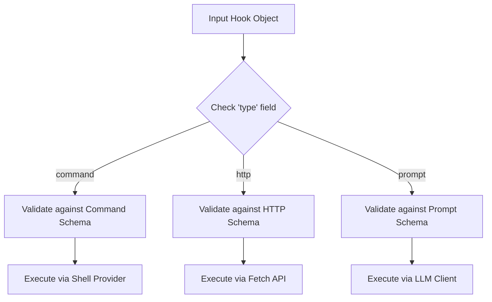

# Chapter 2: Polymorphic Hook Definitions

In the previous chapter, [Event-Based Configuration Registry](01_event_based_configuration_registry.md), we built the "Rulebook." We learned how to map specific events (like `tool_finish`) to a list of rules.

But we left one big question unanswered: **What specific actions can we perform?**

In Chapter 1, we simply ran a `command`. But what if you want to:
1.  **Ask an AI** to review the code?
2.  **Send a Webhook** to a Slack channel?
3.  **Verify** a task using an autonomous agent?

This chapter introduces **Polymorphic Hook Definitions**. It’s a fancy name for a simple concept: A Universal Adapter.

## The Problem: Different Tools for Different Jobs

Imagine you are building a "Deployment" workflow. When you finish writing code, you want three things to happen automatically:

1.  **Format** the code (requires a Shell Command).
2.  **Log** the event to your analytics server (requires an HTTP Request).
3.  **Check** for security vulnerabilities using an LLM (requires an AI Prompt).

If we only supported shell commands, steps 2 and 3 would be very hard to implement. We need a system that can handle different "shapes" of data depending on the task.

### The Solution: The "Universal Adapter"

Think of your wall outlet. You can plug in:
*   A Drill (Motor)
*   A Lamp (Light)
*   A Laptop (Computer)

The outlet doesn't care *what* the device is, as long as the plug fits. In our system, the "plug" is a JSON object, and the "label" that tells us what the device does is the **`type`** field.

## Solving the Use Case

Let's look at how we define these three different actions using our polymorphic schema.

### Type 1: The "Command" (The Drill)

This is the worker. It executes scripts on your machine.

```typescript
{
  // The label that identifies this as a Shell Command
  "type": "command",
  
  // Specific settings for commands
  "command": "npm run format",
  "timeout": 30 // Stop after 30 seconds
}
```
**Explanation:** When the system sees `type: "command"`, it knows to look for a `command` string and executes it in the terminal.

### Type 2: The "HTTP" (The Sensor)

This is the messenger. It talks to the outside world.

```typescript
{
  // The label that identifies this as a Network Request
  "type": "http",
  
  // Specific settings for HTTP
  "url": "https://api.myapp.com/logs",
  "headers": { "Authorization": "Bearer $MY_TOKEN" }
}
```
**Explanation:** When the system sees `type: "http"`, it stops looking for shell commands. Instead, it expects a `url`. It sends the event data there automatically.

### Type 3: The "Prompt" (The Brain)

This is the thinker. It asks an LLM a question.

```typescript
{
  // The label that identifies this as an AI Prompt
  "type": "prompt",
  
  // Specific settings for AI
  "prompt": "Review the code in $ARGUMENTS for security issues.",
  "model": "claude-3-5-sonnet"
}
```
**Explanation:** When the system sees `type: "prompt"`, it knows it needs to talk to an AI model. It sends the `prompt` text to the LLM and streams the response back to you.

## Internal Implementation: Under the Hood

How does the code know which logic to run? It uses a pattern called a **Discriminated Union**.

### The Flow of Logic

Here is how the system processes a generic hook object:



1.  The system receives a generic object from the configuration.
2.  It looks at the `type` property **first**.
3.  Based on that value, it routes the data to the correct validator and execution engine.

### Code Deep Dive

Let's look at `hooks.ts` to see how this is built using Zod.

#### 1. Defining the Shapes

First, we define the individual shapes (schemas) for each type.

```typescript
// hooks.ts (Simplified)
const BashCommandHookSchema = z.object({
  type: z.literal('command'), // This must be "command"
  command: z.string(),
  timeout: z.number().optional(),
});

const HttpHookSchema = z.object({
  type: z.literal('http'),    // This must be "http"
  url: z.string().url(),
});
```

**Explanation:**
*   `z.literal('command')`: This is the magic. It enforces that if you use the `BashCommandHookSchema`, the `type` field *must* be exactly the string "command".

#### 2. The Discriminated Union

Now, we combine them into one master schema. This is the "Polymorphic" part.

```typescript
// hooks.ts
export const HookCommandSchema = lazySchema(() => {
  const { BashCommandHookSchema, HttpHookSchema, /* others */ } = buildHookSchemas()
  
  return z.discriminatedUnion('type', [
    BashCommandHookSchema,
    HttpHookSchema,
    // PromptHookSchema,
    // AgentHookSchema
  ])
})
```

**Explanation:**
*   `z.discriminatedUnion`: This tells Zod, "I have a list of possible objects. They are all different, but they all share one common field called `'type'`."
*   When Zod validates data, it checks `'type'` first. If it finds `"http"`, it *only* checks against `HttpHookSchema` and ignores the Command schema.

### Why is this better?

If we didn't use this approach, we might have a messy object like this:

```typescript
// The WRONG way (Bad design)
{
  "command": "npm run test", // Optional?
  "url": "..."               // Optional?
  "prompt": "..."            // Optional?
}
```

In the "Wrong Way," you could accidentally provide both a `command` and a `url`, confusing the system.

With **Polymorphic Definitions**, the structure is strict. If `type` is "command", you are **not allowed** to have a `url` property. It keeps the configuration clean and error-free.

## Summary

In this chapter, we learned:

1.  **Polymorphism** allows us to define different behaviors (Command, HTTP, Prompt) within the same list of hooks.
2.  The **`type` field** acts as a discriminator (or label) to tell the system how to handle the data.
3.  **Zod's `discriminatedUnion`** ensures strict validation—you can't mix up settings meant for a URL with settings meant for a shell command.

Now that we know how to *define* these hooks, let's see how the most common one actually works.

[Next Chapter: Shell & System Integration](03_shell___system_integration.md)

---

Generated by [Code IQ](https://github.com/adityasoni99/Code-IQ)