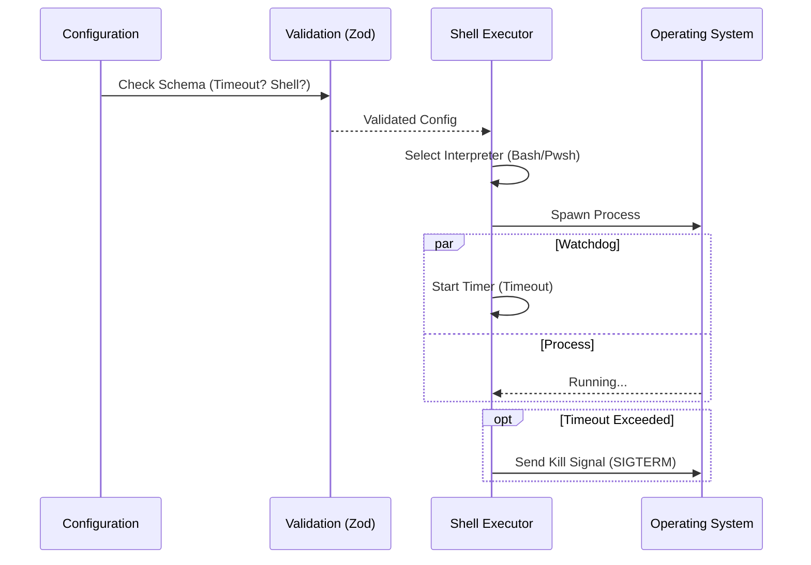

# Chapter 3: Shell & System Integration

In the previous chapter, [Polymorphic Hook Definitions](02_polymorphic_hook_definitions.md), we learned how to differentiate between different types of actions (Commands, HTTP requests, Prompts).

Now, we will focus on the most common and powerful action: **The Command**.

This chapter explores **Shell & System Integration**. We will look at how to define the "Rules of Engagement" for interacting with the operating system, ensuring commands run safely and in the correct environment.

## The Problem: "It's not just about running a command"

Imagine you want your AI assistant to start a local web server. You tell it to run `npm start`.

If you simply execute this command blindly, several things could go wrong:
1.  **Freezing:** The server runs forever. The AI freezes, waiting for the command to finish.
2.  **Wrong Language:** You are on Windows, but the command uses Linux syntax (`ls` vs `dir`).
3.  **Runaway Process:** The command hangs and eats up all your CPU.

We need a way to wrap the raw command in a safety layer. We need to tell the system *how* to run the command, not just *what* to run.

### Analogy: The Soldier's Orders

Think of the `BashCommandHook` as a set of orders given to a soldier before a mission:
*   **The Weapon (Shell):** Are you using a Rifle (Bash) or a Pistol (PowerShell)?
*   **The Time Limit (Timeout):** "If you aren't back in 30 minutes, abort."
*   **The Radio Protocol (Async):** "Call us when you are done" vs. "Maintain radio silence."

## The Solution: `BashCommandHook`

The `BashCommandHook` schema handles these details. Let's look at a concrete use case to understand the configuration options.

### Use Case: Starting a Background Server

**Goal:** We want to start a server (`npm start`). We want it to run in the **background** so we can keep working, and we want to ensure it works on **Windows**.

Here is how we configure that using the schema:

```json
{
  "type": "command",
  "command": "npm start",
  "shell": "powershell",
  "async": true,
  "timeout": 10
}
```

Let's break down the key concepts used here.

### Concept 1: The Shell Interpreter (`shell`)

Operating systems speak different languages. Linux/macOS usually speak **Bash** (or Zsh). Windows usually speaks **PowerShell**.

If you write a script that uses `grep` (Linux search), it will fail on Windows standard command prompt.

*   **Options:** `"bash"` (default) or `"powershell"`.
*   **Why it matters:** It ensures your command syntax is interpreted correctly by the underlying OS.

### Concept 2: Timeouts (`timeout`)

This is your safety switch. It defines the maximum time (in seconds) a command is allowed to run.

*   **Default:** Usually runs until finished.
*   **Why it matters:** If a command asks for user input or enters an infinite loop, the `timeout` kills it automatically so your application doesn't hang forever.

### Concept 3: Background Execution (`async`)

By default, the system blocks. It waits for the command to finish before moving to the next task.

*   **`async: true`**: The system fires the command and immediately moves on. It returns the "Process ID" (PID) instead of the command output.
*   **Why it matters:** Essential for long-running tasks like servers, watchers, or complex builds.

### Concept 4: The Watchdog (`asyncRewake`)

This is a special, advanced feature.

*   **`asyncRewake: true`**: Like `async`, it runs in the background. **However**, if the command crashes (specifically with exit code 2), it "wakes up" the AI model.
*   **Use Case:** You start a server in the background. You go to sleep. The server crashes. The system wakes up the AI to investigate why it crashed.

## Internal Implementation: Under the Hood

How does the system enforce these rules? Let's visualize the flow when a command is executed.

### The Execution Sequence



1.  **Validation:** Zod checks if your settings are valid numbers/strings.
2.  **Selection:** The code checks `shell` to decide which executable to spawn (`/bin/bash` or `pwsh.exe`).
3.  **Watchdog:** A timer starts alongside the process. If the timer hits zero, the process is killed.

### Code Deep Dive

Let's look at the Zod definition in `hooks.ts`. We will break it into two parts for clarity.

#### Part 1: The Basics

This defines the mandatory fields for a command hook.

```typescript
// hooks.ts (Snippet 1)
const BashCommandHookSchema = z.object({
  // The discriminator (must be "command")
  type: z.literal('command'), 
  
  // The actual script to run
  command: z.string(),
  
  // Which interpreter to use?
  shell: z.enum(['bash', 'powershell', 'zsh', 'sh']).optional(),
});
```
**Explanation:**
*   `type`: Must be strictly `'command'`.
*   `shell`: Uses `z.enum`. This limits the user to only valid choices. You can't set shell to `"minecraft"`.

#### Part 2: The Safety & Async Rules

This adds the control layers we discussed.

```typescript
// hooks.ts (Snippet 2)
  // Safety limit in seconds
  timeout: z.number().positive().optional(),

  // Fire and forget?
  async: z.boolean().optional(),
  
  // Run in background, but report errors?
  asyncRewake: z.boolean().optional(),
});
```
**Explanation:**
*   `timeout`: Must be a `.positive()` number. You can't have a timeout of -5 seconds.
*   `asyncRewake`: This implies `async`. It's a boolean flag that alters the internal event listener logic to handle crash reports.

## Summary

In this chapter, we learned:
1.  **Shell Integration** is about more than just text; it's about managing the execution environment.
2.  **`shell`** lets us choose between Bash and PowerShell to ensure compatibility.
3.  **`timeout`** prevents infinite loops and hanging processes.
4.  **`async`** allows us to run long tasks (like servers) without blocking the AI.

We now have a safe way to run commands. But sometimes, running a command isn't enough. Sometimes, we need the AI to **verify** that the command actually did what it was supposed to do.

How do we add a "Brain" to our hooks?

[Next Chapter: AI Verification & Interaction](04_ai_verification___interaction.md)

---

Generated by [Code IQ](https://github.com/adityasoni99/Code-IQ)