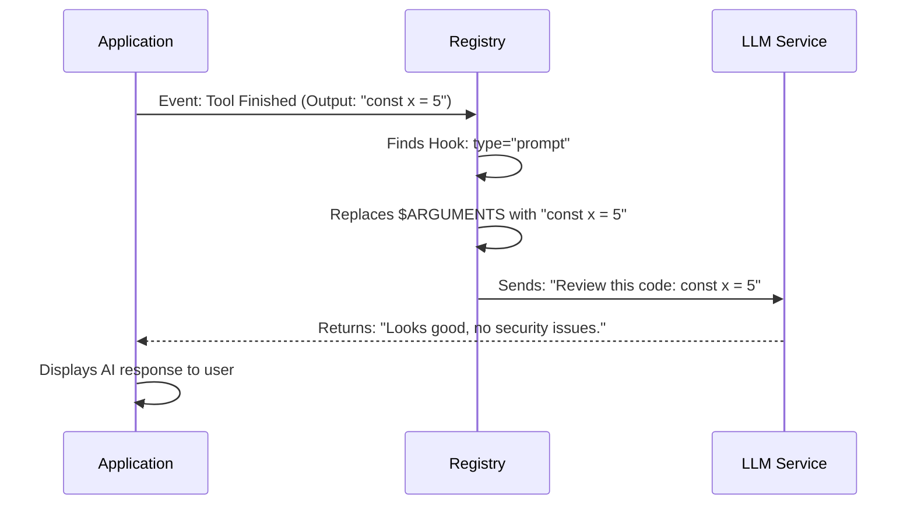

# Chapter 4: AI Verification & Interaction

Welcome to Chapter 4! In the previous chapter, [Shell & System Integration](03_shell___system_integration.md), we learned how to make our system execute "dumb" commands—like running a script or starting a server.

But what if you need intelligence? What if you want the system to **think** before it acts?

This chapter introduces **AI Verification & Interaction**. We will explore the `PromptHook` and `AgentHook`. These allow you to pause the automation pipeline and consult a Large Language Model (LLM) to summarize data, generate text, or verify safety.

## The Problem: "Is this actually correct?"

Imagine you have a hook that runs whenever a file is saved.
1.  **Chapter 3 approach:** You run a "linter" command. It checks for missing semicolons.
2.  **The limitation:** The linter cannot tell you if the code logic makes sense, or if you accidentally pasted your password into the file.

We need a way to inject a "Brain" into the process. We need a Supervisor.

### Use Case: The Automatic Code Reviewer

**Goal:** Every time we finish writing a piece of code, we want an AI to:
1.  **Read** the code.
2.  **Analyze** it for security flaws.
3.  **Report** its findings to us.

## Concept 1: The `PromptHook` (The Consultant)

The `PromptHook` is the simplest way to interact with an LLM. It's a "One Question, One Answer" interaction.

Think of it like sending a quick message to a consultant: *"Hey, look at this and tell me what you think."*

### How to Configure It

Here is how we define a prompt hook in our settings.

```json
{
  "type": "prompt",
  "prompt": "Review this code for security leaks: $ARGUMENTS",
  "model": "claude-3-5-sonnet"
}
```

**Explanation:**
1.  **`type`**: Must be `"prompt"`. This tells the system to wake up the LLM, not the shell.
2.  **`prompt`**: This is the message you send to the AI.
3.  **`$ARGUMENTS`**: This is a magic placeholder. When the hook runs, the system replaces this with the actual data (like the file content or tool output).
4.  **`model`**: (Optional) You can specify which brain to use. Maybe you want a "smarter" model for security checks.

## Concept 2: The `AgentHook` (The Verifier)

The `AgentHook` is similar, but it implies a more autonomous role. In the system's architecture, an "Agent" hook is often used for **Verification**.

Think of it like a Security Guard. It doesn't just chat; it is looking to pass or fail a specific condition.

```json
{
  "type": "agent",
  "prompt": "Verify that the unit tests passed. If not, explain why.",
  "timeout": 60
}
```

**Key Differences:**
*   **Purpose:** While a `prompt` is usually for generating text (summaries, commit messages), an `agent` is for checking work.
*   **Timeouts:** Agent tasks might involve more "thinking" or multiple steps internally, so they often have longer timeouts.

## Internal Implementation: Under the Hood

How does the system go from a JSON configuration to a conversation with an AI?

### The Interaction Flow

When a tool finishes, the system grabs the output and feeds it into your prompt.



1.  **Substitution:** The system injects the real-world data into your prompt template.
2.  **Dispatch:** It uses the configured `model` string to select the correct API (e.g., OpenAI, Anthropic).
3.  **Streaming:** The response is usually streamed back to the user's interface in real-time.

### Code Deep Dive

Let's look at `hooks.ts` to see how these schemas are defined using Zod.

#### The Prompt Hook Schema

```typescript
// hooks.ts
const PromptHookSchema = z.object({
  type: z.literal('prompt'),
  
  // The template string
  prompt: z.string(),
  
  // Which AI model to call?
  model: z.string().optional(),
});
```
**Explanation:**
*   `prompt`: This is required. You can't have a blank thought.
*   `model`: This is optional. If you leave it out, the system usually defaults to a fast, cheap model (like Haiku or GPT-3.5) to save money.

#### The Agent Hook Schema

This looks very similar but serves a distinct purpose in the type system.

```typescript
// hooks.ts
const AgentHookSchema = z.object({
  type: z.literal('agent'),
  
  prompt: z.string(),
  
  // Agents might take longer to verify complex tasks
  timeout: z.number().positive().optional(), 
});
```
**Explanation:**
*   `type`: Must be `"agent"`.
*   `timeout`: While commands have timeouts to prevent hanging, Agents have timeouts to prevent over-spending or infinite thinking loops.

#### Integrating with the Union

Just like in Chapter 2, these are tied together in the master `HookCommandSchema`.

```typescript
// hooks.ts
export const HookCommandSchema = lazySchema(() => {
  // ... imports
  return z.discriminatedUnion('type', [
    BashCommandHookSchema, // Chapter 3
    PromptHookSchema,      // Chapter 4 (Consultant)
    AgentHookSchema,       // Chapter 4 (Verifier)
    HttpHookSchema,        // Webhooks
  ])
})
```

**Explanation:**
Because we use a discriminated union, the validator is strict. If you set `type: "prompt"`, you are allowed to use `model`. If you set `type: "command"`, you are allowed to use `shell`. You cannot mix them!

## Summary

In this chapter, we added **Intelligence** to our hooks.

1.  We use **`PromptHook`** to ask the AI to summarize, explain, or generate text based on tool outputs.
2.  We use **`AgentHook`** for verification tasks where the AI acts as a supervisor.
3.  We use the **`$ARGUMENTS`** placeholder to pass data from the application into the AI's prompt.

We can now run commands (Chapter 3) and ask the AI questions (Chapter 4). But what if we only want to run a hook *sometimes*? What if we only want to review code when it's a `.ts` file, but not a `.md` file?

For that, we need logic.

[Next Chapter: Conditional Execution Logic](05_conditional_execution_logic.md)

---

Generated by [Code IQ](https://github.com/adityasoni99/Code-IQ)