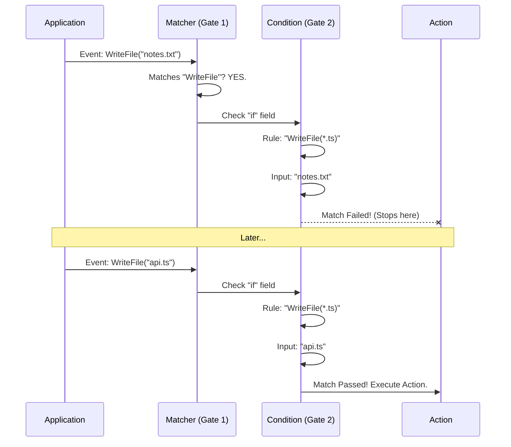

# Chapter 5: Conditional Execution Logic

Welcome to the final chapter of this tutorial series!

In the previous chapter, [AI Verification & Interaction](04_ai_verification___interaction.md), we gave our system a "brain" by allowing it to ask an AI for help. We can now run commands and consult LLMs.

However, we still have a problem with **precision**.

## The Problem: "The Sledgehammer Approach"

Let's say you configured a hook to run a "Linter" every time a file is written.

*   **Configuration:** Matcher = `WriteFile`.
*   **Action:** Run `npm run lint`.

This works great when you save a JavaScript file. But what happens when you save a Markdown (`.md`) file? Or a plain text (`.txt`) file? The system still tries to run the linter. It fails, throws errors, and wastes resources.

The `matcher` we learned in Chapter 1 is like a sledgehammer—it hits everything. We need a scalpel. We need to say:

> "Only run this hook **IF** the file ends in `.ts`."

## The Solution: The `if` Field

To solve this, we introduce the **Conditional Execution Logic**.

This is a special field called `if` that lives inside your hook definition. It acts like a second security guard. Even if the Event matches, this guard checks your ID card to make sure you belong there.

### Analogy: The Club Entrance

1.  **Event (Chapter 1):** The club is open (`tool_finish`).
2.  **Matcher (Chapter 1):** The bouncer lets in anyone named "WriteFile".
3.  **Condition (Chapter 5):** The VIP guard checks: "Are you wearing a Tie (`*.ts`)?"
    *   If **Yes**: You get to the Hook.
    *   If **No**: You are turned away quietly.

## Solving the Use Case

Let's configure a rule that **only** runs a test command when a TypeScript file is saved.

### The Configuration

```json
{
  "matcher": "WriteFile",
  "hooks": [
    {
      "type": "command",
      "command": "npm test",
      
      // The Logic Gate
      "if": "WriteFile(*.ts)"
    }
  ]
}
```

**Explanation:**
1.  **`matcher`: "WriteFile"**: The system wakes up whenever the `WriteFile` tool is used.
2.  **`if`: "WriteFile(*.ts)"**: Before running `npm test`, the system looks at the arguments passed to `WriteFile`.
    *   If the input is `script.ts`, the pattern matches `*.ts`. **RUN.**
    *   If the input is `README.md`, the pattern fails. **SKIP.**

### Syntax: Permission Rules

The text inside the `if` field uses a specific syntax known as **Permission Rules**.

Format: `ToolName(Pattern)`

| Rule Example | Meaning |
| :--- | :--- |
| `WriteFile(*.json)` | Only runs when writing JSON files. |
| `Bash(git commit *)` | Only runs when the command starts with `git commit`. |
| `Bash(npm *)` | Only runs for NPM commands. |

## Internal Implementation: Under the Hood

How does the system decide whether to block or proceed?

### The Logic Flow



1.  The system first filters by the broad **Event Matcher**.
2.  It then looks for the `if` string in the hook definition.
3.  It compares the actual runtime arguments (like the filename or command string) against the pattern.
4.  If it matches, the hook executes. If not, it is silently ignored.

### Code Deep Dive

Let's look at how this is defined in `hooks.ts`.

#### Defining the Schema

First, we define what the `if` field looks like. It is just a string, but the description helps documentation generators understand its purpose.

```typescript
// hooks.ts
const IfConditionSchema = lazySchema(() =>
  z.string()
    .optional()
    .describe(
      'Permission rule syntax (e.g., "Bash(git *)"). ' +
      'Only runs if the tool call matches the pattern.'
    ),
)
```

#### Attaching it to Hooks

We add this schema to every type of hook (Command, Prompt, Agent, HTTP). This means *any* action can be conditional.

```typescript
// hooks.ts (inside BashCommandHookSchema)
const BashCommandHookSchema = z.object({
  type: z.literal('command'),
  command: z.string(),
  
  // Here is our logic gate
  if: IfConditionSchema(),
  
  shell: z.enum(SHELL_TYPES).optional(),
});
```

**Why this matters:**
By adding `IfConditionSchema()` to the object, Zod allows the user to add the `"if"` key in their JSON settings. If the user omits it (it is `.optional()`), the system assumes the condition is "Always True."

## Complex Example: Safe Git Automation

Let's combine everything we've learned in this tutorial.

**Goal:** When I run a git commit, I want an AI to verify the commit message is professional, but I don't want this to happen for `git status` or `git add`.

```json
{
  "matcher": "Bash", 
  "hooks": [
    {
      "type": "prompt",
      "prompt": "Is this commit message professional? $ARGUMENTS",
      
      // Only runs for commits!
      "if": "Bash(git commit *)" 
    }
  ]
}
```

1.  **[Chapter 1](01_event_based_configuration_registry.md)**: We listen for `Bash` tools.
2.  **[Chapter 5](05_conditional_execution_logic.md)**: We filter for only `git commit` commands using `if`.
3.  **[Chapter 4](04_ai_verification___interaction.md)**: We use a `prompt` hook to ask the AI for advice.

## Conclusion

Congratulations! You have completed the **Schemas** project tutorial.

We have built a powerful, reactive system from scratch:

1.  **Event Registry:** We created a central place to listen for application lifecycle events.
2.  **Polymorphism:** We designed a system that can handle Commands, HTTP requests, and AI Prompts using a single list.
3.  **Shell Integration:** We learned how to execute commands safely with timeouts and background modes.
4.  **AI Interaction:** We injected intelligence into the loop to verify and generate content.
5.  **Conditional Logic:** We added the final layer of precision to ensure hooks only run exactly when needed.

You now possess the knowledge to define complex, intelligent, and safe automation workflows using Zod schemas!

---

Generated by [Code IQ](https://github.com/adityasoni99/Code-IQ)