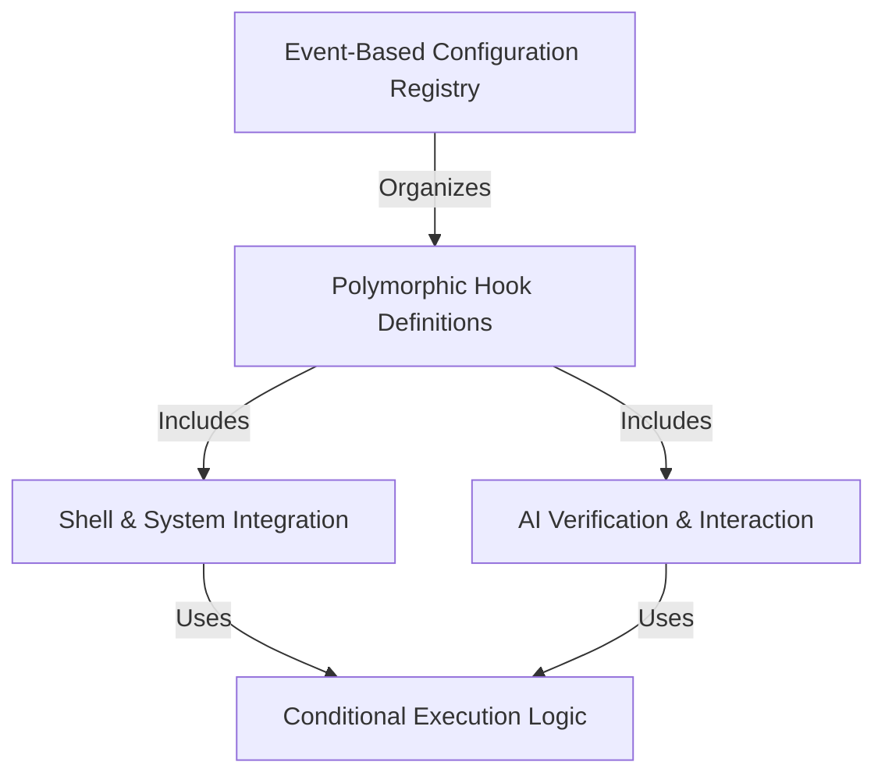

# Tutorial: schemas

This project defines a flexible schema for a **reactive hook system** that allows an automated agent to trigger actions based on lifecycle events. It uses a **polymorphic configuration** to support diverse tasks like executing **shell commands**, consulting *AI models*, or making HTTP requests, all governed by strict **conditional permission rules**.

## Chapters

1. [Event-Based Configuration Registry](01_event_based_configuration_registry.md)
2. [Polymorphic Hook Definitions](02_polymorphic_hook_definitions.md)
3. [Shell & System Integration](03_shell___system_integration.md)
4. [AI Verification & Interaction](04_ai_verification___interaction.md)
5. [Conditional Execution Logic](05_conditional_execution_logic.md)

---

Generated by [Code IQ](https://github.com/adityasoni99/Code-IQ)