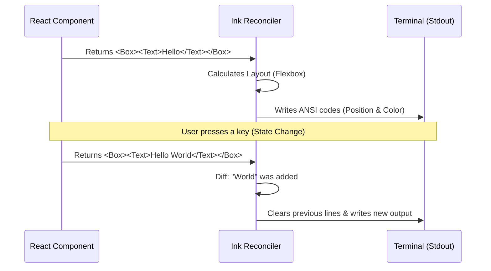

# Chapter 1: Terminal UI Rendering

Welcome to the **Screens** project tutorial! If you have ever used a command-line tool that felt clunky because it just dumped wall-of-text logs, you are in the right place.

In this first chapter, we will explore **Terminal UI Rendering**. We will learn how to turn a standard black-and-white terminal window into a rich, interactive interface using **React**.

### The Motivation: Why use React in the Terminal?

Traditionally, writing a Command Line Interface (CLI) involves a lot of `console.log()` statements.
*   **The Old Way:** You print a line. You can't change it easily. To update a progress bar, you have to use complex cursor movement codes.
*   **The Screens Way:** We treat the terminal like a web browser. We use **components**, **layouts**, and **state**. When data changes, the screen updates automatically.

We use a library called **Ink**. It lets us write standard React code, but instead of rendering HTML (like `<div>` or `<h1>`), it renders text and layout codes to the terminal.

---

### Central Use Case: The "Resume Conversation" Screen

To understand this, let's look at a real feature in our project: **Resuming a Session**.

Imagine a screen that needs to do three things:
1.  Show a **loading spinner** while fetching data.
2.  Display a **list of conversations** to choose from.
3.  Show a **confirmation** when a user selects one.

This is a dynamic UI. It changes based on what the application is doing.

---

### Key Concepts

Before we look at the code, let's define the building blocks.

#### 1. The Canvas Components
Since there is no HTML in the terminal, we swap standard HTML tags for Ink components:
*   **`<Box>`**: Replaces `<div>`. It handles layout (Flexbox). It can have borders, padding, and margins.
*   **`<Text>`**: Replaces `<span>` or `<p>`. It handles text content, colors (e.g., `<Text color="green">`), and styling (bold, italic).

#### 2. The Conditional Render
Just like in web React, we render different components based on the current state (variable values).

#### 3. Reactive Updates
We don't manually clear the terminal. We simply change a state variable (e.g., `setLoading(false)`), and the renderer calculates what pixels (characters) need to change.

---

### Step-by-Step Implementation

Let's look at how the `ResumeConversation.tsx` file handles this. We will break it down into small pieces.

#### Step 1: Handling the "Loading" State

When the component first mounts, we want to show a spinner so the user knows something is happening.

```tsx
// Inside ResumeConversation.tsx
if (loading) {
  return (
    <Box>
      <Spinner />
      <Text> Loading conversations…</Text>
    </Box>
  );
}
```

**Explanation:**
*   We check the JavaScript variable `loading`.
*   We use a `<Box>` to hold our items together.
*   The `<Spinner />` is a custom component that animates a character (like `⠋`, `⠙`, `⠹`).
*   `<Text>` prints the label next to it.

#### Step 2: Handling the "Resuming" State

Once the user selects an item, we transition to a "Resuming" state.

```tsx
// Inside ResumeConversation.tsx
if (resuming) {
  return (
    <Box>
      <Spinner />
      <Text> Resuming conversation…</Text>
    </Box>
  );
}
```

**Explanation:**
*   This looks almost identical to Step 1, but the message is different.
*   Because we use React, we didn't have to write code to "delete" the previous Loading message. React swapped the text for us.

#### Step 3: The Main List View

If we aren't loading and aren't resuming, we show the interactive list.

```tsx
// Inside ResumeConversation.tsx
return (
  <LogSelector
    logs={filteredLogs}
    maxHeight={rows}
    onSelect={onSelect}
    onCancel={onCancel}
    // ... other props
  />
);
```

**Explanation:**
*   `LogSelector` is a complex custom component (composed of `Box` and `Text` elements).
*   We pass it data (`filteredLogs`) and event handlers (`onSelect`).
*   The `maxHeight={rows}` prop ensures our UI adapts to the user's terminal window size.

---

### Internal Implementation: How it Works

How does a `<Box>` actually get on the screen? Here is the flow of data when the application starts.

1.  **React Render:** Your component executes. It returns a tree of Ink elements.
2.  **Reconciliation:** Ink compares this tree to the previous one (if any).
3.  **Layout Calculation:** Ink uses Yoga (a layout engine) to calculate X/Y coordinates for every text string based on Flexbox rules.
4.  **Painting:** Ink translates these coordinates into ANSI Escape Codes (special hidden characters that tell the terminal "move cursor to row 5, column 10, print 'A' in red").



---

### Code Deep Dive: Layouts and Styling

Let's look at the `Doctor.tsx` file to see how complex layouts are constructed using `Box`. This component runs diagnostic checks and displays them in a grid-like list.

#### Example: Grouping Items Vertically

```tsx
// Inside Doctor.tsx
<Box flexDirection="column">
  <Text bold>Diagnostics</Text>
  <Text>└ Currently running: {diagnostic.version}</Text>
  <Text>└ Path: {diagnostic.installationPath}</Text>
</Box>
```

**Explanation:**
*   `flexDirection="column"`: This stacks the children vertically (top to bottom). This is the most common layout in CLIs.
*   `bold`: This prop on `<Text>` adds the ANSI code for bold text (usually bright white).

#### Example: Conditional Styling

We can change colors dynamically based on data.

```tsx
// Inside Doctor.tsx helper function
<Text>
  └ {validation.name}:{" "}
  <Text color={validation.status === "capped" ? "warning" : "error"}>
    {validation.message}
  </Text>
</Text>
```

**Explanation:**
*   We are nesting `<Text>` inside `<Text>`. This is how you style specific words within a sentence.
*   The `color` prop accepts standard HTML color names or keywords like "warning" (which might map to Yellow in our theme).

### A Note on Data

You might be wondering: *Where does `validation.status` or `diagnostic.version` come from?*

The UI is only responsible for **displaying** data. The actual data handling, fetching, and logic live in the Application State.
> We will cover how this data flows into our components in the next chapter: [Application State Management](02_application_state_management.md).

---

### Summary

In this chapter, we learned:
1.  **Terminal UI Rendering** uses React to build rich CLIs.
2.  We use `<Box>` for layout and `<Text>` for content, replacing HTML tags.
3.  The interface is **reactive**—it updates automatically when state changes (like switching from "Loading" to "Resuming").
4.  Ink handles the hard work of translating React components into raw terminal escape codes.

Now that we know *how* to render the screen, we need to understand how to manage the complex data that fuels these screens.

[Next Chapter: Application State Management](02_application_state_management.md)

---

Generated by [Code IQ](https://github.com/adityasoni99/Code-IQ)