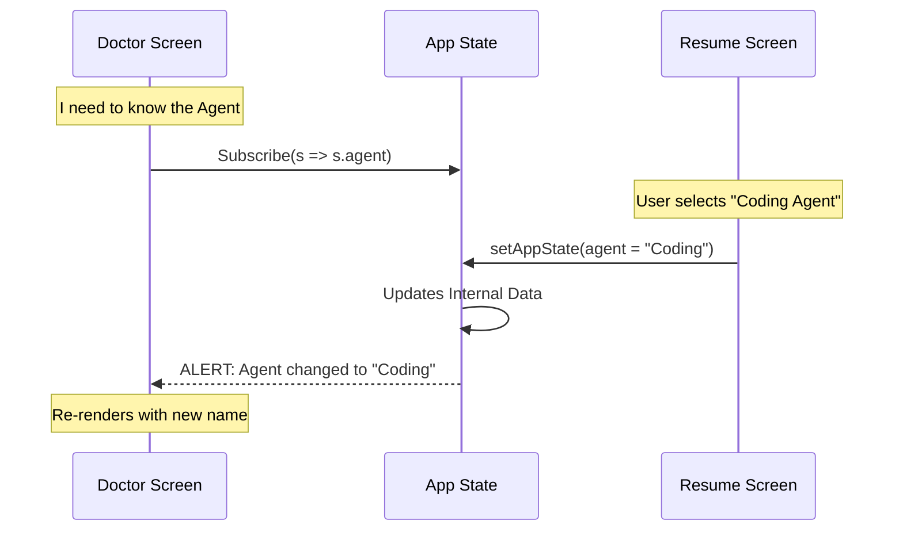

# Chapter 2: Application State Management

In the previous chapter, [Terminal UI Rendering](01_terminal_ui_rendering.md), we built the visual layer of our CLI. We learned how to paint pixels using components like `<Box>` and `<Text>`.

 However, a pretty interface is useless if it doesn't remember anything.

### The Motivation: The "Central Nervous System"

Imagine you are building the **Doctor** screen (a diagnostic tool). It needs to know:
1.  Which **Agents** are currently installed?
2.  Which **Tools** (like file system access) are allowed?
3.  Are there any **Plugin Errors**?

If we stored this data inside the `Doctor` component, no other screen (like the `SessionPicker`) could access it. We would have to pass data up and down a huge chain of components (a messy process called "prop drilling").

**The Solution:** We create a "Central Nervous System"—a global **Application State**. It lives outside your components, holding data that needs to be shared everywhere.

---

### Central Use Case: The "Doctor" Screen

Let's look at the **Doctor** screen (`Doctor.tsx`). It acts as a health check for the system. To do its job, it needs to read data from the global state without asking its parent component for it.

We use a specific pattern called a **Hook** to "hook into" this global brain.

---

### Key Concepts

#### 1. The Store (The Brain)
Think of the **Store** as a secure database living in your computer's memory. It holds the "Truth" about the application.
*   **Active Agents**: Who can I talk to?
*   **MCP Tools**: What capabilities do I have?
*   **Permissions**: What am I allowed to touch?

#### 2. The Hook (`useAppState`)
This is the phone line. Any component can pick up this phone and ask the Store for information.

#### 3. The Selector (The Filter)
When you call the store, you don't want the *entire* database. You only want specific pieces. We use a "selector function" to pick exactly what we need.

---

### Step-by-Step Implementation

Let's see how `Doctor.tsx` retrieves the list of agents and tools.

#### Step 1: Importing the Hook

First, we import the hook that connects us to the state.

```tsx
// Inside Doctor.tsx
import { useAppState } from '../state/AppState.js';
```

#### Step 2: Selecting Data (Reading)

We call the hook and pass a function. This function receives the *entire* state (`s`) and returns just the part we care about.

```tsx
export function Doctor({ onDone }: Props) {
  // "Hey Store, give me just the agentDefinitions"
  const agentDefinitions = useAppState(s => s.agentDefinitions);
  
  // "Hey Store, give me the MCP tools list"
  const mcpTools = useAppState(s => s.mcp.tools);

  // ... rest of component
}
```

**Why do we do `s => s.agentDefinitions`?**
This is a performance optimization. If the application changes the "Theme Color" in the state, the `Doctor` screen shouldn't re-render because it doesn't care about colors. It only re-renders if `agentDefinitions` changes.

#### Step 3: Using the Data

Now that we have `mcpTools`, we can use it just like a normal local variable to render our UI.

```tsx
// Inside Doctor.tsx
const tools = mcpTools || [];

return (
  <Box flexDirection="column">
     <Text>Found {tools.length} tools available.</Text>
  </Box>
);
```

---

### Updating the State (Writing)

Reading data is half the battle. We also need to change it. Let's look at `ResumeConversation.tsx`. When a user picks a session to resume, we need to update the global state to reflect the active agent.

We use a helper hook called `useSetAppState`.

```tsx
// Inside ResumeConversation.tsx
import { useSetAppState } from '../state/AppState.js';

export function ResumeConversation() {
  const setAppState = useSetAppState();

  // ... later, inside an event handler
}
```

When the user selects a log, we update the state:

```tsx
// Inside onSelect function
setAppState(prev => ({
  ...prev,
  // We update the active agent to match the resumed session
  agent: resolvedAgentDef?.agentType
}));
```

**Explanation:**
1.  `prev` represents the current state before the update.
2.  `...prev` means "keep everything else exactly the same."
3.  `agent:` overwrites just the agent property.

---

### Internal Implementation: How it Works

How does a change in `ResumeConversation` instantly update the `Doctor` screen?

1.  **Subscription:** When `Doctor` calls `useAppState`, it subscribes to the store.
2.  **Action:** User clicks a button in `ResumeConversation`, calling `setAppState`.
3.  **Notification:** The Store updates the data and notifies all subscribers.
4.  **Reaction:** `Doctor` realizes the data changed and re-renders automatically.



---

### Code Deep Dive: Complex Logic with Global State

Sometimes we need to combine global state with local logic. In `Doctor.tsx`, we use a `useEffect` to calculate warnings based on the global state.

```tsx
// Inside Doctor.tsx
useEffect(() => {
  // We read the global state values we extracted earlier
  const { activeAgents, allAgents } = agentDefinitions;
  
  // We run a heavy calculation to check for errors
  checkContextWarnings(tools, { activeAgents, allAgents })
    .then(warnings => {
       // We save the result to LOCAL state, not global
       setContextWarnings(warnings);
    });
}, [tools, agentDefinitions]);
```

**Key Takeaway:**
*   **Global State (`agentDefinitions`)**: The raw data shared by everyone.
*   **Local State (`contextWarnings`)**: The specific result calculated just for this screen.
*   We use the global state as an *input* to calculate local state.

---

### Summary

In this chapter, we learned:
1.  **Application State Management** acts as the "Central Nervous System," avoiding the need to pass data manually through every component.
2.  We use **`useAppState`** to read data.
3.  We use **Selectors** (`s => s.data`) to pick only what we need and improve performance.
4.  We use **`useSetAppState`** to update the global data.

Now that our screens can share data, we need to understand where that data comes from. How do we define what an "Agent" is, and how do we load them into this state?

[Next Chapter: Agent & Tool Configuration](03_agent___tool_configuration.md)

---

Generated by [Code IQ](https://github.com/adityasoni99/Code-IQ)