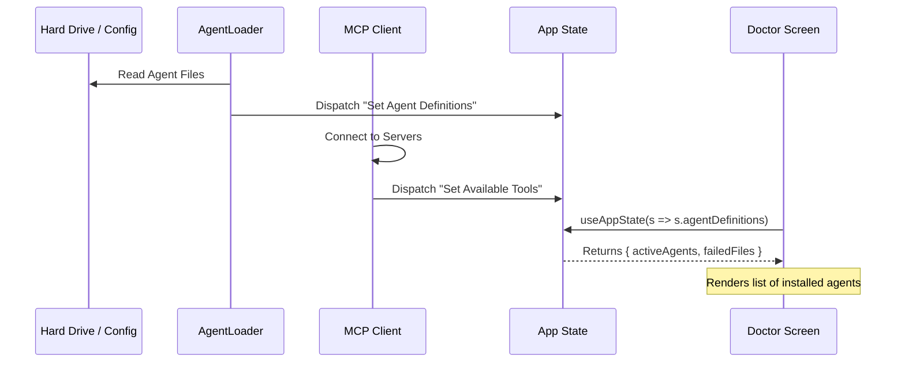

# Chapter 3: Agent & Tool Configuration

In the previous chapter, [Application State Management](02_application_state_management.md), we created a "Central Nervous System" to store our application's data.

Now, we need to populate that brain with knowledge. Specifically, we need to define **who** the AI is (Agents) and **what** it can do (Tools).

### The Motivation: Personalities and Capabilities

Imagine playing a Role Playing Game (RPG). You don't just have a "Player." You have a **Mage** (who casts spells) or a **Warrior** (who swings swords).

In our system, we have the same concept:
1.  **Agents (The Class):** Defines the personality, the specific AI model (e.g., Claude 3.5 Sonnet), and the "System Prompt" (instructions like "You are an expert coder").
2.  **Tools (The Skills):** Defines the functions the agent can execute, like "Read File," "Run Command," or "Search Web."

Without this configuration, the system is just a blank shell. It wouldn't know if it should act like a helpful assistant or a strict code reviewer, and it wouldn't have hands to touch your files.

---

### Central Use Case: The "Doctor" Check

Let's revisit the **Doctor** screen (`Doctor.tsx`). When you run a diagnostic check, the system needs to answer:

> *"What Agents are installed on this computer, and are their files valid?"*

To answer this, the system must scan configuration files on your hard drive, parse them, and load them into memory.

---

### Key Concepts

#### 1. Agent Definitions
An Agent Definition is a blueprint. It usually lives in a JSON or YAML file on your disk. It contains:
*   **Name:** e.g., "CodeArchitect"
*   **Model:** e.g., "claude-3-5-sonnet"
*   **System Prompt:** The "rules" the agent must follow.

#### 2. The Tool Registry & MCP
Tools are the bridge between the AI and your computer. We use the **Model Context Protocol (MCP)**.
Think of MCP like a **USB Hub**. You can plug in different "Servers" (like a GitHub connector or a Database connector), and the AI automatically gains the "Tools" provided by those servers.

---

### Step-by-Step Implementation

How does the application load this "equipment"?

#### Step 1: Defining an Agent
Conceptually, an agent definition looks like this object in our code.

```typescript
type AgentDefinition = {
  agentType: string;    // e.g., "planner"
  name: string;         // e.g., "Project Planner"
  description: string;  // e.g., "Helps break down tasks"
  source: 'built-in' | 'plugin'; 
};
```

**Explanation:**
*   `agentType` is the internal ID used by the code.
*   `source` tells us if this agent came with the app or was added by the user.

#### Step 2: Accessing Definitions in the UI
In `Doctor.tsx`, we need to see if these definitions loaded correctly. We access them via our Global State.

```tsx
// Inside Doctor.tsx
import { useAppState } from '../state/AppState.js';

export function Doctor({ onDone }: Props) {
  // Grab the entire definition object
  const agentDefinitions = useAppState(s => s.agentDefinitions);

  // ...
}
```

#### Step 3: Checking for "Broken" Agents
A unique feature of our configuration system is error handling. If a user writes a bad config file (invalid JSON), we don't crash. We record it as a "failed file."

```tsx
// Inside Doctor.tsx
const { activeAgents, failedFiles } = agentDefinitions;

// We calculate summary data for the UI
const agentInfoData = {
  count: activeAgents.length,
  failures: failedFiles || []
};
```

**Explanation:**
*   `activeAgents`: The list of successfully loaded, ready-to-use agents.
*   `failedFiles`: A list of file paths that couldn't be loaded (syntax errors).

---

### Internal Implementation: The Loading Flow

How does the data get from your hard drive into the `useAppState` hook?

1.  **Boot:** When the app starts, the **Agent Loader** scans specific directories (e.g., `~/.claude/agents`).
2.  **MCP Connection:** The app connects to configured MCP servers (like the FileSystem server).
3.  **Registration:** Tools and Agents are merged into the Global Store.
4.  **Availability:** Components (like `Doctor` or `ResumeConversation`) can now read this data.



---

### Code Deep Dive: Displaying Configuration

Let's look at how `Doctor.tsx` renders this configuration data to the user. It creates a list of warnings if agents failed to load.

#### Displaying Parse Errors
If the configuration system encounters bad files, the Doctor warns the user.

```tsx
// Inside Doctor.tsx
{agentInfo?.failedFiles && agentInfo.failedFiles.length > 0 && (
  <Box flexDirection="column">
    <Text bold color="error">Agent Parse Errors</Text>
    
    {/* Map over the errors and display file paths */}
    {agentInfo.failedFiles.map((file, i) => (
       <Text key={i} dimColor>
         └ {file.path}: {file.error}
       </Text>
    ))}
  </Box>
)}
```

**Explanation:**
*   **Conditional Rendering:** We only show this `<Box>` if `failedFiles.length > 0`.
*   **Looping:** We use `.map()` to create a `<Text>` component for every broken file.
*   **Feedback:** This tells the user exactly *which* file is broken so they can fix their configuration.

#### Using Tools for Validation
The configuration isn't just static data; it dictates logic. The Doctor checks if the loaded agents have access to the necessary tools.

```tsx
// Inside Doctor.tsx
useEffect(() => {
  // We pass 'tools' (capabilities) and 'agents' (personalities)
  // to a helper that checks if they match.
  checkContextWarnings(tools, agentDefinitions)
    .then(warnings => {
       setContextWarnings(warnings);
    });
}, [tools, agentDefinitions]);
```

**Explanation:**
*   This logic ensures that if you have an agent designed to "Edit Files," the "File Edit Tool" is actually loaded.
*   If the configuration is mismatched (Agent exists, but Tool is missing), `setContextWarnings` updates the UI to alert the user.

---

### Summary

In this chapter, we learned:
1.  **Agents** are the "personalities" defined by config files.
2.  **Tools** are the "capabilities" provided by **MCP** (Model Context Protocol).
3.  The system loads these at startup and stores them in the **Application State**.
4.  The `Doctor` screen reads this state to verify that your environment is set up correctly.

Now that we have a UI (Chapter 1), a Brain (Chapter 2), and a Personality (Chapter 3), we need to ensure the AI remembers what we talked about.

[Next Chapter: Session Persistence & Recovery](04_session_persistence___recovery.md)

---

Generated by [Code IQ](https://github.com/adityasoni99/Code-IQ)