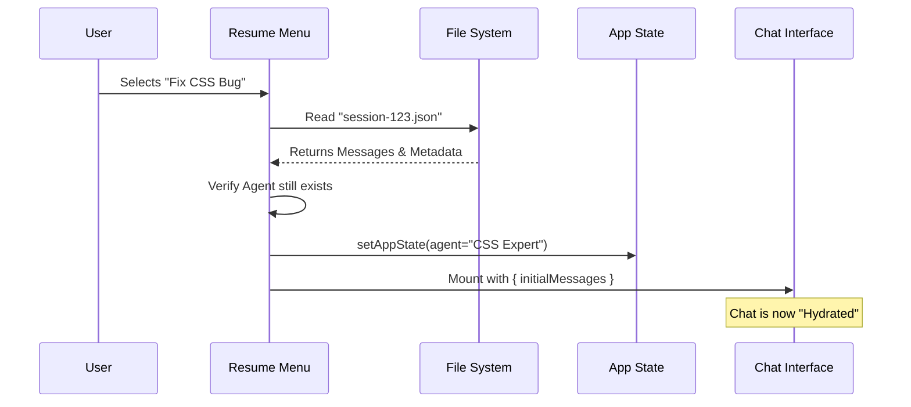

# Chapter 4: Session Persistence & Recovery

In the previous chapter, [Agent & Tool Configuration](03_agent___tool_configuration.md), we gave our AI a personality (Agents) and hands (Tools).

However, without memory, our AI lives in the movie *50 First Dates*. Every time you close the terminal, it forgets who you are, what code it wrote, and what the plan was.

In this chapter, we will build **Session Persistence & Recovery**.

### The Motivation: The "Save Game" System

Video games solved this problem decades ago. You don't restart the game every time you turn on the console; you load a **Save File**.

For a coding assistant, this is critical. Complex tasks take time. You might need to:
1.  Start a refactor on Tuesday.
2.  Close your laptop.
3.  Resume exactly where you left off on Wednesday, with the AI remembering the file context and the previous errors.

**Session Persistence** turns the application from a simple command runner into a long-term project partner.

---

### Central Use Case: The "Time Travel" Resume

Imagine you are working in a folder called `my-website`. You talked to the AI for an hour about fixing a CSS bug. You close the terminal.

When you open **Screens** again, you see a list:
> *   (Just now) Fix CSS bug
> *   (Yesterday) Database migration
> *   (Last Week) Setup project

You select "Fix CSS bug." The screen flashes, and suddenly the chat history, the files the AI was looking at, and even the specific Agent you were using are instantly restored.

---

### Key Concepts

#### 1. The Session Log (The Save File)
Everything that happens—user messages, AI replies, tool outputs—is written to a file on your disk (usually a JSON or specialized log file).

#### 2. Rehydration (Loading)
"Hydration" is a programming term for taking dry data (text in a file) and turning it into "wet," living objects in memory (Application State).

#### 3. Context Safety
You shouldn't be able to load a "Database Project" session while you are currently inside the "Frontend Project" folder. The system must verify that the **Save File** matches your current **Worktree** (working directory).

---

### Step-by-Step Implementation

We will focus on `ResumeConversation.tsx`. This component handles the list of saves and the loading process.

#### Step 1: Fetching the Save Files

When the component mounts, we need to ask the disk for a list of conversations that happened *in this specific folder*.

```tsx
// Inside ResumeConversation.tsx
React.useEffect(() => {
  // Ask for logs specifically for our current 'worktreePaths'
  loadSameRepoMessageLogsProgressive(worktreePaths)
    .then(result => {
      // Save the list to local state to render them
      setLogs(result.logs);
      setLoading(false);
    });
}, [worktreePaths]);
```

**Explanation:**
*   `loadSameRepo...`: This function scans the `.screens` folder (or similar) for log files.
*   `setLogs`: We update the UI to show the list.
*   We use `useEffect` so this happens once when the screen appears.

#### Step 2: The Selection Handler

When the user presses "Enter" on a log, we need to load the full data.

```tsx
// Inside ResumeConversation.tsx
async function onSelect(log: LogOption) {
  setResuming(true); // Show a spinner
  
  // 1. Load the full conversation data from disk
  const result = await loadConversationForResume(log);
  
  if (!result) throw new Error('Failed to load');

  // ... continue to Step 3
}
```

**Explanation:**
*   The `log` object currently only has metadata (date, title).
*   `loadConversationForResume` reads the actual heavy content: messages, file snapshots, etc.

#### Step 3: Rehydrating the Global State

This is the most critical part. We take the data from the file and inject it into the **Application State** we built in [Chapter 2](02_application_state_management.md).

```tsx
// Inside onSelect...
const { agentDefinition } = restoreAgentFromSession(
  result.agentSetting, 
  currentAgentDefinitions
);

// Update the "Brain" (Global Store)
setAppState(prev => ({
  ...prev,
  agent: agentDefinition?.agentType // Restore the specific agent
}));

// Pass the restored messages to the Chat Interface
setResumeData({
  messages: result.messages,
  fileHistorySnapshots: result.fileHistorySnapshots,
  // ... other data
});
```

**Explanation:**
*   **`restoreAgentFromSession`**: If you were using the "Python Expert" agent yesterday, we need to make sure we switch back to "Python Expert" today.
*   **`setAppState`**: This updates the global store so the rest of the app knows who the active agent is.
*   **`setResumeData`**: This triggers the switch from the "Selection Menu" to the "Chat Interface."

---

### Internal Implementation: The "Restore" Flow

What happens under the hood when you click "Resume"?

1.  **Read:** The system reads the serialized JSON file.
2.  **Verify:** It checks if the referenced files still exist.
3.  **Resolve Agent:** It looks up the Agent ID (e.g., "coding-agent") in the currently installed agents (from [Chapter 3](03_agent___tool_configuration.md)).
4.  **Inject:** It pushes the history into the React component tree.



---

### Code Deep Dive: Safety Checks

A common pitfall in CLI tools is "Cross-Project Contamination"—trying to run commands for Project A while sitting in the folder for Project B.

Our `ResumeConversation.tsx` handles this gracefully.

#### Checking the Project Path

Before loading, we check if the log belongs to the current directory.

```tsx
// Inside ResumeConversation.tsx
const crossProjectCheck = checkCrossProjectResume(
  log, 
  showAllProjects, 
  worktreePaths
);

if (crossProjectCheck.isCrossProject) {
  // If we are in the wrong folder, STOP.
  if (!crossProjectCheck.isSameRepoWorktree) {
    // Show a warning component instead of loading
    setCrossProjectCommand(crossProjectCheck.command);
    return;
  }
}
```

**Explanation:**
*   `checkCrossProjectResume`: Compares the path stored in the log file with `process.cwd()` (current working directory).
*   If they don't match, we don't resume. Instead, we render `<CrossProjectMessage />`.

#### The Warning Component

If the check fails, we help the user by giving them the command to switch folders.

```tsx
// Inside CrossProjectMessage component
function CrossProjectMessage({ command }) {
  return (
    <Box flexDirection="column" gap={1}>
      <Text>This conversation is from a different directory.</Text>
      <Box>
        <Text>To resume, run:</Text>
        <Text> {command}</Text>
      </Box>
    </Box>
  );
}
```

**Explanation:**
*   This is a specialized UI state (using the rendering skills from [Chapter 1](01_terminal_ui_rendering.md)).
*   It protects the user from accidentally running file edits on the wrong project.

---

### Summary

In this chapter, we learned:
1.  **Session Persistence** allows users to treat the CLI like a long-term workspace, not a temporary script.
2.  **Rehydration** is the process of loading a "Save File" and updating the Global State and React State.
3.  **Context Safety** ensures we don't mix up sessions from different projects.

We now have a beautiful UI, a central brain, configured agents, and a save-game system. But what happens if the system itself is broken? How do we debug the debugger?

[Next Chapter: Diagnostic System](05_diagnostic_system.md)

---

Generated by [Code IQ](https://github.com/adityasoni99/Code-IQ)