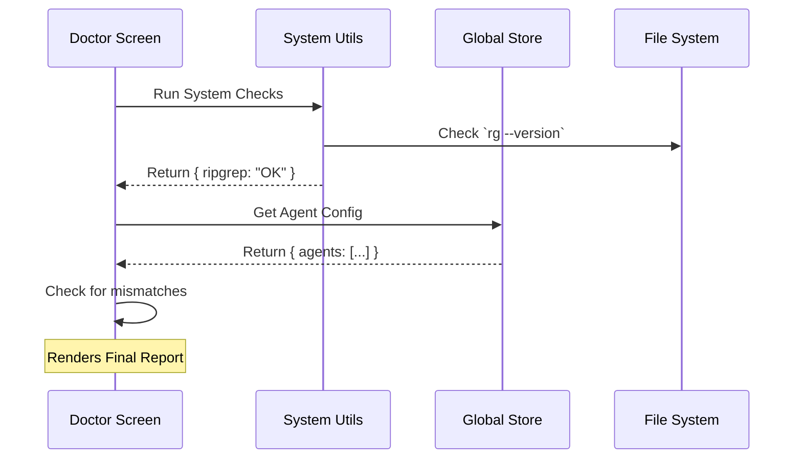

# Chapter 5: Diagnostic System

In the previous chapter, [Session Persistence & Recovery](04_session_persistence___recovery.md), we gave our AI a long-term memory, allowing it to pick up conversations exactly where it left off.

However, even the smartest AI with the best memory will fail if the computer it is running on is broken. What if `git` isn't installed? What if the configuration files have syntax errors? What if the AI doesn't have permission to write files?

In this final chapter, we will build the **Diagnostic System** (often called "The Doctor"). This is the application's mechanic, performing health checks to ensure everything is running smoothly.

### The Motivation: The "Check Engine" Light

Complex applications rely on many moving parts:
1.  **System Tools:** `git`, `ripgrep`, `node`.
2.  **Environment Variables:** API keys, path settings.
3.  **Configuration Files:** JSON/YAML files defining agents.

If one of these is missing, the application might crash silently or throw a confusing error like `ENOENT`.

**The Solution:** Instead of waiting for a crash, we proactively run a battery of tests. We present the results in a clean dashboard so the user can fix issues immediately.

---

### Central Use Case: The `doctor` Command

Imagine a user types `screens doctor`. They see a screen that checks three critical areas:
1.  **Installation:** Is the app version correct?
2.  **Tools:** Is the search tool (`ripgrep`) working?
3.  **Config:** Are there any syntax errors in the user's settings?

The Doctor screens runs these checks in the background and updates the UI live as results come in.

---

### Key Concepts

#### 1. The Diagnostic Check
A function that queries the Operating System. It asks: *"Hey, what version of Node is running?"* or *"Can I execute `rg --version`?"*

#### 2. The Diagnostic State
This is a specific shape of data that holds the health report. It usually includes:
*   **Status:** `OK` | `Warning` | `Error`
*   **Message:** "Git is not installed."
*   **Recommendation:** "Please install git via brew."

#### 3. The Async Loader
Since checking the disk and running commands takes time, the Doctor must handle **loading states** gracefully. We don't want the UI to freeze while we check the file system.

---

### Step-by-Step Implementation

We will explore `Doctor.tsx`. This component acts as the dashboard for all our health checks.

#### Step 1: Triggering the Checks

When the component mounts, we immediately fire off our asynchronous checks. We use `useEffect` for this.

```tsx
// Inside Doctor.tsx
const [diagnostic, setDiagnostic] = useState(null);

useEffect(() => {
  // 1. Run the system check
  getDoctorDiagnostic().then(setDiagnostic);
  
  // 2. Run other async checks (Config, Locks, etc.)
  checkContextWarnings(...).then(setContextWarnings);
}, []);
```

**Explanation:**
*   `getDoctorDiagnostic()`: This is a utility function (imported helper) that runs shell commands to check the OS.
*   `setDiagnostic`: We store the result in the local component state.
*   The `[]` dependency array ensures this runs only once when the screen appears.

#### Step 2: Handling the Loading State

While the computer is thinking, we need to show feedback.

```tsx
// Inside Doctor.tsx
if (!diagnostic) {
  return (
    <Pane>
      <Text dimColor>Checking installation status…</Text>
    </Pane>
  );
}
```

**Explanation:**
*   We use the rendering skills from [Terminal UI Rendering](01_terminal_ui_rendering.md).
*   Until `diagnostic` has data, we show a dim loading text.

#### Step 3: Rendering the Report

Once the data arrives, we display it using our layout components.

```tsx
// Inside Doctor.tsx
return (
  <Box flexDirection="column">
    <Text bold>Diagnostics</Text>
    <Text>└ Version: {diagnostic.version}</Text>
    <Text>└ Path: {diagnostic.installationPath}</Text>
    
    {/* Conditional Rendering for Warnings */}
    {diagnostic.warnings.map(w => (
       <Text color="warning">Warning: {w.issue}</Text>
    ))}
  </Box>
);
```

**Explanation:**
*   We allow the user to see "under the hood" details (Version, Path).
*   We use standard React lists (`.map`) to render dynamic arrays of warnings.

---

### Internal Implementation: The Data Flow

How does the Doctor gather all this information? It acts as a bridge between the **System** and the **Global State**.

1.  **Mount:** The `Doctor` component initializes.
2.  **Query System:** It calls `getDoctorDiagnostic` to check binaries (Git, Ripgrep).
3.  **Query State:** It hooks into the [Application State Management](02_application_state_management.md) to ask about Agents and Tools.
4.  **Synthesize:** It combines these two sources into a single report.



---

### Code Deep Dive: Specific Checks

The Doctor isn't just checking the binary; it's also checking the **Application Logic**.

#### Checking Configuration Validity

We rely on the data loaded in [Agent & Tool Configuration](03_agent___tool_configuration.md). If the user made a typo in their agent config file, we display it here.

```tsx
// Inside Doctor.tsx
const agentInfo = useAppState(s => s.agentDefinitions);

{agentInfo?.failedFiles?.length > 0 && (
  <Box flexDirection="column">
    <Text bold color="error">Agent Parse Errors</Text>
    {agentInfo.failedFiles.map(file => (
      <Text key={file.path}>└ {file.path}: {file.error}</Text>
    ))}
  </Box>
)}
```

**Explanation:**
*   We access `agentDefinitions` from the global store.
*   We specifically look for `failedFiles`.
*   We use `color="error"` (usually red) to draw attention to the broken files.

#### Validating Environment Variables

Sometimes users set limits (like "Max Output Tokens") that are invalid. The Doctor validates these against allowed ranges.

```tsx
// Inside Doctor.tsx (simplified)
const envVars = [
  { name: "BASH_MAX_OUTPUT", default: 4000 },
  // ... other vars
];

const envValidationErrors = envVars
  .map(v => validateBoundedIntEnvVar(v.name, v.default))
  .filter(v => v.status !== "valid");
```

**Explanation:**
*   We define a schema of expected environment variables.
*   We run a validation helper on each one.
*   If `envValidationErrors` has items, we render a warning section in the UI.

---

### Conclusion

In this chapter, we built the **Diagnostic System**. We learned:
1.  **Proactive Health Checks** prevent silent failures and user frustration.
2.  **Async Loading** allows the UI to remain responsive while querying the system.
3.  **Aggregated Reporting** combines system data (OS) with application data (Global Store) to give a complete picture of the app's health.

### Tutorial Complete!

Congratulations! You have navigated through the architecture of a complex React-based CLI application.

We have covered:
1.  **[Terminal UI Rendering](01_terminal_ui_rendering.md):** Painting the screen with Ink.
2.  **[Application State Management](02_application_state_management.md):** Managing data with a global store.
3.  **[Agent & Tool Configuration](03_agent___tool_configuration.md):** Defining the AI's personality and capabilities.
4.  **[Session Persistence & Recovery](04_session_persistence___recovery.md):** Saving and loading conversations.
5.  **Diagnostic System:** ensuring the environment is healthy.

You now possess the knowledge to build, debug, and extend the **Screens** project. Happy coding!

---

Generated by [Code IQ](https://github.com/adityasoni99/Code-IQ)