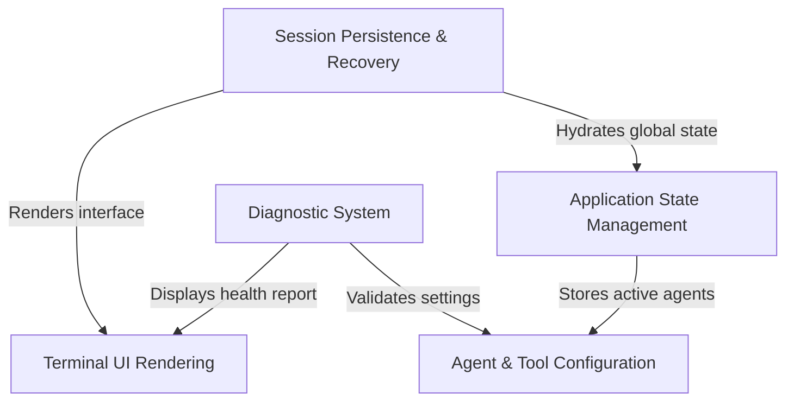

# Tutorial: screens

This project builds the **interactive terminal screens** for an AI assistant application. It features a robust *session recovery system* that allows users to pick up conversations exactly where they left off, restoring message history and active agents. Additionally, it includes a **Diagnostic "Doctor"** utility that scans the environment to validate configurations, permissions, and tool health.

## Chapters

1. [Terminal UI Rendering](01_terminal_ui_rendering.md)
2. [Application State Management](02_application_state_management.md)
3. [Agent & Tool Configuration](03_agent___tool_configuration.md)
4. [Session Persistence & Recovery](04_session_persistence___recovery.md)
5. [Diagnostic System](05_diagnostic_system.md)

---

Generated by [Code IQ](https://github.com/adityasoni99/Code-IQ)