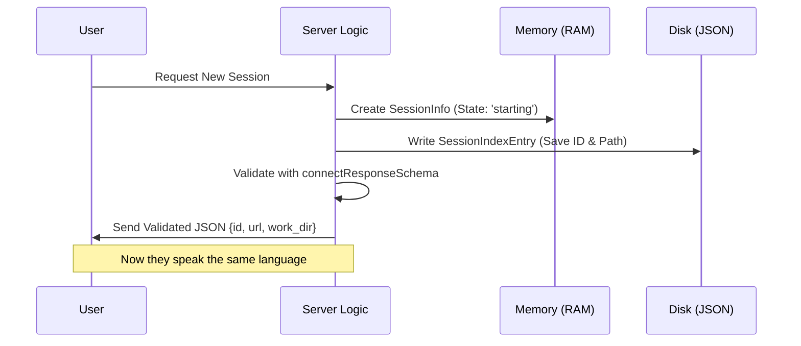

# Chapter 1: Session Data Models

Welcome to the first chapter of the **Server** project tutorial! Before we write code that actually *does* things, we need to agree on *what* we are talking about.

## Why do we need Data Models?

Imagine you are running a hotel. To check a guest in, you need specific information: their name, which room they are assigned to, and whether they have paid. If one receptionist writes "Room 101" and another writes "rm #101", the system gets confused.

**Session Data Models** acts as the "Standard Operating Procedure" for our server. It solves a chaotic communication problem by enforcing strict rules on data.

**The Use Case:**
We want to create a server where a client (like a coding agent) can connect, start a workspace, and resume work later. To do this, the server needs to answer questions like:
*   "What is the ID of this session?"
*   "Is the session running or stopped?"
*   "Where on the hard drive is this session working?"

If the client expects a field named `work_dir` but the server sends `directory`, the connection fails. Our models prevent this.

---

## Concept 1: The Handshake (Zod Schema)

When a client first connects, the server needs to send back a "Welcome Package." In our code, we use a tool called **Zod** to validate this package. Think of Zod as a bouncer at a club—it checks that every piece of data matches exactly what we expect.

Here is the blueprint for the connection response:

```typescript
// From types.ts
import { z } from 'zod/v4'

export const connectResponseSchema = z.object({
  session_id: z.string(),   // The unique ID card
  ws_url: z.string(),       // The address to talk to
  work_dir: z.string().optional(), // Where files are saved
})
```

**Explanation:**
*   `session_id`: This is a mandatory text string. It uniquely identifies the conversation.
*   `ws_url`: The WebSocket URL. This is the "phone number" the client uses to keep talking to the server.
*   `work_dir`: This is optional. It tells the client which folder on the computer is being used.

---

## Concept 2: The Lifecycle (Session State)

A session isn't just "on" or "off." It goes through a lifecycle, much like a car gear shift. We define these states specifically so the code never tries to drive while in "Park."

```typescript
// From types.ts
export type SessionState =
  | 'starting'  // Engine turning on
  | 'running'   // Cruising
  | 'detached'  // Running in background
  | 'stopping'  // Brakes applied
  | 'stopped'   // Engine off
```

**Explanation:**
By limiting the `status` to only these five words, we prevent typos. You can't accidentally set the status to "crashed" or "paused" because the compiler will yell at you. This makes handling logic in [Control & Permission Handling](04_control___permission_handling.md) much safer later on.

---

## Concept 3: RAM vs. Hard Drive

We have two different ways to look at a session. This is a crucial distinction for beginners.

### 1. Live Session (`SessionInfo`)
This exists only in the computer's memory (RAM). It holds the heavy, live objects, like the actual running computer process.

```typescript
// From types.ts
export type SessionInfo = {
  id: string
  status: SessionState
  // The actual running program (cannot be saved to a text file)
  process: ChildProcess | null
  createdAt: number
}
```

### 2. Saved Record (`SessionIndexEntry`)
This is the data we save to a JSON file on the hard drive. If the server restarts, the "Live Session" is wiped out, but this "Saved Record" remains.

```typescript
// From types.ts
export type SessionIndexEntry = {
  sessionId: string
  cwd: string        // Current Working Directory
  lastActiveAt: number
  // Notice: No 'process' here!
}
```

---

## Visualizing the Flow

Before looking at how this is implemented, let's visualize how these models are used when a user connects.



1.  **Request:** The user knocks on the door.
2.  **Memory:** The server creates the live object (`SessionInfo`) to manage the process.
3.  **Disk:** The server writes a note (`SessionIndexEntry`) in a permanent logbook.
4.  **Response:** The server replies using the strict format (`connectResponseSchema`).

---

## Internal Implementation Details

Let's look at how these types connect inside the file `types.ts`.

### defining the Server Configuration

The server needs to know its own settings before it can host any sessions. This is defined in `ServerConfig`.

```typescript
// From types.ts
export type ServerConfig = {
  port: number          // e.g., 3000
  authToken: string     // Password for security
  idleTimeoutMs?: number // Auto-shutdown timer
  maxSessions?: number  // Max capacity
}
```

**How to use this:**
When we initialize the server in the next chapter, we will pass a generic JavaScript object. Because we have this type definition, TypeScript will ensure we don't forget the `port` or pass a number for the `authToken`.

### The Session Index

We mentioned the "Saved Record" earlier. The `SessionIndex` is simply a collection (a dictionary) of these records.

```typescript
// From types.ts
// A dictionary where the Key is the Session ID
export type SessionIndex = Record<string, SessionIndexEntry>
```

**Analogy:**
Think of `SessionIndexEntry` as a single patient's medical file.
Think of `SessionIndex` as the entire filing cabinet containing all the folders.

When the server starts up, it reads this "filing cabinet" to remember previous sessions. This is critical for the `Direct Connect Manager` which we will cover in [Direct Connect Manager](03_direct_connect_manager.md).

---

## Summary

In this chapter, we defined the "vocabulary" our server speaks.

1.  **`connectResponseSchema`**: The strict contract for talking to clients.
2.  **`SessionState`**: The specific stages of a session's life (e.g., 'running', 'stopped').
3.  **`SessionInfo`**: The live data in memory (holds the process).
4.  **`SessionIndexEntry`**: The saved data on disk (holds the history).

By defining these models first, we ensure that the Client, the Server, and the File System all understand each other perfectly.

Now that we have our blueprints, it's time to actually build a session.

[Next Chapter: Session Initialization](02_session_initialization.md)

---

Generated by [Code IQ](https://github.com/adityasoni99/Code-IQ)