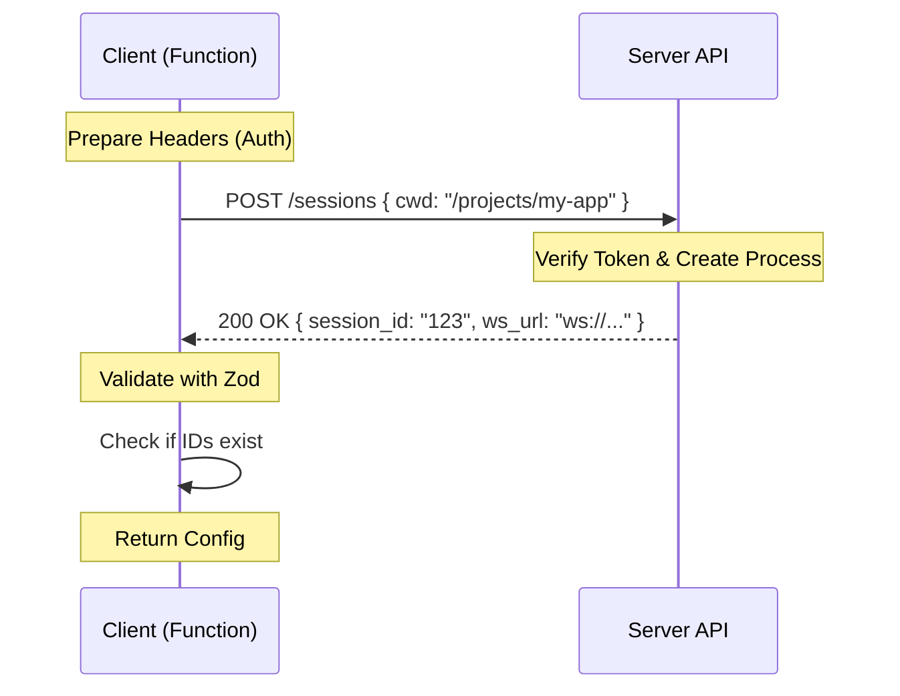

# Chapter 2: Session Initialization

Welcome to Chapter 2! In the previous chapter, [Session Data Models](01_session_data_models.md), we learned the "vocabulary" (Zod schemas and Types) that our server uses.

Now, we are going to learn how to start a conversation using that vocabulary.

## The Problem: The Hotel Check-In

Imagine you want to stay at a secure hotel. You can't just run straight to a room and jump on the bed. You have to go to the front desk first.

**Session Initialization** is exactly like a hotel check-in:
1.  **You approach the desk:** You connect to the HTTP server.
2.  **You show ID:** You provide an authentication token.
3.  **You state your needs:** You tell them where you want to work (`cwd` - current working directory).
4.  **You get a Key Card:** If everything is valid, the server gives you a Session ID and a WebSocket URL.

Without this step, the real-time connection (WebSocket) cannot happen because the server wouldn't know who you are or where you are working.

---

## The Solution: `createDirectConnectSession`

We solve this with a specific function located in `createDirectConnectSession.ts`. Its job is to perform the "HTTP Handshake" before the real work begins.

Let's break down how to implement this function step-by-step.

### Step 1: Preparing the Credentials

First, we need to pack our "ID card" into the HTTP headers. We use a standard called "Bearer Token" for authorization.

```typescript
// Inside createDirectConnectSession function
const headers: Record<string, string> = {
  'content-type': 'application/json',
}

// If a password (token) is required, add it here
if (authToken) {
  headers['authorization'] = `Bearer ${authToken}`
}
```
*   **Translation:** We are preparing an envelope. We stamp it with `json` so the server knows how to read it. If we have a password (`authToken`), we write it on the outside of the envelope.

### Step 2: The HTTP Request

Next, we send the request to the server. We use `fetch` (standard in modern JavaScript/Node) to send a POST request.

```typescript
// Sending the request to the server
resp = await fetch(`${serverUrl}/sessions`, {
  method: 'POST',
  headers,
  // We send the Current Working Directory (cwd)
  body: jsonStringify({
    cwd,
    // (Optional logic for permissions omitted for brevity)
  }),
})
```
*   **Translation:** This is the act of handing your request to the front desk clerk. We tell them: "Here is my token, and I want to open a session in this specific folder (`cwd`)."

### Step 3: Checking the Response (The Key Card)

Once the server replies, we can't blindly trust it. We need to verify that the "Key Card" works. This is where we use the **Zod Schema** we defined in Chapter 1.

```typescript
// Parse the JSON response
const json = await resp.json()

// Validate it against our strict rules
const result = connectResponseSchema().safeParse(json)

if (!result.success) {
  throw new DirectConnectError(
    `Invalid session response: ${result.error.message}`,
  )
}
```
*   **Translation:** We open the package the server sent back. We use `connectResponseSchema` (from [Session Data Models](01_session_data_models.md)) to check: *Does this actually contain a Session ID and a WebSocket URL?* If not, we throw an error immediately.

---

## Visualizing the Flow

Before we look at the return values, let's visualize this handshake.



1.  **POST:** The Client asks to start a session.
2.  **200 OK:** The Server agrees and sends details.
3.  **Validate:** The Client ensures the details are correct.

---

## Internal Implementation: Handling Errors

In programming, things often go wrong. The network might be down, or the password might be wrong.

To make debugging easier for beginners, we wrap these issues in a specific error type: `DirectConnectError`.

```typescript
// From createDirectConnectSession.ts
export class DirectConnectError extends Error {
  constructor(message: string) {
    super(message)
    this.name = 'DirectConnectError'
  }
}
```

We use this wrapper to catch generic computer errors and turn them into human-readable messages:

```typescript
// Catching network errors
} catch (err) {
  throw new DirectConnectError(
    `Failed to connect to server at ${serverUrl}: ${errorMessage(err)}`,
  )
}
```

This ensures that if the user sees a crash, they know exactly *why* (e.g., "Failed to connect") rather than seeing a confusing generic system code.

---

## Usage: What comes out?

If the function succeeds, it returns a `DirectConnectConfig`. This is your "Key Card." It contains everything the next system needs to start talking in real-time.

**Example Output:**
```typescript
return {
  config: {
    serverUrl: "http://localhost:3000",
    sessionId: "sess_abc123",
    wsUrl: "ws://localhost:3000/ws/sess_abc123",
    authToken: "secret123",
  },
  workDir: "/Users/dev/my-project",
}
```

This object is passed directly to the **Direct Connect Manager**, which handles the actual websocket connection.

---

## Summary

In this chapter, we built the "Check-in" mechanism for our server.

1.  We learned how to **Prepare Headers** with authentication.
2.  We sent a **POST Request** to ask for a new session.
3.  We **Validated** the response using the schemas from Chapter 1.
4.  We handled failure gracefully using `DirectConnectError`.

Now that we have checked in and have our "Key Card" (the `config` object), we are ready to go to our room and start working.

[Next Chapter: Direct Connect Manager](03_direct_connect_manager.md)

---

Generated by [Code IQ](https://github.com/adityasoni99/Code-IQ)