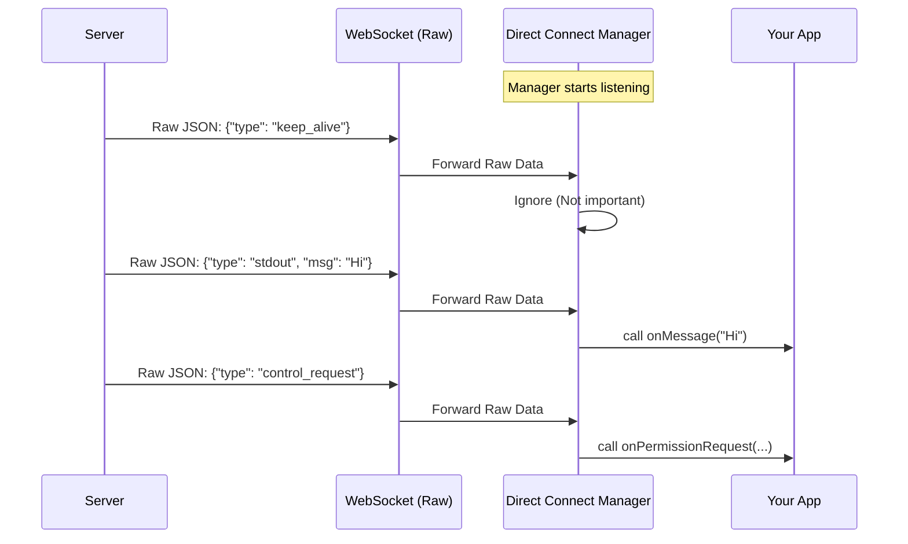

# Chapter 3: Direct Connect Manager

Welcome to Chapter 3!

In [Chapter 2: Session Initialization](02_session_initialization.md), we successfully "checked in" to the hotel. The server gave us a **Direct Connect Config** (our "Key Card").

But holding a key card doesn't mean you are inside the room yet. You still have to walk to the door, tap the card, and open it.

In this chapter, we will build the **Direct Connect Manager**. This is the specialized code that takes your Key Card, opens the connection, and stays on the line to manage the conversation.

## The Problem: Raw Noise vs. Meaningful Conversation

WebSockets (the technology we use for real-time talk) are like a raw telephone line. The server just shouts text down the wire.

If you listened to the raw line, you might hear:
`{"type": "keep_alive"}`
`{"type": "stdout", "content": "Hello"}`
`{"type": "control_request", "subtype": "can_use_tool"}`

If your application had to decipher this manually every time, your code would be a mess. You need a middleman.

**The Solution:**
The **Direct Connect Manager** acts like a dedicated **Telephone Operator**.
1.  It dials the number (connects).
2.  It listens to the raw noise.
3.  It ignores the boring stuff (like "keep_alive" heartbeats).
4.  It identifies important events ("The agent wants to write a file") and taps you on the shoulder.

---

## How to Use It

To use the manager, we need two things:
1.  The **Config** (from Chapter 2).
2.  **Callbacks** (What you want to do when the phone rings).

### Step 1: Defining the Reactions (Callbacks)

Before we connect, we need to decide what to do when messages arrive. We define a set of functions called `DirectConnectCallbacks`.

```typescript
// Define what happens when the server speaks
const myCallbacks = {
  // When the agent sends text or data
  onMessage: (msg) => console.log("Agent said:", msg),
  
  // When the agent asks for permission (covered in Ch 4)
  onPermissionRequest: (req, id) => console.log("Agent wants permission:", id),
  
  // When the connection dies
  onDisconnected: () => console.log("Call ended."),
}
```

### Step 2: Starting the Manager

Now we take the config we got in [Session Initialization](02_session_initialization.md) and plug it into our manager class.

```typescript
import { DirectConnectSessionManager } from './directConnectManager'

// 1. Create the manager with config (from Ch 2) and callbacks
const manager = new DirectConnectSessionManager(
  config,      // Contains wsUrl and authToken
  myCallbacks  // The functions we wrote above
)

// 2. Dial the number
manager.connect()
```

That's it! The manager is now running in the background, handling the complex WebSocket traffic and only notifying you when something interesting happens.

---

## Visualizing the Flow

Let's see how the Manager sits between the Raw Network and your Application.



The Manager filters out the noise so your App acts only on what matters.

---

## Internal Implementation Details

Let's look under the hood of `directConnectManager.ts` to see how this Operator works.

### 1. Dialing the Number (`connect`)

When you call `.connect()`, the manager creates the actual WebSocket connection. It also attaches the security badge (Authentication Token) we learned about in [Session Data Models](01_session_data_models.md).

```typescript
// Inside directConnectManager.ts
connect(): void {
  const headers: Record<string, string> = {}
  
  // Attach the "Key Card" (Token) if it exists
  if (this.config.authToken) {
    headers['authorization'] = `Bearer ${this.config.authToken}`
  }

  // Create the actual connection
  this.ws = new WebSocket(this.config.wsUrl, { headers })
  
  // Start listening for events...
}
```

### 2. The Sorting Hat (Processing Messages)

This is the most critical part of the Manager. When a message arrives, the Manager has to decide what it is.

The code listens for the `message` event, parses the text into JSON, and then uses a series of `if` statements to route the traffic.

```typescript
// Inside the 'message' event listener
this.ws.addEventListener('message', event => {
  const raw = jsonParse(event.data)

  // Case A: The Agent wants permission (e.g., to run a command)
  if (raw.type === 'control_request') {
    this.callbacks.onPermissionRequest(raw.request, raw.request_id)
    return
  }

  // Case B: Regular chatter (Agent talking to us)
  // We filter out boring system messages first
  if (raw.type !== 'keep_alive' /* ... and others ... */) {
    this.callbacks.onMessage(raw)
  }
})
```

**Why is this helpful?**
Without this logic, your main application would have to handle `jsonParse` errors, filter out `keep_alive` pings, and distinguish between different message types. The Manager hides this complexity.

### 3. Talking Back (`sendMessage`)

Conversation is a two-way street. When your user types something, the Manager wraps it up in the specific format the Server expects (as defined in our schemas).

```typescript
sendMessage(content: string): boolean {
  // 1. Check if the line is open
  if (!this.ws || this.ws.readyState !== WebSocket.OPEN) return false

  // 2. Wrap the message in the "User Message" envelope
  const payload = jsonStringify({
    type: 'user',
    message: { role: 'user', content: content },
    session_id: '', // Implementation detail
  })

  // 3. Send it
  this.ws.send(payload)
  return true
}
```

### 4. Handling Permissions

One specific message type is so important it gets its own logic: `control_request`.

This happens when the Agent says: *"I want to run `npm install`. Is that okay?"*

The Manager detects this and triggers `onPermissionRequest`. The app must then reply with "Yes" or "No". The Manager provides a helper for this reply:

```typescript
respondToPermissionRequest(requestId: string, result: Response): void {
  const response = jsonStringify({
    type: 'control_response',
    response: {
      subtype: 'success',
      request_id: requestId,
      // Pass the user's decision (Allow/Deny)
      response: { behavior: result.behavior },
    },
  })
  this.ws.send(response)
}
```

We will dive deep into how to make these decisions in the next chapter.

---

## Summary

In this chapter, we built the **Central Nervous System** of our live session.

1.  We initialized the **Manager** using the config from Chapter 2.
2.  We learned how the Manager **filters** raw WebSocket noise.
3.  We saw how it **routes** important events (like permission requests) to our callbacks.
4.  We looked at how it **wraps** outgoing messages in the correct JSON envelopes.

Now that our connection is live and we can hear the agent, we need to handle the most critical part of an autonomous coding agent: **Security**.

What happens when the agent wants to delete a file? How do we say "No"?

[Next Chapter: Control & Permission Handling](04_control___permission_handling.md)

---

Generated by [Code IQ](https://github.com/adityasoni99/Code-IQ)