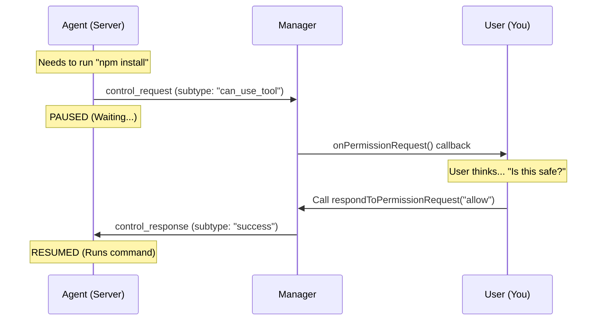

# Chapter 4: Control & Permission Handling

Welcome to the final chapter of our beginner's guide!

In the previous chapter, [Direct Connect Manager](03_direct_connect_manager.md), we established a live telephone line with our server. We can hear the agent, and the agent can hear us.

However, having a connection isn't enough. Imagine you hire a contractor to renovate your kitchen. You give them a key to the house (the Connection), but you don't want them knocking down load-bearing walls without asking first.

**Control & Permission Handling** is that safety mechanism. It forces the agent to stop and ask for permission before using tools or running commands.

---

## The Problem: The Over-Eager Agent

Autonomous agents are powerful. They can write code, delete files, and install software.

If we let them run without supervision, an agent might:
1.  Accidentally delete your project folder.
2.  Install a massive file that fills your hard drive.
3.  Get stuck in an infinite loop printing "Hello" forever.

We need a **Security Checkpoint**. Even though the agent is "inside the building" (connected), it cannot enter "restricted areas" (use tools) without showing a badge to the security guard (You).

---

## The Solution: The Request-Response Loop

The logic is simple. It follows a "Mother May I?" protocol.

1.  **Stop:** The agent pauses its work.
2.  **Ask:** It sends a special message: `control_request`.
3.  **Wait:** It sits idly until it hears back.
4.  **Answer:** You (via the Manager) send a `control_response`.
5.  **Proceed:** The agent acts based on your answer (runs the command or stops).

---

## Visualizing the Checkpoint

Here is how the flow looks when an agent wants to use a tool (like `npm install`).



---

## How to Use It

In [Direct Connect Manager](03_direct_connect_manager.md), we briefly touched on the `onPermissionRequest` callback. Now, let's learn how to actually use it.

### Step 1: Receiving the Request

When setting up your Manager, you provide a function to handle requests. This is your "Security Desk."

```typescript
const callbacks = {
  onPermissionRequest: (request, requestId) => {
    // 1. Inspect what the agent wants
    console.log("Agent wants to use tool:", request.tool_name)
    
    // 2. Make a decision (logic in next step)
    handleDecision(requestId) 
  },
  // ... other callbacks
}
```

**Explanation:**
*   `request`: Contains details like the command being run or the tool being used.
*   `requestId`: A unique ticket number (e.g., "req_123"). You **must** include this when you reply so the agent knows which question you are answering.

### Step 2: Approving (Allowing)

If the request looks safe, we give the "Green Light."

```typescript
// Giving permission
manager.respondToPermissionRequest(requestId, {
  behavior: 'allow' 
  // You can also modify the input here if you want!
})
```

**What happens:** The agent receives the "Allow" signal and immediately executes the command it wanted to run.

### Step 3: Blocking (Denying)

If the agent tries to do something dangerous (like `rm -rf /`), we give the "Red Light."

```typescript
// Denying permission
manager.respondToPermissionRequest(requestId, {
  behavior: 'block',
  message: 'Permission denied: Deleting files is not allowed.'
})
```

**What happens:** The agent receives the rejection. It **does not** run the command. Instead, it sees your error message (`"Permission denied..."`) and tries to think of a different solution.

---

## Internal Implementation Details

How does the `DirectConnectSessionManager` actually send these approvals? Let's look inside `directConnectManager.ts`.

### Constructing the Response

When you call `respondToPermissionRequest`, the manager builds a strict JSON packet to send back to the server.

```typescript
// Inside DirectConnectSessionManager
respondToPermissionRequest(requestId, result) {
  // 1. Ensure the line is open
  if (!this.ws) return

  // 2. Build the packet
  const response = jsonStringify({
    type: 'control_response', // Tells server: "Here is my answer"
    response: {
      subtype: 'success',     // The communication worked
      request_id: requestId,  // Matching the ticket number
      response: {
        behavior: result.behavior // 'allow' or 'block'
      },
    },
  })

  // 3. Send it
  this.ws.send(response)
}
```

**Why so many layers?**
Notice the structure: `{ response: { response: { ... } } }`.
*   The outer layer is for the Network (WebSocket type).
*   The middle layer is for the Protocol (Matching the ID).
*   The inner layer is for the Agent (The actual answer).

This strict nesting ensures that even if the answer is "No," the message itself is a "Success" in terms of network communication.

---

## Advanced Concept: Interrupts

Sometimes, you don't want to answer a question—you just want the agent to **stop talking**.

Maybe the agent is printing 1,000 lines of text, or it's hallucinating. You can press the "Emergency Stop" button.

### sending an Interrupt

```typescript
// Stop the agent immediately
manager.sendInterrupt()
```

### Internal Implementation

This sends a specific `control_request` *from* the user *to* the agent.

```typescript
// Inside DirectConnectSessionManager
sendInterrupt() {
  const request = jsonStringify({
    type: 'control_request',
    request_id: crypto.randomUUID(), // New ticket
    request: {
      subtype: 'interrupt', // The specific command
    },
  })
  this.ws.send(request)
}
```

This tells the server: "Cancel whatever you are doing right now."

---

## Summary of the Series

Congratulations! You have completed the **Server** project tutorial. Let's recap your journey:

1.  **[Session Data Models](01_session_data_models.md):** We learned the language (Types and Schemas) used to define a session.
2.  **[Session Initialization](02_session_initialization.md):** We learned how to "Check In" and get our credentials via HTTP.
3.  **[Direct Connect Manager](03_direct_connect_manager.md):** We built the phone operator that manages the WebSocket connection.
4.  **Control & Permission Handling:** We implemented the security guard that approves or denies agent actions.

You now have a complete mental model of how a client connects to, listens to, and controls an autonomous coding agent server.

**Happy Coding!**

---

Generated by [Code IQ](https://github.com/adityasoni99/Code-IQ)