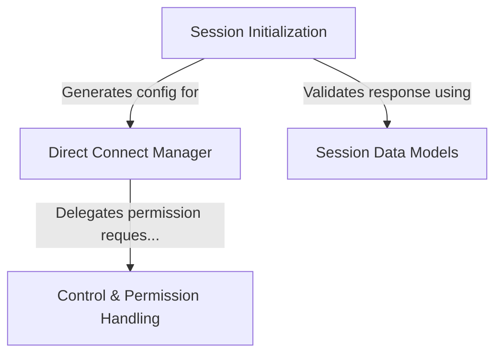

# Tutorial: server

This project implements a **Direct Connect** system to establish and manage real-time communication between a client and a remote server. It handles the complete lifecycle, starting with **Session Initialization** via an authenticated HTTP handshake and upgrading to a persistent **WebSocket** connection for continuous data exchange. The system enforces strict **Data Models** for validation and integrates a **Control & Permission Handling** layer to securely gate sensitive actions like tool usage through an approval process.

## Chapters

1. [Session Data Models](01_session_data_models.md)
2. [Session Initialization](02_session_initialization.md)
3. [Direct Connect Manager](03_direct_connect_manager.md)
4. [Control & Permission Handling](04_control___permission_handling.md)

---

Generated by [Code IQ](https://github.com/adityasoni99/Code-IQ)