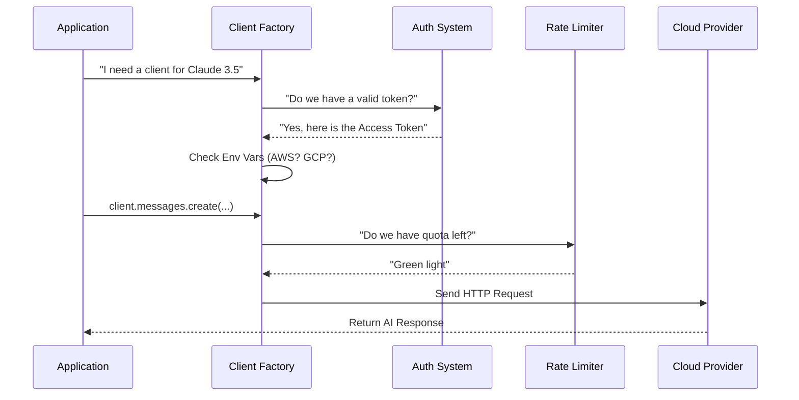

# Chapter 1: API Client & Connectivity

Welcome to the first chapter of the **Services** project tutorial!

Before we can make an AI "think," "remember," or "act," we first need a reliable way to talk to it. This layer acts as the **Universal Adapter** for our application.

## 1. The Big Picture: A Universal Adapter

Imagine you are traveling internationally. Every country has different electrical outlets. If you want to charge your phone, you don't want to rewire the wall; you just want a **universal travel adapter** that fits into any socket and gives you power.

In this project, the **API Client** is that adapter.

We might need to connect to:
1.  **Anthropic's Direct API**
2.  **AWS Bedrock**
3.  **Google Cloud Vertex AI**
4.  **Microsoft Azure (Foundry)**

Each of these providers requires different passwords (API keys or OAuth tokens) and speaks a slightly different technical dialect. The **API Client** hides all this complexity. The rest of our app simply asks, *"Please send this message to Claude,"* and the client handles the rest.

### Central Use Case
**Goal:** The user types "Hello, World!" in the terminal. We want to send this to the fastest available AI model and get a text response, regardless of which cloud provider is running underneath.

## 2. Key Concepts

### A. Authentication (The Badge vs. The Password)
We support two main ways to prove who we are:
1.  **API Keys:** Like a secret password (`sk-ant-...`). Simple and direct.
2.  **OAuth:** Like an ID badge. You log in via a browser, and we get a "token" that expires and refreshes automatically. This is used for Claude.ai subscribers.

### B. Provider Selection
The system checks environment variables (like `CLAUDE_CODE_USE_BEDROCK`) to decide which "Cloud Cloud" to call. It initializes the correct software development kit (SDK) for that specific cloud.

### C. Rate Limiting (The Traffic Light)
AI services have limits on how much you can talk to them per minute or hour. Our client checks these limits *before* making a request to avoid getting errors.

---

## 3. Using the Client

To use this layer, you generally don't create a `new Client()` manually. Instead, you ask a helper function to build one for you.

### Step 1: Getting the Client
This function looks at your configuration and gives you a ready-to-use object.

```typescript
// From services/api/client.ts
import { getAnthropicClient } from './api/client.js'

// Ask for a client ready to talk to a specific model
const client = await getAnthropicClient({
  maxRetries: 3,
  model: 'claude-3-5-sonnet-20240620',
  source: 'tutorial_demo' 
})
```
*Explanation: We request a client. We don't need to pass API keys here; `getAnthropicClient` automatically finds them in the system config.*

### Step 2: Making a Request
Now that we have the `client`, we can send a message.

```typescript
const response = await client.messages.create({
  model: 'claude-3-5-sonnet-20240620',
  max_tokens: 1024,
  messages: [{ role: 'user', content: 'Hello!' }]
})

console.log(response.content[0].text)
```
*Explanation: This looks standard, but under the hood, this request might be routing through AWS, Google, or Anthropic directly depending on your setup.*

---

## 4. Under the Hood: How It Works

When you call `getAnthropicClient`, a series of checks happens instantly to configure your connection.



### Internal Implementation Details

Let's look at the actual code that makes this "Universal Adapter" work.

#### 1. The Factory Function (`api/client.ts`)
This is the heart of the connectivity layer. It decides which SDK to load.

```typescript
// services/api/client.ts (Simplified)
export async function getAnthropicClient({ apiKey, model }) {
  // 1. Check for specific cloud flags
  if (process.env.CLAUDE_CODE_USE_BEDROCK) {
    const { AnthropicBedrock } = await import('@anthropic-ai/bedrock-sdk')
    return new AnthropicBedrock({ /* AWS credentials */ })
  }
  
  if (process.env.CLAUDE_CODE_USE_VERTEX) {
    const { AnthropicVertex } = await import('@anthropic-ai/vertex-sdk')
    return new AnthropicVertex({ /* Google credentials */ })
  }

  // 2. Default to standard Anthropic API
  return new Anthropic({ apiKey: getAnthropicApiKey() })
}
```
*Explanation: This function acts like a railway switch. If it sees the `BEDROCK` flag, it switches tracks to AWS. Otherwise, it defaults to the standard API.*

#### 2. Handling OAuth Refresh (`oauth/client.ts`)
If we are using OAuth (the "ID Badge"), the badge might expire. We handle this automatically so the user isn't interrupted.

```typescript
// services/oauth/client.ts
export async function refreshOAuthToken(refreshToken: string) {
  // Call the token URL to trade an old token for a new one
  const response = await axios.post(getOauthConfig().TOKEN_URL, {
    grant_type: 'refresh_token',
    refresh_token: refreshToken,
    client_id: getOauthConfig().CLIENT_ID,
  })

  // Returns new access token + new expiration date
  return {
    accessToken: response.data.access_token,
    expiresAt: Date.now() + response.data.expires_in * 1000
  }
}
```
*Explanation: Before every request, we check if the token is valid. If it's about to expire, this function quietly runs in the background to keep the connection alive.*

#### 3. Checking Limits (`claudeAiLimits.ts`)
We don't want to hit a wall. We check our "gas tank" (quota) frequently.

```typescript
// services/claudeAiLimits.ts
export async function checkQuotaStatus(): Promise<void> {
  // Make a tiny, cheap request to check headers
  try {
    const raw = await makeTestQuery()
    // Read the "remaining-requests" headers from the response
    extractQuotaStatusFromHeaders(raw.headers)
  } catch (error) {
    // If we get a 429 (Too Many Requests), we stop traffic
    if (error.status === 429) {
      emitStatusChange({ status: 'rejected' })
    }
  }
}
```
*Explanation: This layer acts as a safety guard. It parses special headers returned by the API (like `anthropic-ratelimit-unified-reset`) to calculate if we need to slow down.*

## 5. Summary

We have established a robust communication line.
1.  **Universal Adapter:** We don't care if it's AWS, GCP, or Direct; the code works the same.
2.  **Auto-Auth:** Passwords and Tokens are managed for us.
3.  **Safety:** Rate limits are monitored to prevent crashes.

Now that we can receive raw text from the AI, we need to make sure the AI remembers what we said five minutes ago. Raw text has no memory!

[Next Chapter: Memory & Knowledge Extraction](02_memory___knowledge_extraction.md)

---

Generated by [Code IQ](https://github.com/adityasoni99/Code-IQ)