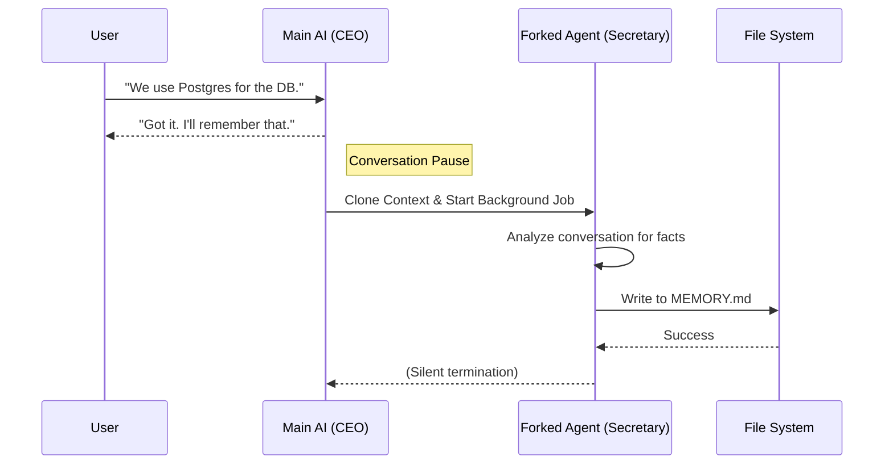

# Chapter 2: Memory & Knowledge Extraction

Welcome to the second chapter of the **Services** project tutorial!

In the previous chapter, [API Client & Connectivity](01_api_client___connectivity.md), we built a "Universal Adapter" to talk to the AI. However, raw AI models have a major flaw: **Amnesia**. Every time you start a new session, the AI forgets everything you told it previously.

## 1. The Big Picture: The "Secretary" Analogy

Imagine you are in an important business meeting. The discussion moves fast. You (the user) and the CEO (the AI) are brainstorming.

If the CEO stops every 5 minutes to write down detailed minutes, the conversation flow dies. But if no one takes notes, the CEO forgets the decisions by next week.

**Memory & Knowledge Extraction** acts as a silent **Executive Secretary**.
1.  It sits in the background, listening to the conversation.
2.  It waits for a pause in the dialogue.
3.  It quietly writes down key facts, decisions, and project structures into a "Notebook" (Markdown files).
4.  It doesn't interrupt the main flow.

### Central Use Case
**Goal:**
1.  **Session 1:** You tell the AI, *"My project uses Port 3000 for the backend."*
2.  **Session 2 (Next Day):** You ask, *"Start the server."*
3.  **Result:** The AI looks at its notebook, sees the note about Port 3000, and starts the server correctly without asking you again.

## 2. Key Concepts

### A. The Forked Agent (The Clone)
This is the most critical technical concept. To prevent the "Secretary" from messing up the "CEO's" thought process, we use a **Forked Agent**.

When we want to save a memory, we don't ask the main AI instance. We "fork" (clone) the conversation context into a separate, invisible process. This clone analyzes the chat log, extracts facts, saves them to disk, and then disappears. The main AI never even knows it happened.

### B. Session Memory vs. Durable Memory
We have two types of notes:
1.  **Session Memory:** A scratchpad for the *current* conversation (e.g., "User is currently debugging `index.ts`").
2.  **Durable Memory:** Permanent facts stored in `MEMORY.md` files (e.g., "The project uses TypeScript").

### C. Auto-Dreaming
Sometimes, notes get messy. **Auto-Dreaming** is a process that runs when you are away (idle). It reads through all the scattered notes and consolidates them into a clean, organized summary. It's like the Secretary organizing the filing cabinet overnight.

---

## 3. How It Works (The Implementation)

This system operates largely automatically in the background using "Hooks." You generally don't call it manually; you just configure the triggers.

### The Workflow



## 4. Code Walkthrough

Let's look at how the code handles this "Silent Secretary" logic.

### Part 1: Deciding When to Take Notes (`sessionMemory.ts`)
We don't want to save memories after every single word. We wait for thresholds (like number of tokens used or tools called).

```typescript
// services/SessionMemory/sessionMemory.ts
export function shouldExtractMemory(messages: Message[]): boolean {
  // 1. Check if enough "stuff" has happened (Token Threshold)
  const currentTokenCount = tokenCountWithEstimation(messages)
  const hasMetTokenThreshold = hasMetUpdateThreshold(currentTokenCount)

  // 2. Ensure the AI finished its turn (don't interrupt a tool use)
  const hasToolCallsInLastTurn = hasToolCallsInLastAssistantTurn(messages)

  // Only extract if threshold met AND the AI is done talking
  return hasMetTokenThreshold && !hasToolCallsInLastTurn
}
```
*Explanation: This function acts as the "Traffic Light." It only turns green when the conversation has progressed enough to be worth summarizing, and specifically avoids running if the AI is in the middle of a complex task.*

### Part 2: The Forked Agent (`extractMemories.ts`)
Once the traffic light is green, we create the "Secretary" (the Forked Agent).

```typescript
// services/extractMemories/extractMemories.ts
async function runExtraction({ context }) {
  // Create a special prompt telling the AI to act as a librarian
  const userPrompt = buildExtractAutoOnlyPrompt(newMessageCount, existingMemories)

  // Run the "Forked Agent" - a separate process sharing the prompt cache
  const result = await runForkedAgent({
    promptMessages: [createUserMessage({ content: userPrompt })],
    // "cacheSafeParams" ensures we reuse the expensive context from the main chat
    cacheSafeParams: createCacheSafeParams(context),
    forkLabel: 'extract_memories',
    skipTranscript: true // Don't write this internal thought to the user's screen
  })
}
```
*Explanation: `runForkedAgent` is the magic function. It spins up a parallel AI request. `skipTranscript: true` ensures the user doesn't see "I am now saving memories..." in their terminal. It happens invisibly.*

### Part 3: Writing to Disk
The Forked Agent uses tools just like the main agent. It calls `FileWrite` or `FileEdit` to save the facts.

```typescript
// services/extractMemories/extractMemories.ts (Concept)
function extractWrittenPaths(agentMessages: Message[]): string[] {
  const paths: string[] = []
  
  // Look through the Secretary's output
  for (const message of agentMessages) {
    // Did the Secretary use the "Write File" tool?
    const filePath = getWrittenFilePath(message)
    if (filePath) paths.push(filePath)
  }
  
  return paths // Return list of files updated (e.g., ['project_structure.md'])
}
```
*Explanation: After the forked agent finishes, we scan its output to see what files it touched. We might then show a subtle "Saved memory to project_structure.md" log to the user.*

### Part 4: Auto-Dreaming (`autoDream.ts`)
This runs when the system detects the user has been away for a while (e.g., 24 hours).

```typescript
// services/autoDream/autoDream.ts
export function initAutoDream(): void {
  runner = async function runAutoDream(context) {
    // Check if 24 hours have passed since last cleanup
    const hoursSince = (Date.now() - lastAt) / 3_600_000
    if (hoursSince < config.minHours) return

    // If yes, run a specialized "Dream" agent to consolidate files
    await runForkedAgent({
      promptMessages: [createUserMessage({ content: 'Consolidate memories...' })],
      querySource: 'auto_dream',
      forkLabel: 'auto_dream'
    })
  }
}
```
*Explanation: This is a maintenance task. It prevents the memory files from becoming cluttered with duplicates. It treats the memory folder like a garden that needs weeding.*

## 5. Summary

We have given our AI a long-term memory system that:
1.  **Watches** the conversation.
2.  **Forks** a background process to avoid interruption.
3.  **Writes** facts to Markdown files.
4.  **Cleans up** (Dreams) when you are away.

Now that the AI can remember facts, the amount of information in the conversation ("context") will grow larger and larger. Eventually, it will become too big for the model to handle efficiently.

We need a way to "zip" or compress this conversation history.

[Next Chapter: Context Compaction](03_context_compaction.md)

---

Generated by [Code IQ](https://github.com/adityasoni99/Code-IQ)