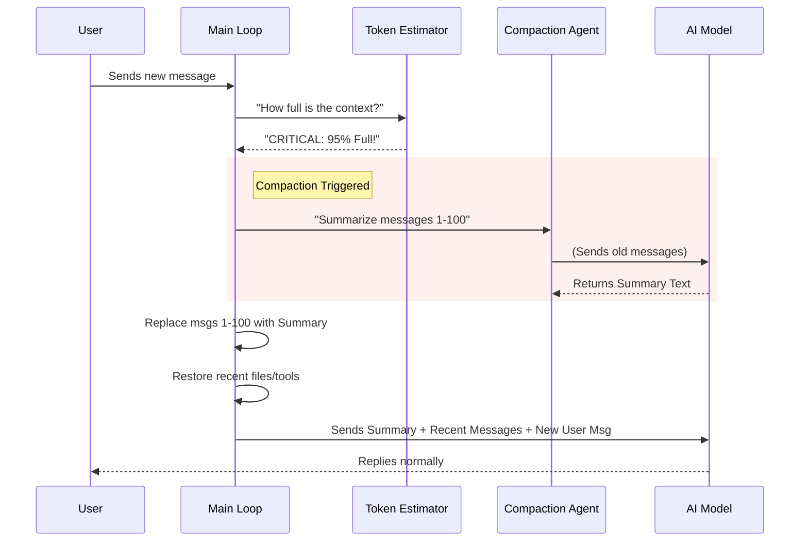

# Chapter 3: Context Compaction

Welcome to the third chapter of the **Services** project tutorial!

In the previous chapter, [Memory & Knowledge Extraction](02_memory___knowledge_extraction.md), we built a "Silent Secretary" to record permanent facts into files.

However, we face a more immediate physical limitation: **The Context Window**.
Just as a human has a limit to how much they can hold in their "working memory" at one time (e.g., trying to remember a 50-digit number), AI models have a hard limit on how much text they can process in a single request.

If we talk to the AI for hours, or paste massive error logs, we will hit this wall. If we do nothing, the system crashes.

## 1. The Big Picture: The "Spring Cleaning" Analogy

Imagine your conversation history is a **backpack**.
Every time you send a message or the AI replies, you put a rock in the backpack.
1.  **Small rocks:** "Hello."
2.  **Huge boulders:** A 500-line error log.

Eventually, the backpack gets too heavy to lift (the Context Limit). You cannot continue the journey unless you make space.

**Context Compaction** is the process of:
1.  Stopping the hike.
2.  Taking all the old rocks (old messages) out.
3.  Crushing them into a handful of sand (a summary).
4.  Putting the sand and only the *newest* rocks back in.
5.  Resuming the hike.

### Central Use Case
**Goal:** You are debugging a massive codebase. You have been talking for 2 hours. The conversation history is 190,000 tokens long. The limit is 200,000.
**Action:** The system automatically triggers "Auto-Compaction."
**Result:** The history is compressed down to 20,000 tokens. The AI still remembers what you are debugging, but the exact phrasing of your first message is replaced by a summary.

## 2. Key Concepts

### A. Tokens (The Currency of Size)
AI models don't count words; they count **Tokens**. A token is roughly 4 characters or 0.75 words.
*   "apple" ≈ 1 token
*   "ing" ≈ 1 token
*   A 100-line code file ≈ 1,000 tokens.

We constantly estimate this count to know when the backpack is getting full.

### B. The Threshold (The Traffic Light)
We don't wait until the backpack bursts. We set a "Safety Buffer" (e.g., 13,000 tokens remaining). Once we cross this line, the traffic light turns Red, and we must compact before sending the next message.

### C. Recursive Summarization
How do we summarize the conversation? We use the AI itself!
We create a **Forked Agent** (just like in Chapter 2) and give it the instruction: *"Please summarize the following conversation, keeping key technical details."*
We take the output of that agent and replace the user's history with it.

---

## 3. How It Works (The Workflow)

The compaction system usually runs automatically.



### Critical Detail: File Restoration
If we summarize away a message where the AI read `utils.ts`, the AI might forget what was in that file.
Our compactor is smart: after summarizing, it checks which files were recently accessed and **re-injects** them into the context so the AI doesn't lose its "working materials."

---

## 4. Under the Hood: The Code

Let's look at the implementation of this safety system.

### Step 1: Counting the Rocks (`tokenEstimation.ts`)
We need to know how many tokens we are using. We prioritize asking the API for an exact count, but fall back to math if needed.

```typescript
// services/tokenEstimation.ts
export async function countTokensWithAPI(content: string): Promise<number | null> {
  // 1. If content is empty, cost is 0
  if (!content) return 0

  // 2. Ask the Anthropic API to count the tokens for us
  const anthropic = await getAnthropicClient({ source: 'count_tokens' })
  const response = await anthropic.beta.messages.countTokens({
    model: 'claude-3-5-sonnet',
    messages: [{ role: 'user', content }]
  })

  // 3. Return the exact number
  return response.input_tokens
}
```
*Explanation: This function acts as our scale. It asks the API, "How heavy is this text?"*

### Step 2: The Decision to Compact (`autoCompact.ts`)
Before every turn, we check if we are in the danger zone.

```typescript
// services/compact/autoCompact.ts
export async function shouldAutoCompact(messages, model) {
  // 1. Get current usage
  const tokenCount = tokenCountWithEstimation(messages)
  
  // 2. Calculate the limit (Max Capacity - Safety Buffer)
  // BUFFER is usually around 13,000 tokens
  const threshold = getEffectiveContextWindowSize(model) - AUTOCOMPACT_BUFFER_TOKENS

  // 3. Return true if we are overflowing
  return tokenCount >= threshold
}
```
*Explanation: If the current `tokenCount` is higher than our safety `threshold`, we return `true` to trigger the cleaning crew.*

### Step 3: Performing the Compaction (`compact.ts`)
This is the core logic. It replaces the long history with a summary.

```typescript
// services/compact/compact.ts
export async function compactConversation(messages, context) {
  // 1. Run a forked agent to generate the summary text
  const summaryResponse = await runForkedAgent({
    promptMessages: [{ role: 'user', content: 'Summarize this conversation...' }],
    querySource: 'compact'
  })
  
  const summaryText = summaryResponse.content[0].text

  // 2. Create a new "User" message containing this summary
  const summaryMessage = createUserMessage({
    content: `Here is a summary of our conversation so far: ${summaryText}`,
    isCompactSummary: true
  })

  // 3. Keep the very last few messages (so the flow feels natural)
  const recentMessages = messages.slice(-5) 

  // 4. Return the new, clean history
  return {
    summaryMessages: [summaryMessage],
    messagesToKeep: recentMessages
  }
}
```
*Explanation: We outsource the heavy lifting to `runForkedAgent`. It reads the old history and returns a paragraph of text. We then stitch that paragraph onto the front of the 5 most recent messages.*

### Step 4: Restoring Lost Files (`compact.ts`)
As mentioned, we don't want the AI to lose file contents it just read.

```typescript
// services/compact/compact.ts
export async function createPostCompactFileAttachments(readFileState) {
  // 1. Look at the cache of files we read recently
  const recentFiles = Object.values(readFileState)
    .sort((a, b) => b.timestamp - a.timestamp) // Newest first
    .slice(0, 5) // Take top 5

  // 2. Re-read these files from disk
  const attachments = await Promise.all(recentFiles.map(file => 
    generateFileAttachment(file.filename)
  ))

  // 3. These will be appended to the new history
  return attachments
}
```
*Explanation: This ensures that even though the conversation history is gone, the "working documents" are immediately placed back on the AI's desk.*

## 5. Summary

We have built a waste management system for our AI.
1.  **Estimation:** We constantly weigh our backpack.
2.  **Threshold:** We know when to stop before breaking.
3.  **Compaction:** We trade granular history for a concise summary.
4.  **Restoration:** We ensure vital files persist through the cleanup.

Now we have an AI that can connect (Chapter 1), remember facts forever (Chapter 2), and talk indefinitely without crashing (Chapter 3).

Next, we need to give the AI the ability to actually *do* things—like running commands and editing files.

[Next Chapter: Tool Execution Pipeline](04_tool_execution_pipeline.md)

---

Generated by [Code IQ](https://github.com/adityasoni99/Code-IQ)