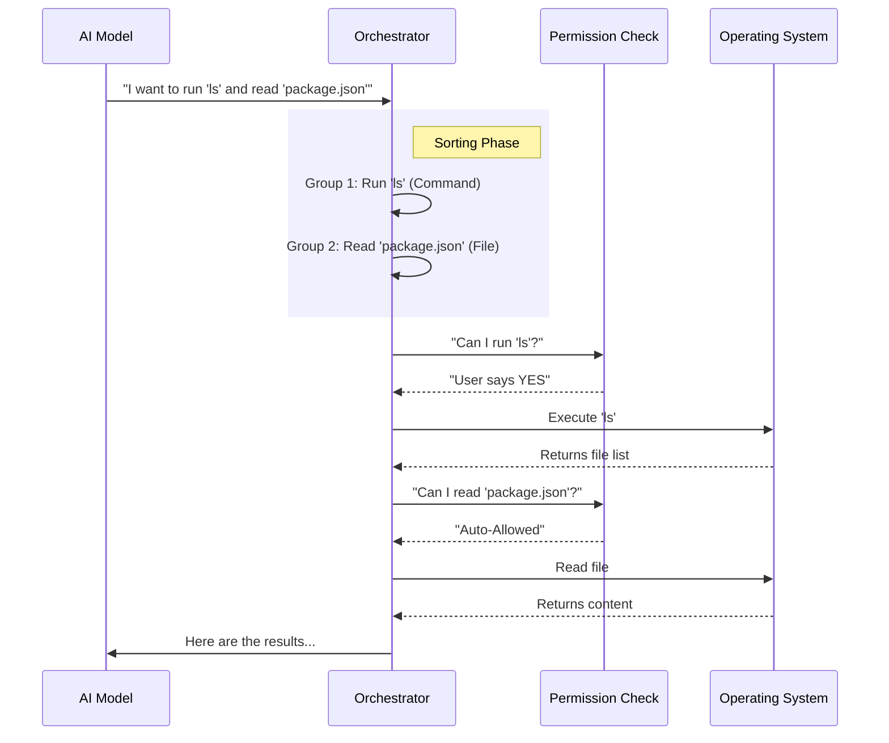

# Chapter 4: Tool Execution Pipeline

Welcome to the fourth chapter of the **Services** project tutorial!

In the previous chapter, [Context Compaction](03_context_compaction.md), we learned how to keep our conversation history light so the AI doesn't get overwhelmed.

At this point, we have a smart conversationalist. It can talk, remember, and summarize. But it is still just a "brain in a jar." It cannot *touch* anything. It cannot run a terminal command, edit a file, or browse the web.

The **Tool Execution Pipeline** acts as the **Mechanical Hands** of the AI. It translates the AI's textual desire ("I want to read file.txt") into actual operating system actions.

## 1. The Big Picture: Brains into Action

Imagine you are a Chef (the AI). You have a recipe and the knowledge, but you are stuck in a control room. You can only shout orders through a microphone.

You need a **Sous-Chef** (The Tool Pipeline) in the kitchen.
1.  **Orchestration:** If you shout "Cut the carrots" and "Boil the water," the Sous-Chef decides if these can happen at the same time (Parallel) or one after another (Serial).
2.  **Safety:** If you shout "Burn down the kitchen," the Sous-Chef pauses and asks the restaurant owner (the User), "Are you sure about that?"
3.  **Execution:** The Sous-Chef actually performs the action and reports back: "Carrots are chopped."

### Central Use Case
**Goal:** The AI wants to fix a bug. It decides to:
1.  Read `src/index.ts` (to see the code).
2.  Read `src/utils.ts` (to see helper functions).

**Action:** The Pipeline notices both are "read-only" actions. It runs them **simultaneously** to save time. It gets the file contents and feeds them back to the AI.

## 2. Key Concepts

### A. The "Tool Use" Block
The AI doesn't run code directly. It outputs a special JSON block called `tool_use`. It looks like this:
`{ "tool": "readFile", "path": "src/index.ts" }`
Our pipeline constantly scans the AI's response for these blocks.

### B. Serial vs. Parallel Execution
*   **Parallel:** Safe actions like "Read File" or "Search" can happen together. If the AI asks for 5 files, we fetch them all at once.
*   **Serial:** Dangerous or dependent actions like "Write File" or "Run Command" must happen one by one. You can't edit a file and delete it at the exact same time.

### C. Permissions (The Safety Guard)
Before executing any tool, the pipeline checks if the user allows it.
*   **Auto-Allow:** Reading harmless files might be allowed automatically.
*   **Ask User:** Running `rm -rf /` will trigger a popup asking you to click "Approve."

---

## 3. How It Works (The Workflow)

When the AI decides to act, the pipeline takes over.



---

## 4. Under the Hood: The Code

Let's break down the actual TypeScript code that manages this flow.

### Step 1: Sorting the Tasks (`toolOrchestration.ts`)
The AI might ask for 10 things at once. We need to group them. We check if tools are `isConcurrencySafe` (read-only).

```typescript
// services/tools/toolOrchestration.ts (Simplified)
function partitionToolCalls(toolMessages) {
  const batches = []
  
  // Group consecutive safe tools (like "Read File") together
  // But isolate unsafe tools (like "Write File") into their own batch
  for (const tool of toolMessages) {
    if (isReadBuffer(tool)) {
      addToCurrentBatch(tool)
    } else {
      startNewBatch(tool)
    }
  }
  return batches
}
```
*Explanation: This organizes the "orders." If we have [Read, Read, Write, Read], it becomes Batch 1: [Read, Read] (Parallel), Batch 2: [Write] (Wait for finish), Batch 3: [Read] (Parallel).*

### Step 2: Running the Batch (`toolOrchestration.ts`)
Now we iterate through our sorted batches.

```typescript
// services/tools/toolOrchestration.ts (Simplified)
export async function* runTools(batches) {
  for (const batch of batches) {
    if (batch.isSafe) {
      // Run all read requests at the exact same time
      yield* runToolsConcurrently(batch.tools) 
    } else {
      // Run sensitive requests one by one
      yield* runToolsSerially(batch.tools)
    }
  }
}
```
*Explanation: `runToolsConcurrently` uses `Promise.all` to be fast. `runToolsSerially` uses a simple `for` loop to be safe.*

### Step 3: Checking Permissions (`toolExecution.ts`)
Before we actually touch the system, we stop at the checkpoint.

```typescript
// services/tools/toolExecution.ts (Simplified)
async function checkPermissionsAndCallTool(tool, input) {
  // 1. Ask the Permission System (Hooks/User Settings)
  const decision = await resolveHookPermissionDecision(tool, input)

  // 2. If the user said "No", stop immediately
  if (decision.behavior !== 'allow') {
    return "Error: User denied this action."
  }

  // 3. User said "Yes", proceed to execution
  return await executeTool(tool, input)
}
```
*Explanation: This is where the popup "Allow Command?" happens. If the user rejects it, the function returns an error string to the AI, so the AI knows it wasn't allowed to do that.*

### Step 4: Execution & Result (`toolExecution.ts`)
Finally, we run the tool logic and format the output.

```typescript
// services/tools/toolExecution.ts (Simplified)
async function executeTool(tool, input) {
  try {
    // Run the actual function (e.g., fs.readFile)
    const result = await tool.call(input)

    // Log success for telemetry
    logEvent('tool_success', { toolName: tool.name })

    // Return the data
    return result
  } catch (error) {
    // If the file doesn't exist, tell the AI
    return `Error: ${error.message}`
  }
}
```
*Explanation: This calls the specific tool class (like `FileReadTool`). It captures the output (or error) and sends it back up the chain to be given to the AI.*

## 5. Summary

We have given our AI hands!
1.  **Orchestration:** We intelligently group tasks to be fast but safe.
2.  **Safety:** We verify permissions so the AI doesn't go rogue.
3.  **Execution:** We interact with the OS and return the results.

Now the AI can connect, remember, manage its context, and execute standard tools. But what if we want to connect to *external* tools provided by other applications, like a database client or a Slack integration?

We need a standard protocol for connecting to outside tools.

[Next Chapter: Model Context Protocol (MCP)](05_model_context_protocol__mcp_.md)

---

Generated by [Code IQ](https://github.com/adityasoni99/Code-IQ)