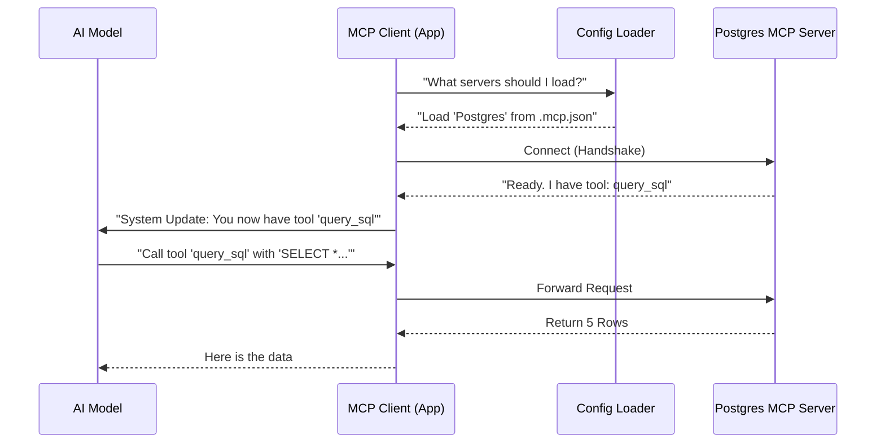

# Chapter 5: Model Context Protocol (MCP)

Welcome to the fifth chapter of the **Services** project tutorial!

In the previous chapter, [Tool Execution Pipeline](04_tool_execution_pipeline.md), we gave our AI "mechanical hands" to perform basic tasks like reading files and running terminal commands.

However, built-in tools aren't enough. What if the AI needs to check your calendar on Google, query a PostgreSQL database, or send a message on Slack? We cannot write a custom tool for every single software in the world inside our core codebase. It would become impossible to maintain.

We need a standard way to plug *any* external tool into our AI.

## 1. The Big Picture: The "USB Port" Analogy

Imagine buying a laptop.
*   It has a built-in keyboard and screen (Internal Tools).
*   But you want to connect a printer, a camera, or a microphone.
*   You don't need to solder wires to the motherboard. You just plug them into a **USB Port**.

**Model Context Protocol (MCP)** is the USB port for AI applications.

It is an open standard that lets us build "Connectors" (MCP Servers) for things like GitHub, Google Drive, or Databases. Our application (the MCP Client) simply "plugs in" these servers, and suddenly the AI knows how to use them.

### Central Use Case
**Goal:** The user asks, *"Who are the top 5 users in my database?"*
**Problem:** Our AI app doesn't know your database password or schema.
**Solution:** We plug in a "Postgres MCP Server."
**Result:** The AI sees a new tool called `query_database`, uses it, and answers the question.

## 2. Key Concepts

### A. The Client (The Host)
This is our application (Claude Code). It is the "computer" that accepts the USB devices. It provides the interface for the AI to discover available tools.

### B. The Server (The Device)
This is the external program we are connecting to. It could be a simple script running locally or a complex service running in the cloud. It tells the Client: *"Hi, I am the GitHub Server. I have a tool called `create_issue`."*

### C. The Configuration (`.mcp.json`)
How does our app know which servers to plug in? It looks for a configuration file. This file acts like a list of startup instructions.

### D. The Transport (The Cable)
This is how data moves between the Client and the Server.
*   **Stdio:** We run the server as a background process and talk via standard input/output (like a pipe).
*   **SSE/HTTP:** We talk over the network (useful for remote tools).

---

## 3. How It Works (The Workflow)

When the application starts, the MCP system spins into action to discover capabilities.



### Example Configuration (`.mcp.json`)

To add a server, users simply edit a JSON file. The system reads this to launch the connections.

```json
{
  "mcpServers": {
    "sqlite": {
      "command": "uvx",
      "args": ["mcp-server-sqlite", "--db-path", "test.db"]
    }
  }
}
```

---

## 4. Under the Hood: The Code

Let's look at how we implement this "USB System" in the codebase.

### Step 1: Loading the Config (`mcp/config.ts`)
First, we need to read the configuration file to know what servers exist. We support multiple scopes (User, Project, Enterprise).

```typescript
// services/mcp/config.ts
export function parseMcpConfigFromFilePath({ filePath }) {
  const fs = getFsImplementation()

  // 1. Read the text from the .mcp.json file
  const configContent = fs.readFileSync(filePath, { encoding: 'utf8' })
  
  // 2. Parse the text into a JSON object
  const parsedJson = safeParseJSON(configContent)

  // 3. Return the config (or errors if file is broken)
  return {
    config: parsedJson,
    errors: []
  }
}
```
*Explanation: This function acts like checking the "Device Manager." It reads the file from disk and parses the JSON to list all the servers the user wants to connect.*

### Step 2: Policy & Security (`mcp/config.ts`)
Just because a user *wants* to plug something in doesn't mean they *should*. Enterprise policies might block certain "unsafe" servers.

```typescript
// services/mcp/config.ts
function isMcpServerAllowedByPolicy(serverName, config): boolean {
  // 1. Check if this server is explicitly on the "Denylist"
  if (isMcpServerDenied(serverName, config)) {
    return false
  }

  // 2. Check if we have an "Allowlist" (Only allow specific ones)
  const settings = getMcpAllowlistSettings()
  
  // If no allowlist exists, we default to allowing it
  if (!settings.allowedMcpServers) return true
  
  // Logic to match name/command against allowlist...
  return matchAllowlist(serverName)
}
```
*Explanation: This acts as an antivirus or firewall. Before plugging in the device, we check if it's on a list of banned devices or if the company policy restricts USB usage.*

### Step 3: The Transport Layer (`mcp/InProcessTransport.ts`)
Once approved, we need to send messages. For internal communication or testing, we might use an "In-Process" transport, which is like a virtual cable.

```typescript
// services/mcp/InProcessTransport.ts
async send(message: JSONRPCMessage): Promise<void> {
  if (this.closed) throw new Error('Transport is closed')

  // Deliver the message to the "peer" (the other side of the connection)
  // We use queueMicrotask to make it async, simulating a real network
  queueMicrotask(() => {
    this.peer?.onmessage?.(message)
  })
}
```
*Explanation: When the AI sends a command, this function passes the message to the MCP Server. `queueMicrotask` ensures the message is delivered in the next tick of the event loop, mimicking how a real cable works.*

### Step 4: The Official Registry (`mcp/officialRegistry.ts`)
We also maintain a list of "Official" servers that we know are safe and high-quality.

```typescript
// services/mcp/officialRegistry.ts
export async function prefetchOfficialMcpUrls(): Promise<void> {
  // 1. Download the list from Anthropic's API
  const response = await axios.get(
    'https://api.anthropic.com/mcp-registry/v0/servers'
  )

  // 2. Store the URLs in a "Set" for fast lookup later
  const urls = new Set<string>()
  for (const entry of response.data.servers) {
    urls.add(entry.server.url)
  }
  officialUrls = urls
}
```
*Explanation: This is like a "Certified Accessories" list. We download a trusted list so we can tell the user, "Yes, this connection is verified."*

## 5. Summary

We have expanded the horizons of our AI significantly.
1.  **Standardization:** We don't write custom code for every tool; we use the MCP standard.
2.  **Configuration:** Users can define what they want to plug in via `.mcp.json`.
3.  **Safety:** We check policies before allowing connections.
4.  **Transport:** We handle the messaging plumbing seamlessly.

At this point, our AI is smart (Chapter 1-3) and capable of using both internal (Chapter 4) and external (Chapter 5) tools.

However, writing code is special. It requires understanding the structure of programming languages, not just text. To do this, we use another specialized protocol.

[Next Chapter: Language Server Integration (LSP)](06_language_server_integration__lsp_.md)

---

Generated by [Code IQ](https://github.com/adityasoni99/Code-IQ)