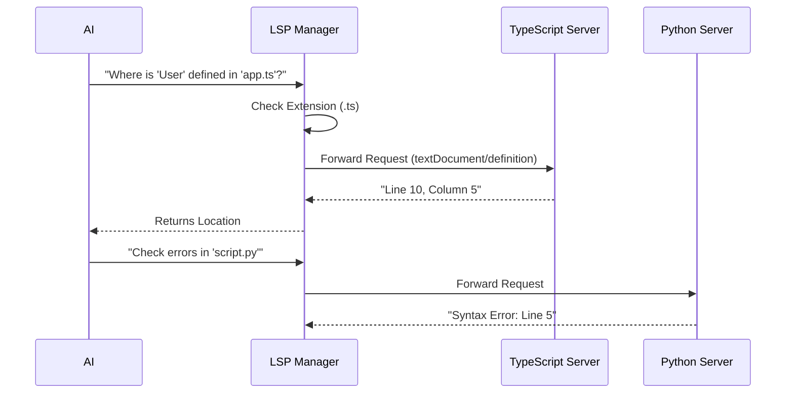

# Chapter 6: Language Server Integration (LSP)

Welcome to the sixth chapter of the **Services** project tutorial!

In the previous chapter, [Model Context Protocol (MCP)](05_model_context_protocol__mcp_.md), we gave our AI the ability to plug into external tools like databases and Slack.

However, our AI is primarily a **Coder**. While reading text files is helpful, true coding intelligence requires more. It requires knowing where a function is defined, seeing syntax errors before running the code, and knowing available methods on a class.

We don't want to re-invent this logic. Instead, we connect our AI to the exact same "brains" that power editors like VS Code.

## 1. The Big Picture: The "Smart Glasses" Analogy

Imagine reading a book in a foreign language. You can read the letters, but you don't understand the grammar or the deep meaning.
Now, imagine putting on **Smart Glasses** that instantly highlight grammar mistakes, translate words, and draw lines connecting pronouns to the people they refer to.

**Language Server Integration (LSP)** gives our AI these smart glasses.

Without LSP, the AI just sees text:
`function add(a, b) { return a + b }`

With LSP, the AI sees structure:
*   "This is a function named `add`."
*   "It accepts two parameters."
*   "It returns a number."
*   "It is referenced in 5 other files."

### Central Use Case
**Goal:** The AI is editing a TypeScript file. It wants to call a function `calculateTax()`, but it doesn't know what arguments that function needs.
**Action:** The AI asks the LSP system: *"Show me the signature for `calculateTax`."*
**Result:** The LSP responds: *"It takes `amount: number` and `rate: number`."* The AI then writes the correct code without guessing.

## 2. Key Concepts

### A. The Language Server (The Expert)
A Language Server is a background process dedicated to a specific language.
*   `tsserver` for TypeScript/JavaScript.
*   `gopls` for Go.
*   `pyright` for Python.

It doesn't care about the UI (colors, buttons); it only cares about the code logic.

### B. The Protocol (JSON-RPC)
LSP stands for **Language Server Protocol**. It's the universal language these servers speak.
Instead of sending raw text, we send JSON messages like:
`{ "method": "textDocument/definition", "params": { ... } }`

### C. The Manager (The Router)
Since a project might have Python, TypeScript, and HTML files mixed together, we need a **Manager**. This manager looks at the file extension (e.g., `.ts`) and routes the question to the correct server.

---

## 3. How It Works (The Implementation)

To the rest of our app, the LSP system looks like a simple query engine. You give it a file path and a question, and it gives you an answer.

### The Workflow



---

## 4. Under the Hood: The Code

Let's explore how we build this integration using `LSPServerManager.ts` and `LSPClient.ts`.

### Part 1: The Client (`LSPClient.ts`)
We need a way to launch the server process (like `node tsserver.js`) and talk to it. This is the **LSP Client**.

#### Starting the Process
We use Node.js `spawn` to start the server. We communicate via "Standard Input/Output" (stdin/stdout)—like passing notes through a slot in a door.

```typescript
// services/lsp/LSPClient.ts (Simplified)
export function createLSPClient(serverName) {
  return {
    async start(command, args) {
      // 1. Launch the server process (e.g., "node tsserver")
      process = spawn(command, args, { stdio: ['pipe', 'pipe', 'pipe'] })
      
      // 2. Connect readers/writers to the process
      const reader = new StreamMessageReader(process.stdout)
      const writer = new StreamMessageWriter(process.stdin)
      
      // 3. Create the JSON-RPC connection object
      connection = createMessageConnection(reader, writer)
      connection.listen() // Start listening for messages
    }
  }
}
```
*Explanation: This function turns a simple command line program into a structured server we can talk to.*

#### Sending a Request
Once connected, we can send requests.

```typescript
// services/lsp/LSPClient.ts (Simplified)
async sendRequest(method, params) {
  if (!isInitialized) throw new Error('Server not ready')

  // Send JSON-RPC message and await the response
  return await connection.sendRequest(method, params)
}
```
*Explanation: We wrap the complex JSON formatting. We just say `sendRequest('definition')` and the library handles the ID tracking and response matching.*

### Part 2: The Manager (`LSPServerManager.ts`)
The Manager is the boss. It manages multiple Clients.

#### Initialization & Routing
When the app starts, the manager reads a config to see which servers to launch.

```typescript
// services/lsp/LSPServerManager.ts (Simplified)
async function initialize() {
  const config = await getAllLspServers()
  
  // Create a client for every server in config
  for (const [name, cfg] of Object.entries(config)) {
    const instance = createLSPServerInstance(name, cfg)
    servers.set(name, instance)
    
    // Map file extensions (e.g., .ts -> tsserver)
    mapExtensionsToServer(cfg.extensionToLanguage, name)
  }
}
```
*Explanation: This builds a lookup map. If we see a `.ts` file later, we know to look up the server named `typescript`.*

#### keeping the Server in Sync
LSP servers don't read files from your hard drive constantly. They keep a virtual version in memory. We must tell them when we open or change a file.

```typescript
// services/lsp/LSPServerManager.ts
async function openFile(filePath, content) {
  // 1. Find the right server
  const server = await ensureServerStarted(filePath)
  
  // 2. Send the "didOpen" notification
  await server.sendNotification('textDocument/didOpen', {
    textDocument: {
      uri: filePathToUri(filePath),
      text: content, // We send the full file content
      version: 1
    }
  })
}
```
*Explanation: Before asking "Where is the definition?", we MUST call `openFile`. Otherwise, the server will say "I don't know what file you are talking about."*

#### Ensuring the Server is Running
We don't want to run heavy servers if we aren't using them. We start them lazily (on demand).

```typescript
// services/lsp/LSPServerManager.ts (Simplified)
async function ensureServerStarted(filePath) {
  const server = getServerForFile(filePath)
  if (!server) return undefined

  // Only start if it's currently stopped
  if (server.state === 'stopped') {
    await server.start()
  }

  return server
}
```
*Explanation: This is efficient. If you never open a Python file, the Python server never starts, saving memory.*

### Part 3: Using the System
The AI uses the manager to perform advanced analysis.

```typescript
// usage example (Simplified)
const manager = createLSPServerManager()

// 1. Open the file so the server knows about it
await manager.openFile('/src/app.ts', fileContent)

// 2. Ask for a definition location
const result = await manager.sendRequest(
  '/src/app.ts', 
  'textDocument/definition', 
  { position: { line: 10, character: 5 } }
)

console.log(`Definition found at: ${result.uri}`)
```

## 5. Summary

We have upgraded our AI from a "text reader" to a "code analyzer."
1.  **LSP Client:** Connects to standard tools like `tsserver`.
2.  **LSP Manager:** Routes requests based on file extensions.
3.  **Synchronization:** Keeps the server's view of the code in sync with the AI's view.

With this system, the AI can perform refactoring, find bugs, and navigate complex codebases with the same precision as a human using a professional IDE.

Now that we have a fully functional AI system—capable of connecting, remembering, using tools, and analyzing code—we need to know what it is doing. How do we track errors? How do we know if it's being successful?

[Next Chapter: Telemetry & Observability](07_telemetry___observability.md)

---

Generated by [Code IQ](https://github.com/adityasoni99/Code-IQ)