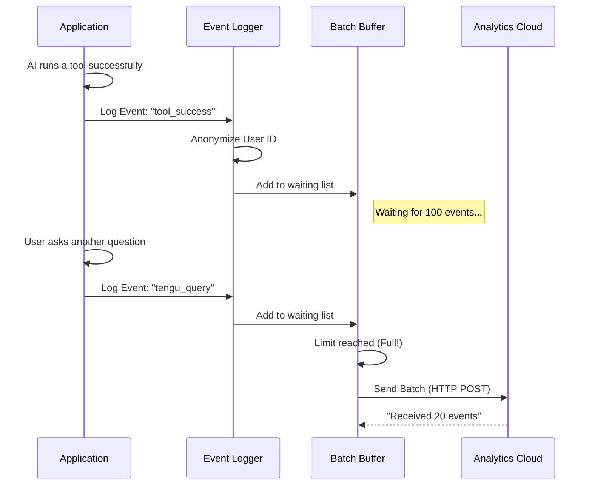

# Chapter 7: Telemetry & Observability

Welcome to the seventh chapter of the **Services** project tutorial!

In the previous chapter, [Language Server Integration (LSP)](06_language_server_integration__lsp_.md), we gave our AI "Smart Glasses" to understand code structure.

At this point, we have a very complex machine. It connects to clouds, manages memory, compresses context, runs tools, talks to external servers, and analyzes code.
But here is the scary part: **What happens when it breaks?**

If a user says, *"The AI froze when I tried to edit my database,"* how do we know what happened? We can't look over their shoulder.

We need a **Flight Recorder**.

## 1. The Big Picture: The "Black Box" Analogy

In aviation, every plane carries a "Black Box" (Flight Recorder). It records every switch flip, altitude change, and engine grumble. If something goes wrong, investigators analyze this data to understand the root cause.

In software, this is called **Telemetry & Observability**.
1.  **Telemetry:** The raw data (Logs, Metrics, Events).
2.  **Observability:** The ability to look at that data and answer the question: *"Why is the system behaving this way?"*

This layer runs silently in the background, watching every action the AI takes, packaging that information, and sending it to our analytics servers.

### Central Use Case
**Goal:** A user reports that the "Auto-Fix" feature failed.
**Without Telemetry:** We have to guess. "Maybe it was a network error? Maybe the file was locked?"
**With Telemetry:** We look at the dashboard. We see an event `tool_error` with the message `EACCES: permission denied`. We instantly know the AI tried to edit a file it didn't have permission to touch.

## 2. Key Concepts

### A. The Event (The Atom)
We don't just dump text into a file. We log structured **Events**.
An event isn't just "Error happened." It is a JSON object:
```json
{
  "eventName": "tool_use_error",
  "toolName": "edit_file",
  "errorType": "permission_denied",
  "duration": 450
}
```
This allows us to make charts (e.g., "Graph of Permission Errors over time").

### B. The Bus (Batching)
Imagine if every time a passenger arrived at a bus stop, a bus drove them individually to the destination. Traffic would be a nightmare!
Instead, the bus waits until it is full (or until a schedule triggers), then takes everyone at once.

Our system works the same way. We don't send an HTTP request for every single log. We **batch** them into groups (e.g., 100 logs) and send them in one request to save network bandwidth.

### C. Privacy (The Mask)
We respect user privacy. We want to know *that* a crash happened, but we don't necessarily want to know *who* you are or read your private code.
*   **Hashing:** We often convert your User ID into a scramble (hash) like `a1b2...`. We can count how many unique users had an error, but we can't map it back to your email easily.
*   **Sanitization:** We avoid logging file contents or specific code snippets unless you are an internal developer (an "Ant").

---

## 3. How It Works (The Workflow)

The telemetry system sits at the end of every major action in the app.



---

## 4. Under the Hood: The Code

Let's look at how we implement this "Flight Recorder" using TypeScript. We use two main systems: **Datadog** (for general metrics) and a **1st Party Logger** (for our own internal analytics).

### Step 1: tracking an Event (`analytics/datadog.ts`)
This is the entry point. When something happens, the code calls this function.

```typescript
// services/analytics/datadog.ts (Simplified)
export async function trackDatadogEvent(eventName, properties) {
  // 1. Check if we are allowed to log this (Privacy/Opt-out)
  if (!DATADOG_ALLOWED_EVENTS.has(eventName)) return

  // 2. Prepare the data packet
  const log = {
    message: eventName,
    service: 'claude-code',
    ...properties, // e.g. { duration: 500 }
    userBucket: getUserBucket() // Anonymized ID
  }

  // 3. Put it on the "Bus" (The Batch Array)
  logBatch.push(log)

  // 4. If the bus is full, drive!
  if (logBatch.length >= MAX_BATCH_SIZE) {
    await flushLogs()
  } else {
    scheduleFlush() // Drive in 15 seconds regardless
  }
}
```
*Explanation: We validate the event, package it with metadata, and push it into a local array (`logBatch`). We only send data over the internet if the batch is full or if a timer runs out.*

### Step 2: Hashing for Privacy (`analytics/datadog.ts`)
We want to know how many users are affected by a bug without tracking individuals. We use "Buckets."

```typescript
// services/analytics/datadog.ts
const getUserBucket = memoize((): number => {
  // 1. Get the real User ID
  const userId = getOrCreateUserID()
  
  // 2. Scramble it using SHA-256 encryption
  const hash = createHash('sha256').update(userId).digest('hex')
  
  // 3. Assign to a bucket (e.g., Bucket 5 out of 30)
  return parseInt(hash.slice(0, 8), 16) % NUM_USER_BUCKETS
})
```
*Explanation: Instead of logging "User John Doe," we log "User from Bucket 5." This helps us estimate impact (is it 1 user failing 100 times, or 100 users failing once?) while maintaining privacy.*

### Step 3: Sending the Data (`analytics/datadog.ts`)
When the "Bus" leaves the station, this function runs.

```typescript
// services/analytics/datadog.ts (Simplified)
async function flushLogs() {
  if (logBatch.length === 0) return

  // 1. Take all logs currently in the waiting room
  const logsToSend = logBatch
  logBatch = [] // Clear the waiting room

  // 2. Send them to Datadog via HTTP
  await axios.post(DATADOG_LOGS_ENDPOINT, logsToSend, {
    headers: { 'DD-API-KEY': API_KEY }
  })
}
```
*Explanation: This is the actual network call. By sending `logsToSend` (an array) in one go, we make one HTTP request instead of 100, which is much faster and uses less CPU.*

### Step 4: Internal Diagnostics (`internalLogging.ts`)
For the developers building this tool ("Ants"), we log deeper details to help us debug the tool itself.

```typescript
// services/internalLogging.ts
export async function logPermissionContextForAnts(context) {
  // 1. Security Check: ONLY run this for internal employees
  if (process.env.USER_TYPE !== 'ant') {
    return
  }

  // 2. Gather environment info (Container ID, Kubernetes Namespace)
  const namespace = await getKubernetesNamespace()
  
  // 3. Log the event
  void logEvent('tengu_internal_debug', { namespace, context })
}
```
*Explanation: Normal users are `USER_TYPE = 'user'`. Developers are `USER_TYPE = 'ant'`. The system checks this flag. If you are a developer, it logs extra info (like which Kubernetes cluster you are in) to help fix bugs in the platform.*

## 5. Summary

We have built the nervous system of our application.
1.  **Events:** We capture what happens as structured data.
2.  **Batching:** We group data to save network performance.
3.  **Privacy:** We use hashing to understand trends without spying on individuals.
4.  **Diagnostics:** We have special modes for developers to trace complex bugs.

### Conclusion of the Tutorial

Congratulations! You have completed the **Services** project tutorial.

You have walked through the entire architecture of a modern AI Agent:
1.  **Connecting** to the AI Brain (Chapter 1).
2.  **Remembering** context via the Silent Secretary (Chapter 2).
3.  **Compacting** history to fit in the backpack (Chapter 3).
4.  **Executing** actions via the Tool Pipeline (Chapter 4).
5.  **Expanding** capabilities with MCP (Chapter 5).
6.  **Analyzing** code with LSP (Chapter 6).
7.  **Observing** the system with Telemetry (Chapter 7).

You now understand the "Skeleton" that supports the AI "Brain." Without these services, the AI is just a text generator. With them, it is a powerful, autonomous engineer.

---

Generated by [Code IQ](https://github.com/adityasoni99/Code-IQ)