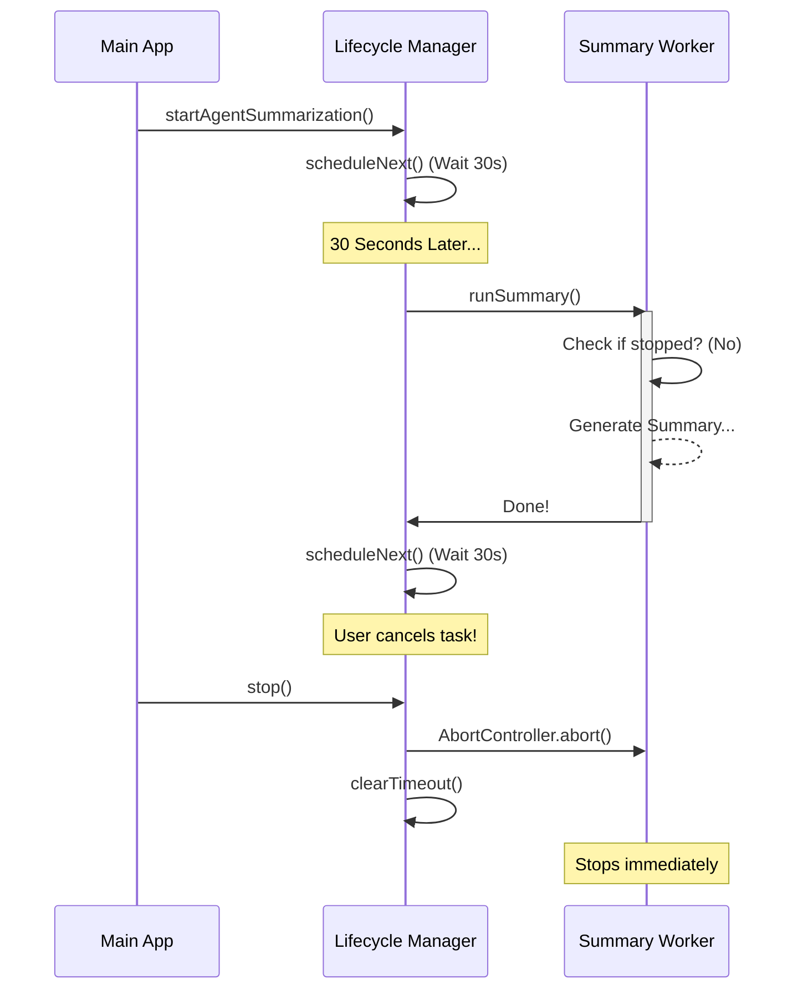

# Chapter 1: Background Lifecycle Management

Welcome to the **AgentSummary** project! In this first chapter, we are going to build the engine that keeps our system running. Before we worry about *how* to summarize text or handle AI models, we need a reliable way to schedule that work.

## The Motivation: The Security Guard Analogy

Imagine you are managing a building security guard. You want them to check the perimeter every 30 minutes.

Here is the challenge:
1.  **Overlapping Shifts:** If checking the perimeter takes 40 minutes, but you ask them to start every 30 minutes, eventually you'll have two guards checking the same door at the same time. That's messy.
2.  **Emergency Stop:** If the building is closing down for the night, you need to radio the guard and say, "Stop immediately, even if you are in the middle of a check."

In code, our "Guard" is a function that summarizes what the AI is doing.
*   **The Heartbeat:** We need a timer that runs periodically.
*   **The Lifecycle:** We need to handle starting, repeating, and stopping cleanly.

## Key Concepts

### 1. The Recursive Timer (`setTimeout`)
Instead of using `setInterval` (which fires every 30 seconds no matter what), we use a recursive `setTimeout`. This ensures we wait for the current job to finish before starting the timer for the next one. This prevents the "Overlapping Shifts" problem.

### 2. The Abort Signal (`AbortController`)
This is the standard web way to cancel asynchronous tasks. Think of it as a "Cancel Button" that is connected to a specific operation. When we press it, any network request or calculation listening to it will stop immediately.

---

## How to Build the Lifecycle

Let's look at how we structure this logic. We will create a function that starts the process and returns a way to stop it.

### Step 1: Setting the State
First, we need variables to track if we are running and to hold our "Cancel Button."

```typescript
// Inside startAgentSummarization...
let stopped = false
let timeoutId: ReturnType<typeof setTimeout> | null = null

// The controller lets us cancel a specific run
let summaryAbortController: AbortController | null = null
```

### Step 2: The Worker Loop
Next, we define the function that does the actual work. Notice the `if (stopped) return` check. This is the first thing the guard checks before starting a round.

```typescript
async function runSummary(): Promise<void> {
  // 1. Safety check: Is the system off?
  if (stopped) return

  // 2. Create a new "Cancel Button" for this specific round
  summaryAbortController = new AbortController()
  
  try {
    // ... logic to generate summary goes here ...
    console.log("Generating summary...") 
  } finally {
    // 3. Cleanup: clear the controller
    summaryAbortController = null
    
    // 4. Schedule the NEXT round only after this one finishes
    if (!stopped) scheduleNext() 
  }
}
```

### Step 3: Scheduling the Next Round
We wrap the standard `setTimeout` in a helper function. This is our "alarm clock."

```typescript
const SUMMARY_INTERVAL_MS = 30_000 // 30 seconds

function scheduleNext(): void {
  if (stopped) return
  
  // Call runSummary again after the delay
  timeoutId = setTimeout(runSummary, SUMMARY_INTERVAL_MS)
}
```

### Step 4: The Kill Switch
Finally, we need a way to stop everything. This function does three things:
1.  Sets the flag to `true` (stops future runs).
2.  Cancels the alarm clock (`clearTimeout`).
3.  Cancels any work currently in progress (`abort`).

```typescript
function stop(): void {
  stopped = true
  
  // Kill the waiting timer
  if (timeoutId) {
    clearTimeout(timeoutId)
    timeoutId = null
  }
  
  // Kill the active worker immediately
  if (summaryAbortController) {
    summaryAbortController.abort()
    summaryAbortController = null
  }
}
```

---

## Under the Hood: The Flow of Control

When `startAgentSummarization` is called, it kicks off a cycle that continues until `stop()` is called.

Here is the sequence of events:



### Internal Implementation Details

Now let's look at the actual implementation in `agentSummary.ts`.

The function `startAgentSummarization` returns an object with a `stop` function. This allows the parent task (the one managing the AI) to control this background process.

#### The "Drop" Context Trick
In the real code, you might see this line at the start:

```typescript
// agentSummary.ts
const { forkContextMessages: _drop, ...baseParams } = cacheSafeParams
```

**Why do we do this?**
When we start the lifecycle, we are passed a snapshot of messages (`cacheSafeParams`). However, the summary needs to run every 30 seconds. If we kept using the messages passed at the *start*, our summary would never change!

We drop the old messages here because `runSummary` will fetch the **fresh** transcript every time it wakes up. We will cover how we get those messages in [Transcript Sanitization](03_transcript_sanitization.md).

#### Error Handling
The lifecycle must be robust. If the summary generation crashes, we don't want to crash the whole application.

```typescript
// agentSummary.ts (inside runSummary)
} catch (e) {
  // If an error happens, log it but keep going!
  if (!stopped && e instanceof Error) {
    logError(e)
  }
} finally {
  // ALWAYS schedule the next run, even if this one failed
  if (!stopped) {
    scheduleNext()
  }
}
```

This `finally` block is the most important part of the lifecycle. It ensures that even if the network fails or the AI bugs out, the "guard" will still try again in 30 seconds.

## Conclusion

You have now implemented the **Background Lifecycle Management**. You have a system that:
1.  Wakes up every 30 seconds.
2.  Ensures runs don't overlap.
3.  Can be stopped instantly and cleanly.

But right now, our worker function is empty! It wakes up, looks around, and goes back to sleep. To make it useful, we need to create a "sub-agent" that can look at the data without disturbing the main AI.

In the next chapter, we will learn how to spawn this invisible worker.

[Next Chapter: Forked Agent Execution](02_forked_agent_execution.md)

---

Generated by [Code IQ](https://github.com/adityasoni99/Code-IQ)