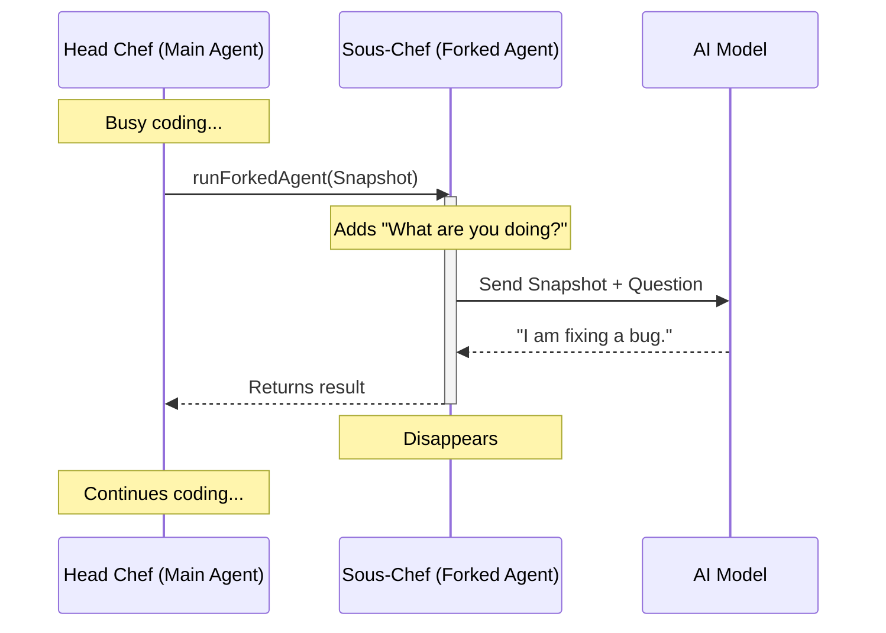

# Chapter 2: Forked Agent Execution

Welcome back! In [Background Lifecycle Management](01_background_lifecycle_management.md), we built a "security guard" (a timer) that wakes up every 30 seconds. But right now, that guard just wakes up and stares at the wall.

In this chapter, we will give the guard a job. We will learn how to perform **Forked Agent Execution**.

## The Motivation: The Chef and the Sous-Chef

Imagine a Head Chef (the Main Agent) cooking a very complex 5-course meal. They are deeply focused on chopping onions and reducing wine.

You want to know how the food tastes. You have two options:

1.  **The Bad Way (Interrupting):** You grab the Head Chef's arm and say, "Stop! Taste this and write a report." The Chef stops, loses their focus, writes the report, and then has to remember where they left off.
2.  **The Good Way (Forking):** You send in a Sous-Chef (the Forked Agent). The Sous-Chef looks at the *same* pot of ingredients, tastes a spoonful, writes the note, and quietly leaves. The Head Chef never even noticed.

In AI terms:
*   **The Ingredients** are the chat history (Context).
*   **The Head Chef** is the main task (coding, writing, analysis).
*   **The Sous-Chef** is our summarizer.

If we interrupt the main agent, we "pollute" its memory with questions like "What are you doing?". By **forking**, we create a parallel reality, ask a question, and then delete that reality.

## How It Works

We use a function called `runForkedAgent`. This function takes a snapshot of the current conversation and spins up a temporary process to generate a response.

### Step 1: Preparing the Question
First, we need to decide what we want to ask the Sous-Chef. We create a message just like a normal user would.

```typescript
import { createUserMessage } from '../../utils/messages.js'

// We ask the AI to describe its work in present tense
const promptText = `Describe your most recent action in 3-5 words...`

// Wrap it in a message object
const userMessage = createUserMessage({ content: promptText })
```

### Step 2: The Fork Execution
Now we call the magic function. We pass it the message and the current "ingredients" (parameters).

```typescript
import { runForkedAgent } from '../../utils/forkedAgent.js'

// This creates the parallel process
const result = await runForkedAgent({
  promptMessages: [userMessage], // The question
  cacheSafeParams: forkParams,   // The memory snapshot
  querySource: 'agent_summary',  // Label for logging
})
```

**What just happened?**
1.  The system paused just long enough to copy the state.
2.  It sent the history + your question to the AI.
3.  The AI responded.
4.  The system returned the result and *discarded* the parallel conversation.

## Under the Hood: The Flow of Control

Let's visualize how the Main Agent and the Forked Agent interact.



Notice that the "Head Chef" (Main Agent) never sees the message "What are you doing?". It only sees the final report (if we choose to show it).

## Implementing the Logic

Let's look at how this fits into the `runSummary` function we created in the previous chapter.

### 1. Handling the Snapshot
We need to get the current state of the agent. We will go into detail on how to get `cleanMessages` in [Transcript Sanitization](03_transcript_sanitization.md), but for now, assume we have the message history.

```typescript
// agentSummary.ts

// 1. Prepare the parameters (The Ingredients)
const forkParams: CacheSafeParams = {
  ...baseParams,
  forkContextMessages: cleanMessages, // The conversation history
}
```

### 2. Preventing Tool Use
Our Sous-Chef is here to *observe*, not to *cook*. We don't want the summarizer to accidentally delete a file or run a test. We will learn more about this in [Tool Governance (Denial)](04_tool_governance__denial_.md).

```typescript
// agentSummary.ts

// 2. Define strict rules: NO TOOLS ALLOWED.
const canUseTool = async () => ({
  behavior: 'deny' as const,
  message: 'No tools needed for summary',
  decisionReason: { type: 'other', reason: 'summary only' },
})
```

### 3. Running the Fork
Now we put it all together inside our worker loop.

```typescript
// agentSummary.ts

// 3. Execute the fork
const result = await runForkedAgent({
  promptMessages: [
    createUserMessage({ content: buildSummaryPrompt(previousSummary) }),
  ],
  cacheSafeParams: forkParams,
  canUseTool, // Apply our safety rules
  overrides: { abortController: summaryAbortController },
})
```

### 4. Reading the Result
The `result` object contains a list of messages. We need to find the AI's response.

```typescript
// agentSummary.ts

// 4. Extract the text
for (const msg of result.messages) {
  if (msg.type === 'assistant') {
    const textBlock = msg.message.content.find(b => b.type === 'text')
    
    if (textBlock) {
      const summaryText = textBlock.text.trim()
      console.log("Summary:", summaryText)
      // Save the summary to the UI...
    }
  }
}
```

## A Note on Performance

You might be wondering: "Isn't it expensive to copy the whole conversation every 30 seconds?"

Ideally, yes. However, modern LLM providers use **Prompt Caching**. Because the "Ingredients" (the history) are exactly the same for the Head Chef and the Sous-Chef, the API doesn't charge us full price to process them again.

To make this work, we have to be very careful *not* to change settings like `maxOutputTokens` between the two agents. We will cover this optimization strategy in [Prompt Cache Optimization](05_prompt_cache_optimization.md).

## Conclusion

You now understand **Forked Agent Execution**.
1.  We take a snapshot of the Main Agent's context.
2.  We spawn a temporary "Sous-Chef" (Forked Agent).
3.  We ask it to summarize the situation.
4.  We enforce rules so it doesn't touch the actual project files.

However, simply passing the *entire* raw conversation history to the Sous-Chef can be messy. The raw history might contain huge file dumps or failed tool calls. We need to clean up the ingredients before the Sous-Chef tastes them.

In the next chapter, we will learn how to prepare our data.

[Next Chapter: Transcript Sanitization](03_transcript_sanitization.md)

---

Generated by [Code IQ](https://github.com/adityasoni99/Code-IQ)