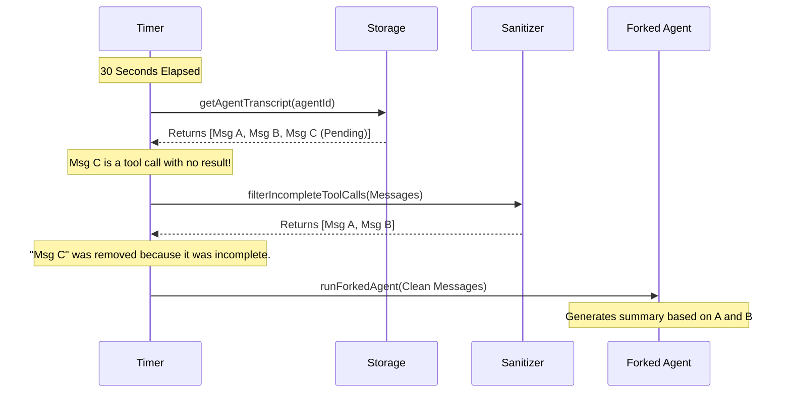

# Chapter 3: Transcript Sanitization

Welcome back! In [Forked Agent Execution](02_forked_agent_execution.md), we learned how to spawn a "Sous-Chef" (a sub-agent) to observe our main AI and write a summary.

However, we have a small problem. We can't just throw the entire raw conversation history at the Sous-Chef. The Main Agent might be in the middle of a messy operation.

In this chapter, we will learn about **Transcript Sanitization**.

## The Motivation: The Blurry Photograph

Imagine you want to take a photograph of your friend jumping into a pool to post on Instagram (the Summary).

1.  **The Perfect Shot:** You snap the photo when they are posing nicely by the edge.
2.  **The Messy Shot:** You snap the photo exactly when they are mid-air, flailing their arms, and making a weird face.

If you show the "Messy Shot" to people, they won't say "Cool pool party." They will ask, "Is your friend okay?"

In our AI system:
*   **The Perfect Shot** is a completed conversation where the AI asked for a tool, and the tool finished running.
*   **The Messy Shot** is when the AI has requested a tool (like `readFile`), but the system hasn't finished reading the file yet.

If we send this "Messy Shot" to our summarizer, it gets confused. Instead of summarizing the work, it might say: *"I am waiting for a file to load"* or *"I see a half-finished command."*

**Transcript Sanitization** is the digital photo editor that removes the blurry parts before we show the image to the summarizer.

## Key Concepts

### 1. The Transcript
The **Transcript** is the log of every single message, thought, and tool call the Main Agent has made since it started the task. It grows constantly.

### 2. The Pending State
A "Pending State" happens when the AI says: *"I want to run `npm test`"*, but the computer hasn't responded with the test results yet. This looks like an open bracket `[` without a closing bracket `]`.

### 3. Sanitization
This is the process of retrieving the transcript and actively **filtering out** these incomplete interactions. We want to show the summarizer only the history that has *settled*.

---

## How to Implement Sanitization

We perform this cleaning process inside our `runSummary` loop (which we built in Chapter 1).

### Step 1: Fetching the Raw Data
First, we need to grab the latest logs from the storage. We use the `agentId` to find the correct session.

```typescript
import { getAgentTranscript } from '../../utils/sessionStorage.js'

// Inside runSummary...
const transcript = await getAgentTranscript(agentId)

// Safety check: Do we have enough data to summarize?
if (!transcript || transcript.messages.length < 3) {
  console.log("Not enough data yet...")
  return
}
```

### Step 2: The Cleaning Process
This is the core of this chapter. We pass the raw messages through a filter function.

```typescript
import { filterIncompleteToolCalls } from '../../tools/AgentTool/runAgent.js'

// Remove the "blurry" parts
const cleanMessages = filterIncompleteToolCalls(transcript.messages)

console.log(`Raw: ${transcript.messages.length}, Clean: ${cleanMessages.length}`)
```

### Step 3: Updating the Ingredients
In [Forked Agent Execution](02_forked_agent_execution.md), we talked about the "Ingredients" (parameters) for our Sous-Chef. Now we replace the old, stale ingredients with our fresh, clean ones.

```typescript
// Create a new parameter object for the fork
const forkParams: CacheSafeParams = {
  ...baseParams, // Keep the system prompts/settings
  forkContextMessages: cleanMessages, // INSERT CLEAN DATA HERE
}
```

Now, when we call `runForkedAgent`, it sees a perfectly tidy history.

---

## Under the Hood: The Flow of Data

Let's visualize exactly what happens when the timer ticks.



### Internal Implementation Details

Let's look at how the `filterIncompleteToolCalls` function conceptually works. You don't need to write this (it's part of the core), but it helps to understand it.

The function looks at the end of the conversation list.

1.  **Is the last message from the Assistant?**
2.  **Does it try to call a tool?**
3.  **Is the NEXT message a result from that tool?**

If the answer to #3 is "No" (because the tool is still running), then the Assistant's message is "dangling." The sanitizer cuts it off.

```typescript
// Conceptual logic of the filter
export function filterIncompleteToolCalls(messages: Message[]): Message[] {
  const lastMsg = messages[messages.length - 1]

  // If the last thing happening is a tool call...
  if (lastMsg.type === 'assistant' && hasToolCall(lastMsg)) {
    // ...and there is no result following it...
    // REMOVE IT.
    return messages.slice(0, -1)
  }

  return messages
}
```

### Why this matters for the AI
If we didn't do this, the Forked Agent would receive the tool call (e.g., `list_files`) but see no files listed.

It might hallucinate and say:
> *"I listed the files and found nothing."* (Incorrect!)

With sanitization, it sees the history *before* the tool call and says:
> *"I have decided to list the files."* (Correct!)

## Integrating with the Lifecycle

Let's verify where this fits in our `agentSummary.ts` file.

```typescript
// agentSummary.ts inside runSummary()

try {
  // 1. Get the raw history
  const transcript = await getAgentTranscript(agentId)
  
  // 2. Clean it up
  const cleanMessages = filterIncompleteToolCalls(transcript.messages)

  // 3. Prepare the fork
  const forkParams = { ...baseParams, forkContextMessages: cleanMessages }
  
  // 4. Run the fork (As seen in Chapter 2)
  await runForkedAgent({ cacheSafeParams: forkParams, ... })

} catch (e) {
  // Handle errors...
}
```

## Conclusion

You have now mastered **Transcript Sanitization**.

You learned that:
1.  Real-time AI history is often "messy" or incomplete.
2.  Showing messy history to a summarizer causes hallucinations or confusion.
3.  We simply slice off the incomplete end of the conversation before processing.

Now our Sous-Chef has a clean kitchen and fresh ingredients. But wait! Even though the *history* is clean, the Sous-Chef itself still has access to knives and fire (Tools). We need to make sure the summarizer doesn't accidentally delete your project while trying to summarize it.

In the next chapter, we will learn how to lock down the kitchen.

[Next Chapter: Tool Governance (Denial)](04_tool_governance__denial_.md)

---

Generated by [Code IQ](https://github.com/adityasoni99/Code-IQ)