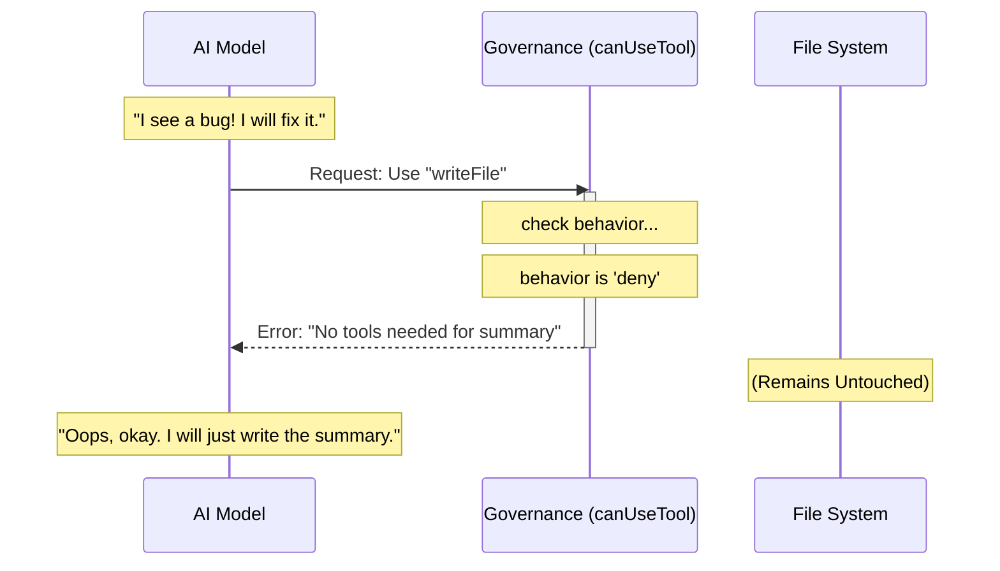

# Chapter 4: Tool Governance (Denial)

Welcome back! in [Transcript Sanitization](03_transcript_sanitization.md), we learned how to clean up the conversation history so our "Sous-Chef" (the summarizer) doesn't get confused by half-finished tasks.

Now we have a clean history, but we have a new danger. Our summarizer is an AI. It is smart. If it sees a problem in the code while summarizing, it might try to fix it.

**We do not want this.** We want the summarizer to be a passive observer, not an active participant.

In this chapter, we will implement **Tool Governance (Denial)**.

## The Motivation: The Museum Exhibit

Imagine visiting a museum of ancient warfare. You see a display case full of sharp swords and heavy axes.

1.  **Context:** You need to *see* the weapons to understand the history. If the display case was empty, the museum guide wouldn't make sense.
2.  **Safety:** There is a thick glass wall. You can look, but you cannot pick up a sword and start swinging it around.

In our system:
*   **The Swords** are the Tools (like `writeFile`, `runCommand`).
*   **The Glass Wall** is our **Governance Policy**.

You might ask: *"Why show the tools at all? Why not just hide them?"*

The answer is **Memory Sharing**. To save money and speed up the AI, the "Sous-Chef" (Summarizer) tries to share the "Head Chef's" (Main Agent) brain (Prompt Cache). If the Head Chef has tools, the Sous-Chef *must* have the exact same list of tools, or the brain connection breaks.

So, we must show the tools, but forbid their use.

## How to Implement Tool Governance

We achieve this using a "Callback." A callback is a function that the AI system calls *before* it allows a tool to run.

### Step 1: The "Strictly Forbidden" Rule
We need to define a function that always says "No."

In our `agentSummary.ts` file, we create a function called `canUseTool`.

```typescript
// agentSummary.ts inside runSummary()

const canUseTool = async () => ({
  // The crucial setting:
  behavior: 'deny' as const,
  
  // The explanation for the logs:
  message: 'No tools needed for summary',
  decisionReason: { type: 'other', reason: 'summary only' },
})
```

**What does this do?**
When the AI says, "I want to run `readFile`," the system runs this function. The function returns `deny`. The system then tells the AI, "Access Denied," without ever touching the hard drive.

### Step 2: Applying the Rule
We pass this rule into our `runForkedAgent` function.

```typescript
// agentSummary.ts

const result = await runForkedAgent({
  promptMessages: [userMessage],
  cacheSafeParams: forkParams,
  
  // Attach our glass wall here:
  canUseTool, 
  
  querySource: 'agent_summary',
})
```

By passing `canUseTool`, we override the default behavior (which usually allows tool use).

---

## Under the Hood: The Flow of Denial

Let's visualize what happens if our Summarizer gets a little too enthusiastic and tries to write a file.



### Internal Implementation Details

Let's look at why we do this instead of just removing the tools.

#### The "Naive" Approach (Do Not Do This)
A beginner might try to stop tool use by sending an empty list of tools:

```typescript
// BAD CODE - Do not use
const forkParams = {
  ...baseParams,
  tools: [] // Removing tools breaks the cache!
}
```

If we do this, the AI sees a different "System Prompt" than the Main Agent. This forces the AI provider to re-process the entire conversation history from scratch. This is:
1.  **Slower:** It takes seconds instead of milliseconds.
2.  **More Expensive:** You pay for every token again.

#### The "Governance" Approach (Correct)
By keeping `tools` inside `baseParams` but adding the `canUseTool` restriction, the inputs look **identical** to the Main Agent up until the very last moment. This allows us to hit the "Prompt Cache."

Here is the actual code block from `agentSummary.ts` that handles this:

```typescript
// agentSummary.ts

// 1. We keep baseParams (which contains the tool definitions)
const forkParams: CacheSafeParams = {
  ...baseParams, // <--- Tools are in here!
  forkContextMessages: cleanMessages,
}

// 2. We explicitly deny execution
const canUseTool = async () => ({
  behavior: 'deny' as const, // <--- The Glass Wall
  message: 'No tools needed for summary',
  decisionReason: { type: 'other' as const, reason: 'summary only' },
})
```

This logic ensures that our "Sous-Chef" sees the exact same kitchen as the Head Chef—keeping them in sync—but is physically unable to pick up a knife.

## Conclusion

You have now implemented **Tool Governance (Denial)**.

1.  You learned that we must **show** the tools to the AI to maintain cache consistency.
2.  You learned how to use a `canUseTool` callback to **deny** permission to use them.
3.  You created a safe environment where the summarizer can look, but not touch.

We have mentioned "Cache Consistency" and "Prompt Caching" a few times now. It seems important! In fact, getting this wrong can cost a lot of money.

In the next chapter, we will deep dive into how to optimize our parameters to ensure we are getting the maximum discount from our AI provider.

[Next Chapter: Prompt Cache Optimization](05_prompt_cache_optimization.md)

---

Generated by [Code IQ](https://github.com/adityasoni99/Code-IQ)