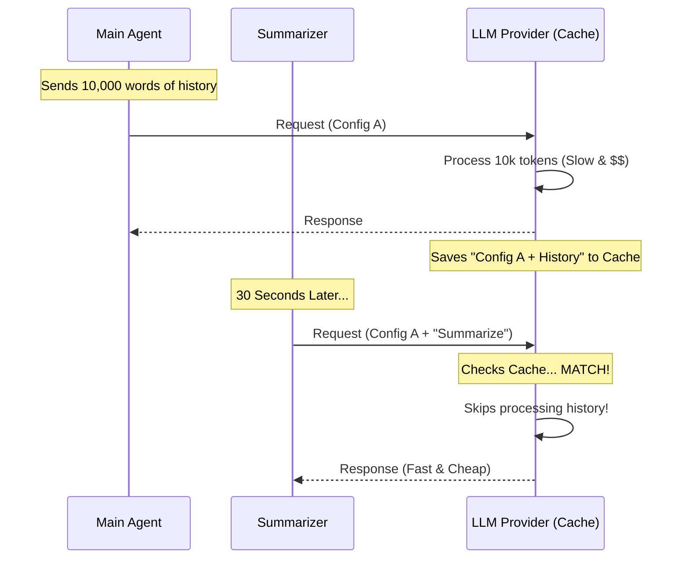

# Chapter 5: Prompt Cache Optimization

Welcome back! In [Tool Governance (Denial)](04_tool_governance__denial_.md), we learned a somewhat counter-intuitive rule: we must **show** the tools to our summarizer, even if we forbid the summarizer from using them.

You might have asked, "Why not just delete the tools from the list? Wouldn't that be cleaner?"

The answer lies in performance and cost. In this chapter, we will learn about **Prompt Cache Optimization**.

## The Motivation: The Library Card

Imagine a very strict librarian (the LLM Provider) who manages a restricted section of books. Every time someone wants to enter, the librarian spends 10 minutes filling out paperwork to verify their identity and the list of books they are allowed to see.

1.  **The Main Agent** enters. The librarian spends 10 minutes processing their paperwork.
2.  **The Summarizer** enters 30 seconds later.
    *   **Scenario A (Bad):** The Summarizer says, "I don't need the book list." The librarian says, "That's a change in paperwork! I need to start over." (Another 10 minutes wasted).
    *   **Scenario B (Optimization):** The Summarizer presents an ID card that looks **identical** to the Main Agent's. The librarian says, "Oh, I just processed this ID. Go right in." (0 minutes wasted).

In AI terms, "filling out paperwork" is **Token Processing**. It takes time and costs money. By ensuring our "Forked Agent" looks exactly like the "Main Agent," we skip the processing and save massive amounts of resources.

## Key Concepts

### 1. The Cache Key
When you send a request to an AI model, the provider creates a "fingerprint" (Cache Key) based on:
*   The Model Name (e.g., Claude 3.5 Sonnet).
*   The System Prompt.
*   **The Tool Definitions.**
*   **The Configuration Settings** (like `maxOutputTokens`).
*   The Conversation History.

### 2. Cache Hit vs. Miss
*   **Cache Hit:** If your request matches the previous fingerprint exactly, the AI reuses the work it already did. This is fast and cheap.
*   **Cache Miss:** If you change even *one* setting (like removing a tool), the fingerprint changes. The AI must re-read the entire history. This is slow and expensive.

## How to Optimize

The secret to optimization is actually doing **nothing**. We must resist the urge to customize the settings for the summarizer.

In `agentSummary.ts`, we explicitly avoid changing specific parameters.

### 1. Reusing `baseParams`
We use the `baseParams` object passed from the parent task. This contains the Model, System Prompt, and Tools.

```typescript
// agentSummary.ts

// We use the EXACT params from the main agent
const forkParams: CacheSafeParams = {
  ...baseParams, // Includes tools, model, system prompt
  forkContextMessages: cleanMessages,
}
```

By spreading `...baseParams`, we ensure the tool list is identical to the Main Agent's tool list.

### 2. The `maxOutputTokens` Trap
A common mistake is trying to limit the summary length by setting `maxOutputTokens: 100`. **Do not do this.**

In many modern models, the "Thinking Budget" (how much the AI thinks before speaking) is calculated as a percentage of `maxOutputTokens`.

1.  **Main Agent:** `maxOutputTokens: 8000` (Thinking Budget: ~4000)
2.  **Summarizer:** `maxOutputTokens: 100` (Thinking Budget: ~50)

Because the "Thinking Budget" is part of the request configuration, changing the output limit changes the configuration. **This breaks the cache.**

```typescript
// agentSummary.ts - What we actually do

const result = await runForkedAgent({
  promptMessages: [summaryPrompt],
  cacheSafeParams: forkParams,
  
  // DO NOT add this line:
  // maxOutputTokens: 100  <-- THIS WOULD BREAK THE CACHE
  
  querySource: 'agent_summary',
})
```

We let the summarizer inherit the large token limit of the main agent, even if we only expect 2 sentences back. The cost savings from the *Input Cache* are worth far more than the risk of a slightly longer output.

## Under the Hood: The Flow of Savings

Let's visualize how the Main Agent and the Summarizer share the same "Brain" (Cache).



### Internal Implementation Details

The implementation in `agentSummary.ts` is designed to be "hands-off." We rely on `runForkedAgent` to handle the heavy lifting, but we are very careful about what we pass into it.

Here is the specific block of code where we define the rules:

```typescript
// agentSummary.ts inside runSummary()

// 1. We prepare the fork. Note we do NOT override model or tokens.
const result = await runForkedAgent({
  promptMessages: [
    createUserMessage({ content: buildSummaryPrompt(previousSummary) }),
  ],
  cacheSafeParams: forkParams,
  canUseTool, // We deny tool use, but keep tool definitions!
  
  // 2. We skip the transcript because we manually provided 
  // 'forkContextMessages' in forkParams earlier.
  skipTranscript: true, 
})
```

**Why `skipTranscript: true`?**
Normally, `runForkedAgent` tries to fetch the transcript for you. In [Transcript Sanitization](03_transcript_sanitization.md), we manually fetched and cleaned the messages ourselves. We pass `skipTranscript: true` to tell the system: "Don't load the history again, I have already provided the clean version in `forkParams`."

This ensures the history matches exactly what we prepared, maintaining our cache integrity.

## Conclusion

You have now mastered **Prompt Cache Optimization**.

You learned that:
1.  **Uniformity is key:** The summarizer must look like the main agent (same tools, same settings).
2.  **Do not optimize inputs:** Removing unused tools breaks the cache.
3.  **Do not optimize outputs:** Lowering `maxOutputTokens` changes the thinking budget and breaks the cache.

By following these rules, our summarizer becomes a "Ghost" in the system—extremely lightweight and nearly free to run, piggybacking on the work the Main Agent has already done.

Now we have a generated summary text. But currently, it just sits inside a variable in our code. We need to send this information to the user interface so the human can see it.

In the next chapter, we will learn how to broadcast our results.

[Next Chapter: Task State Integration](06_task_state_integration.md)

---

Generated by [Code IQ](https://github.com/adityasoni99/Code-IQ)