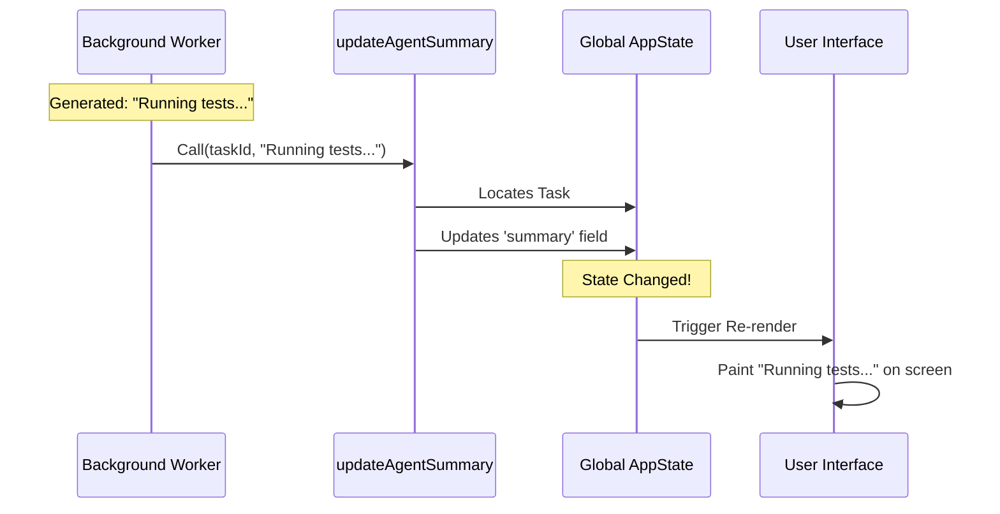

# Chapter 6: Task State Integration

Welcome to the final chapter! 

In [Prompt Cache Optimization](05_prompt_cache_optimization.md), we successfully generated a cheap, fast, and accurate summary of what our AI is doing. We have a piece of text like: *"Fixing null check in validate.ts"*.

But right now, that text is invisible. It lives inside a variable in our background worker. If a tree falls in a forest and no one is there to hear it, does it make a sound? If an AI generates a summary but the user doesn't see it, is it useful?

In this chapter, we will implement **Task State Integration**. This is the bridge that moves our text from the background worker onto the user's screen.

## The Motivation: The News Ticker

Imagine a busy newsroom. 
1.  **The Reporters (Summarizers)** are out in the field, writing down what is happening.
2.  **The Viewer (User)** is watching TV at home.

If the reporter just writes the news in their private notebook, the viewer never knows what is happening. We need a system to take that note, send it to the control room, and display it on the **News Ticker** scrolling at the bottom of the TV screen.

In our application:
*   **The Notebook** is the local variable `summaryText`.
*   **The TV Screen** is the User Interface (UI).
*   **The Control Room** is the **Global Application State**.

We need to push our text into the Global State so the UI updates automatically.

## Key Concepts

### 1. Global State (`AppState`)
Think of the Global State as a giant whiteboard in the middle of the office. 
*   The **UI** constantly watches this whiteboard. 
*   If anyone erases a word and writes a new one, the UI immediately updates the screen to match.

### 2. Immutability
When we write on this whiteboard, we have to be careful. We don't just scribble over the old text. In modern app development, we replace the whole section of the board with a pristine new version. This ensures the UI notices the change.

### 3. The Update Function
We don't let just anyone touch the whiteboard. We use a specific function (`updateAgentSummary`) that knows exactly *where* on the board to write the summary for this specific task.

---

## How to Implement Integration

We are working inside the `runSummary` function in `agentSummary.ts`. We have just received the result from the "Sous-Chef" (Forked Agent).

### Step 1: Extracting the Text
The AI returns a message object. We need to dig inside to find the actual text string.

```typescript
// Inside agentSummary.ts

// 1. Find the text block in the message
const textBlock = msg.message.content.find(b => b.type === 'text')

if (textBlock && textBlock.text.trim()) {
  // 2. Clean up the string
  const summaryText = textBlock.text.trim()
  
  console.log(`New Summary: ${summaryText}`)
}
```

### Step 2: Updating the State
Now that we have the string, we call our integration function. We need three things:
1.  **Task ID:** Which task is this summary for?
2.  **Text:** What is the new summary?
3.  **Setter:** The tool to unlock the whiteboard (`setAppState`).

```typescript
import { updateAgentSummary } from '../../tasks/LocalAgentTask/LocalAgentTask.js'

// Inside the loop where we found the text...

// 3. Save it for the next prompt loop (so we don't repeat ourselves)
previousSummary = summaryText

// 4. Push to the UI
updateAgentSummary(taskId, summaryText, setAppState)
```

**That's it!** As soon as line 4 runs, the progress bar on the user's screen will flicker and show the new text.

---

## Under the Hood: The Flow of Information

Let's visualize how the text travels from the invisible background worker to the visible screen.



### Internal Implementation Details

Let's look at the specific block in `agentSummary.ts` that handles this logic. 

We iterate through the messages returned by the fork. We are looking for an `assistant` message that isn't an error.

```typescript
// agentSummary.ts

for (const msg of result.messages) {
  // Only look at what the AI said
  if (msg.type !== 'assistant') continue

  // Ignore API errors
  if (msg.isApiErrorMessage) continue 

  // ... processing continues ...
}
```

Once we validate the message, we perform the update. Notice that we update `previousSummary` at the same time. This is important for **Context**, as discussed in [Chapter 5](05_prompt_cache_optimization.md), so the AI knows what it said last time.

```typescript
// agentSummary.ts

const textBlock = msg.message.content.find(b => b.type === 'text')

if (textBlock?.type === 'text' && textBlock.text.trim()) {
  const summaryText = textBlock.text.trim()
  
  // Update local memory for the next loop
  previousSummary = summaryText
  
  // Update global state for the user
  updateAgentSummary(taskId, summaryText, setAppState)
  
  break // We found our summary, stop looking!
}
```

### The `updateAgentSummary` Helper
While we won't write the code for `LocalAgentTask.ts` here, it is helpful to understand what it does conceptually:

1.  It takes the current `AppState`.
2.  It copies it (immutability).
3.  It drills down: `Tasks` -> `Specific Task ID` -> `Agent Progress`.
4.  It sets the `summary` field to our new text.
5.  It saves the new state.

## Conclusion

**Congratulations!** You have built the complete **AgentSummary** system.

Let's recap what we have built together:

1.  **[Background Lifecycle Management](01_background_lifecycle_management.md):** We built a "Security Guard" timer that wakes up every 30 seconds safely.
2.  **[Forked Agent Execution](02_forked_agent_execution.md):** We learned to spawn a "Sous-Chef" to work in parallel without disturbing the main agent.
3.  **[Transcript Sanitization](03_transcript_sanitization.md):** We learned to clean up the conversation history to prevent hallucinations.
4.  **[Tool Governance (Denial)](04_tool_governance__denial_.md):** We created a "Look but don't touch" policy to keep the summarizer safe.
5.  **[Prompt Cache Optimization](05_prompt_cache_optimization.md):** We optimized our inputs to trick the API into giving us a massive discount.
6.  **Task State Integration:** We finally pushed that data to the user's screen.

You now have a fully functional, cost-effective, real-time summarization system that keeps users informed without distracting the AI performing the actual work.

Thank you for following the AgentSummary tutorial series!

---

Generated by [Code IQ](https://github.com/adityasoni99/Code-IQ)