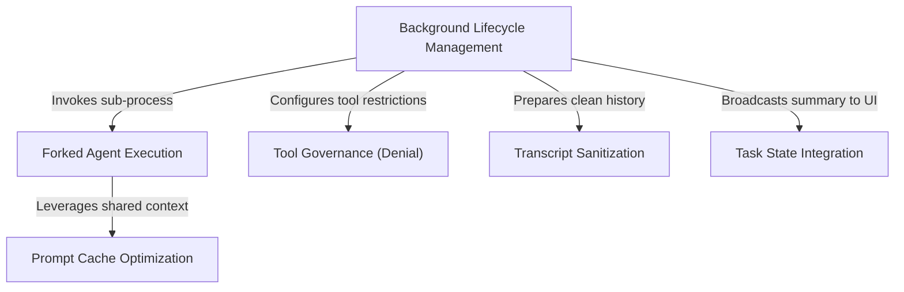

# Tutorial: AgentSummary

The **AgentSummary** project implements a "background reporter" for AI tasks. It silently watches the main agent's conversation and periodically creates a *forked process* (a temporary copy) to generate a 1-2 sentence progress update. This system ensures the user sees real-time status changes on the UI without **interrupting** the main agent's work or corrupting its memory.

## Chapters

1. [Background Lifecycle Management](01_background_lifecycle_management.md)
2. [Forked Agent Execution](02_forked_agent_execution.md)
3. [Transcript Sanitization](03_transcript_sanitization.md)
4. [Tool Governance (Denial)](04_tool_governance__denial_.md)
5. [Prompt Cache Optimization](05_prompt_cache_optimization.md)
6. [Task State Integration](06_task_state_integration.md)

---

Generated by [Code IQ](https://github.com/adityasoni99/Code-IQ)