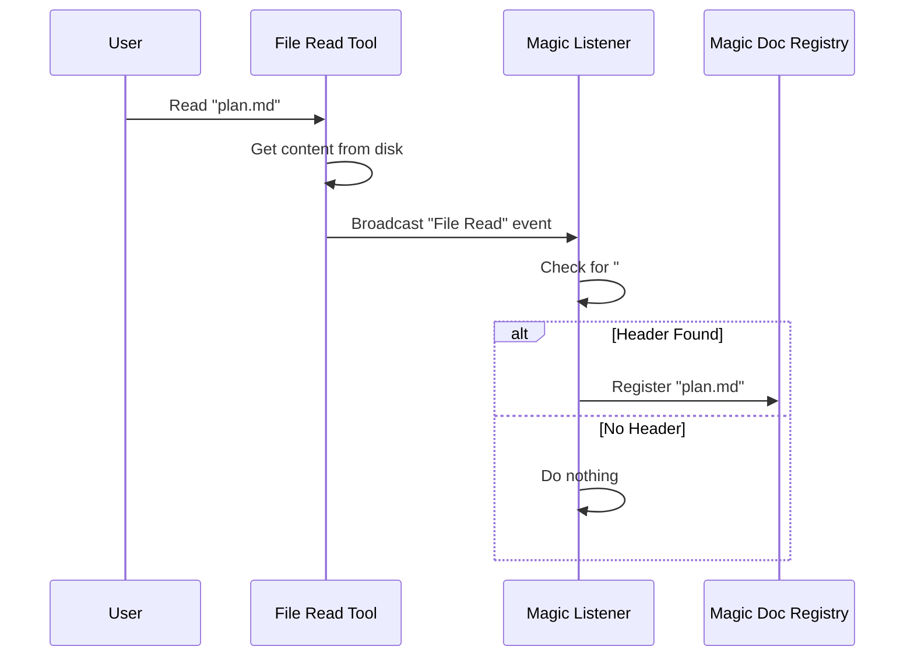

# Chapter 1: Magic Doc Identification

Welcome to the **MagicDocs** project tutorial! 

We have all faced a common problem in software development: **stale documentation**. You write a beautiful `README.md` or a `project-plan.md`, but as you write code, you forget to update the documents. Within a week, the documentation no longer matches reality.

**Magic Doc Identification** is the first step in solving this. It allows you to place a specific "sticker" on a file that tells the system: *"This is a living document. Watch it and keep it updated."*

In this chapter, we will learn how the system recognizes these special files.

## The Core Concept: The "Magic" Header

Think of a physical filing cabinet. Most folders are just standard manila folders. But imagine you put a bright red sticker on one specific folder that says **"URGENT: UPDATE DAILY"**.

In our system, that sticker is a text pattern.

Any Markdown file becomes a "Magic Doc" if the **very first line** looks like this:

```markdown
# MAGIC DOC: Project Roadmap
```

### Adding Instructions

Sometimes, a title isn't enough. You want to tell the system *how* to maintain the file. You can add specific instructions by using **italics** on the line immediately following the header.

```markdown
# MAGIC DOC: API Documentation
*Update this file whenever we change a function signature.*
```

When the system reads a file with this pattern, it doesn't just display the text; it registers the file in its memory as something special.

## Use Case: Creating a Self-Updating Plan

Let's say we want to create a `plan.md` that tracks our progress.

**Standard File (Static):**
```markdown
# My Plan
- [ ] Build the backend
- [ ] Build the frontend
```
*Result:* The system treats this as plain text.

**Magic File (Dynamic):**
```markdown
# MAGIC DOC: Current Dev Plan
_Mark items as done when the tests pass._

- [ ] Build the backend
- [ ] Build the frontend
```
*Result:* The system identifies this as a **Magic Doc**. It extracts the title ("Current Dev Plan") and the instructions ("Mark items as done when the tests pass").

## How It Works: Step-by-Step

What happens under the hood when you open a file?

1.  **File Read:** The user or the system opens a file (e.g., `plan.md`).
2.  **Pattern Scan:** Before doing anything else, the system scans the content using a specific pattern (Regular Expression).
3.  **Identification:** It looks for `# MAGIC DOC:`.
4.  **Registration:** If found, the file path is saved into a "Registry" (a list of active Magic Docs).

Here is the flow of events:



## Internal Implementation

Let's look at the code that powers this logic. We use TypeScript to define the patterns and handle the detection.

### 1. The Regular Expression
First, we define the "sticker." We use a Regex pattern to match the first line of the file.

```typescript
// Matches: # MAGIC DOC: [Title]
// ^ matches start of line, "i" flag makes it case-insensitive
const MAGIC_DOC_HEADER_PATTERN = /^#\s*MAGIC\s+DOC:\s*(.+)$/im;

// Matches italics: *text* or _text_
const ITALICS_PATTERN = /^[_*](.+?)[_*]\s*$/m;
```
*Explanation:* This pattern looks for a line starting with `#`, followed by `MAGIC DOC:`, and captures everything after it as the title.

### 2. Detecting the Header
Next, we need a function that accepts the file content and checks if it's "Magic."

```typescript
export function detectMagicDocHeader(content: string) {
  // Check if the first line matches the pattern
  const match = content.match(MAGIC_DOC_HEADER_PATTERN);
  
  // If no match, it's just a normal file
  if (!match || !match[1]) {
    return null;
  }

  // Return the title we found
  return { title: match[1].trim() };
}
```
*Explanation:* This function acts as the scanner. It takes the full string of the file and returns the title if the header exists, or `null` if it doesn't.

### 3. Detecting Instructions
If a header is found, we peek at the next line to see if there are italicized instructions.

```typescript
// (Inside detectMagicDocHeader...)

// Check the line immediately after the header
// We skip newlines to find the next text
const nextLineMatch = afterHeader.match(/^\s*\n(?:\s*\n)?(.+?)(?:\n|$)/);

if (nextLineMatch) {
  // Check if that line is wrapped in * or _
  const italicsMatch = nextLineMatch[1].match(ITALICS_PATTERN);
  if (italicsMatch) {
    // We found instructions!
    return { title, instructions: italicsMatch[1].trim() };
  }
}
```
*Explanation:* This logic ensures we capture the optional context provided by the user. This context is crucial for [Dynamic Prompt Templating](04_dynamic_prompt_templating.md) later on.

### 4. Listening for File Reads
Finally, we hook into the system's file reading process. We don't want to manually scan files; we want it to happen automatically whenever a file is touched.

```typescript
import { registerFileReadListener } from '../../tools/FileReadTool/FileReadTool.js';

// When the system starts up:
export async function initMagicDocs() {
  // Listen to every file read operation
  registerFileReadListener((filePath: string, content: string) => {
    
    // Check if it's magic
    const result = detectMagicDocHeader(content);
    
    // If yes, save it to our registry
    if (result) {
      registerMagicDoc(filePath);
    }
  });
}
```
*Explanation:* This is the entry point. `registerFileReadListener` is a hook provided by the core system. It ensures that simply *looking* at a file is enough to activate its magic properties.

## Conclusion

You have learned how **Magic Doc Identification** works. By adding a simple text header, we transform a static text file into a tracked entity within our system.

However, identifying the file is only the beginning. Once the system knows a file is "Magic," it needs to know *when* to update it.

In the next chapter, we will explore how the system decides the perfect moment to perform maintenance.

[Next Chapter: Update Lifecycle Hooks](02_update_lifecycle_hooks.md)

---

Generated by [Code IQ](https://github.com/adityasoni99/Code-IQ)