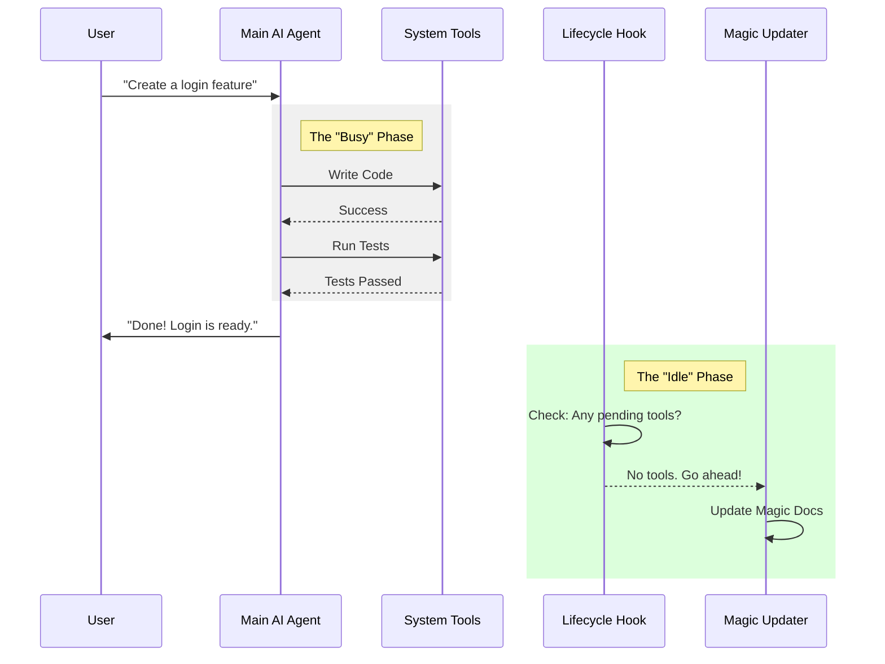

# Chapter 2: Update Lifecycle Hooks

Welcome back! In the previous chapter, [Magic Doc Identification](01_magic_doc_identification.md), we learned how to mark a file as "Magic" using a special header.

Now that the system knows **which** files to track, we face a new question: **When should the system update them?**

If we update the documentation too often, it wastes resources. If we update it too rarely, the documentation stays stale. We need a "Goldilocks" moment—a time that is just right.

In this chapter, we will learn about **Update Lifecycle Hooks**.

## The Motivation: The "Janitor" Analogy

Imagine a busy office. People are moving furniture, painting walls, and installing new computers.

If a cleaning crew tries to come in *while* the workers are moving desks, it’s chaos. The cleaners get in the way, and the floor gets dirty again immediately after mopping.

The best time for the cleaning crew to work is **after the office closes**.

*   **The Office Workers** = The Main AI Assistant (coding, running tests).
*   **The Cleaning Crew** = The MagicDocs Updater.

We want the MagicDocs system to wait until the Main Assistant is completely done with its current task before it tries to "clean up" (update) the documentation.

## Key Concept: The "Idle" State

How does the computer know the work is done?

In our system, a conversation isn't just "User asks, AI answers." It is often a loop:
1.  **User:** "Fix the bug."
2.  **AI:** "I need to read the file." (Tool Call) -> *System runs tool*
3.  **AI:** "I found the bug. I will fix it." (Tool Call) -> *System runs tool*
4.  **AI:** "The bug is fixed." (Final Text Response)

We only want to update the docs at step **#4**.

We call this the **Idle State**. It means the AI has stopped asking to run tools and is waiting for the user to speak again.

## Visualizing the Lifecycle

Here is how the flow looks. Notice that the "Magic Updater" only runs at the very end.



## Internal Implementation

To make this happen, we use a concept called a **Post-Sampling Hook**.

"Sampling" is the technical term for the AI generating text. A "Post-Sampling Hook" is a function that runs automatically every time the AI finishes generating a chunk of text.

Let's look at the code logic in simple steps.

### 1. Registering the Hook

When the application starts, we register our specific "clean up" function.

```typescript
import { registerPostSamplingHook } from '../../utils/hooks/postSamplingHooks.js';

// This runs once when the app boots up
export async function initMagicDocs() {
  
  // Register the "Janitor" function to run after every turn
  registerPostSamplingHook(updateMagicDocs);
  
}
```
*Explanation:* `registerPostSamplingHook` tells the core system: "Hey, whenever the AI finishes talking, please run this function called `updateMagicDocs`."

### 2. The Guard Clause: Are We Busy?

Inside our update function, the first thing we do is check if the AI is truly finished.

```typescript
const updateMagicDocs = sequential(async function (context) {
  const { messages } = context;

  // Check the last message from the assistant
  const hasToolCalls = hasToolCallsInLastAssistantTurn(messages);

  // If the assistant requested a tool (like 'edit_file'), we are NOT done.
  if (hasToolCalls) {
    return; // Stop here. Do not update docs yet.
  }

  // If we get here, the assistant is idle. Proceed!
});
```
*Explanation:* If `hasToolCalls` is true, it means the AI is in the middle of a job (like moving the furniture). We immediately `return` (exit) so we don't interrupt.

### 3. The Source Check: Preventing Infinite Loops

There is one other important check. The MagicDocs system itself uses an AI to update the docs. We don't want the MagicDocs AI to trigger *another* MagicDocs update, creating an infinite loop!

```typescript
  // Inside updateMagicDocs...
  
  const { querySource } = context;

  // Only run if the message came from the main user conversation
  if (querySource !== 'repl_main_thread') {
    return;
  }
```
*Explanation:* We ensure that we only clean up after the *User's* request, not after our own internal background processes.

### 4. Triggering the Update

Finally, if the conversation is idle and it's the main thread, we look at our list of tracked files (from [Chapter 1](01_magic_doc_identification.md)) and start the update process.

```typescript
  // Inside updateMagicDocs...

  // Get the list of docs we found in Chapter 1
  const docCount = trackedMagicDocs.size;

  if (docCount === 0) {
    return; // Nothing to update
  }

  // Loop through every magic doc and update it
  for (const docInfo of Array.from(trackedMagicDocs.values())) {
    await updateMagicDoc(docInfo, context);
  }
```
*Explanation:* This iterates through every file we previously identified as "Magic" and initiates the update function for each one.

## Conclusion

In this chapter, we learned about **Update Lifecycle Hooks**.

We moved from simply *identifying* files to understanding *when* to safely modify them. We established that updates should only happen when:
1.  The system identifies a "Magic Doc."
2.  The Main Assistant has finished its work (Idle State).
3.  There are no pending tool calls.

But wait—we're still missing a piece of the puzzle.

We know *which* file to update, and *when* to update it. But **who** actually writes the new content? We can't use the Main Assistant because it's waiting for the user. We need a specialized worker for this specific task.

In the next chapter, we will meet this specialized worker.

[Next Chapter: The Magic Docs Sub-Agent](03_the_magic_docs_sub_agent.md)

---

Generated by [Code IQ](https://github.com/adityasoni99/Code-IQ)