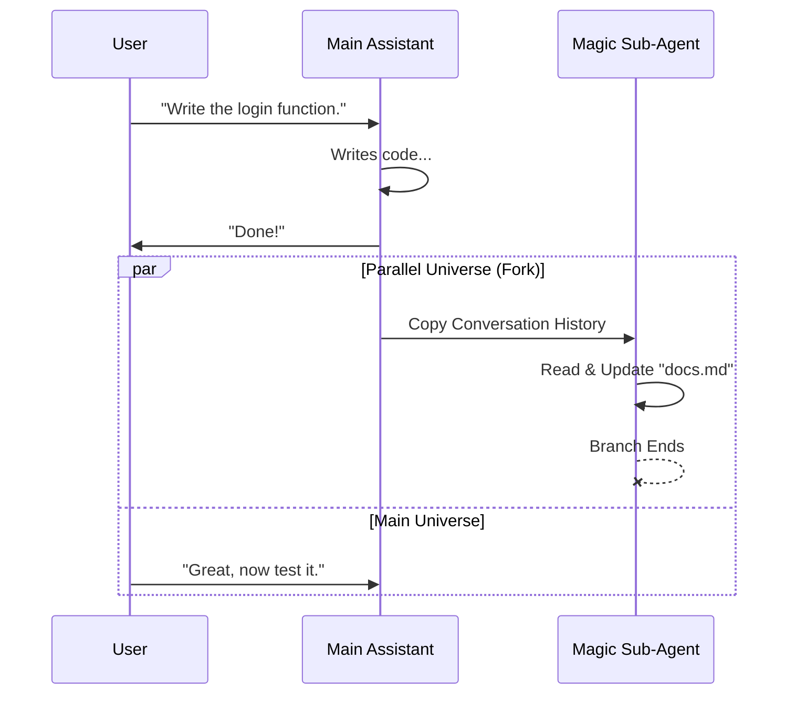

# Chapter 3: The Magic Docs Sub-Agent

Welcome to Chapter 3!

In the previous chapter, [Update Lifecycle Hooks](02_update_lifecycle_hooks.md), we learned **when** to update our documentation: during the "Idle State," right after the main AI finishes a task.

But now we have a logistical problem. The Main AI is sitting there, waiting for the user to reply. If we ask the Main AI to suddenly start reading and rewriting documentation, it gets "distracted." It might pollute its context window or lose track of the conversation flow.

We need a way to do this work **in the background**.

In this chapter, we introduce **The Magic Docs Sub-Agent**.

## The Concept: The Silent Scribe

Imagine you are in a high-stakes strategy meeting with your Chief Architect (the Main AI). You are brainstorming on a whiteboard.

You don't want the Chief Architect to stop thinking about code just to tidy up the meeting notes. Instead, you bring in a **Scribe**.

*   **The Scribe** sits in the corner.
*   **The Scribe** has a copy of all the notes (Context).
*   **The Scribe** is only allowed to use a pen and paper (Restricted Tools).
*   **The Scribe** never speaks during the meeting; they just update the records silently.

In our system, this "Scribe" is a **Sub-Agent**.

## Why Use a Sub-Agent?

Using a sub-agent solves three major problems:

1.  **Context Preservation:** The Main AI's memory stays clean. It doesn't get cluttered with system instructions like "Please update the README."
2.  **Safety:** We can restrict the Sub-Agent so it *only* edits specific files. It can't accidentally delete your database or run terminal commands.
3.  **Specialization:** We can use a different AI model or system prompt specifically designed for documentation, rather than coding.

## Visualizing the "Fork"

Technically, creating a sub-agent involves **Forking**.

Imagine the conversation history is a timeline. When the Main AI goes idle, we split the timeline into two branches.
1.  **Main Branch:** Waits for the user.
2.  **Forked Branch:** The Sub-Agent takes a snapshot of the history, updates the docs, and then this branch disappears.



## Internal Implementation

How do we code this "Scribe"? We use the `runAgent` function provided by the core system. Let's break down the implementation steps.

### 1. Defining the Agent's Personality

First, we define who the Scribe is. We create a configuration object that tells the system: "This agent is for Magic Docs, and it is only allowed to edit files."

```typescript
function getMagicDocsAgent() {
  return {
    agentType: 'magic-docs',
    // Only allow the "File Edit" tool. No terminal, no web search.
    tools: ['file_edit_tool'], 
    model: 'sonnet', // Use a smart model for writing
    whenToUse: 'Update Magic Docs',
  }
}
```
*Explanation:* This acts as the job description. The most important part is the `tools` array. By limiting this to `file_edit_tool`, we ensure the Scribe cannot do anything dangerous.

### 2. Creating a Safe Environment (Cloning)

Before we let the agent work, we need to give it a copy of the current file state. If the Main AI just wrote a file, the Sub-Agent needs to "see" that new content to document it.

```typescript
import { cloneFileStateCache } from '../../utils/fileStateCache.js';

// Inside our update function...
const clonedReadFileState = cloneFileStateCache(
  toolUseContext.readFileState
);

// We remove the specific doc from the cache so we force a fresh read
clonedReadFileState.delete(docInfo.path);
```
*Explanation:* `cloneFileStateCache` is like photocopying the papers on the desk. The Sub-Agent gets its own stack of papers to scribble on, so it doesn't mess up the Main AI's original copies.

### 3. The Tool Guard

Even though we gave the agent the "File Edit" tool, we want to be extra safe. We want to ensure it *only* edits the Magic Doc, not your source code.

We create a "Guard" function:

```typescript
const canUseTool = async (tool, input) => {
  // Only allow editing if the file path matches our Magic Doc
  if (tool.name === 'file_edit_tool' && input.file_path === docInfo.path) {
    return { behavior: 'allow' };
  }
  
  // Block everything else
  return { behavior: 'deny', message: 'You can only edit the Magic Doc.' };
}
```
*Explanation:* This is the strict manager standing over the Scribe's shoulder. If the Scribe tries to edit `server.js`, the manager says "No." If the Scribe tries to edit `README.md` (the Magic Doc), the manager says "Go ahead."

### 4. Running the Forked Agent

Finally, we spin up the agent. This is where the magic happens.

```typescript
import { runAgent } from '../../tools/AgentTool/runAgent.js';

// Run the sub-agent
await runAgent({
  agentDefinition: getMagicDocsAgent(),
  
  // This is the KEY: pass the Main AI's history to the Sub-Agent
  forkContextMessages: mainConversationMessages,
  
  // Apply our strict security guard
  canUseTool: canUseTool, 
  
  // Tell it to run in the background (async)
  isAsync: true 
});
```
*Explanation:* 
*   `forkContextMessages`: This passes the entire conversation memory to the Sub-Agent so it knows what just happened (e.g., "The user just added a login feature").
*   `isAsync`: This allows the process to happen without freezing the user interface.

## Summary

In this chapter, we learned how to build **The Magic Docs Sub-Agent**.

1.  We identified the need for a background process to avoid distracting the Main AI.
2.  We defined a specialized agent with restricted tools (the "Scribe").
3.  We implemented "Forking" to share memory without sharing consequences.
4.  We added a security guard (`canUseTool`) to ensure only the documentation file is touched.

Now we have a Scribe ready to work. But... what exactly do we tell the Scribe to do? We can't just say "Update the file." We need to construct a specific, intelligent prompt that combines the old file content, the user's instructions, and the recent conversation.

In the next chapter, we will learn how to generate these instructions on the fly.

[Next Chapter: Dynamic Prompt Templating](04_dynamic_prompt_templating.md)

---

Generated by [Code IQ](https://github.com/adityasoni99/Code-IQ)