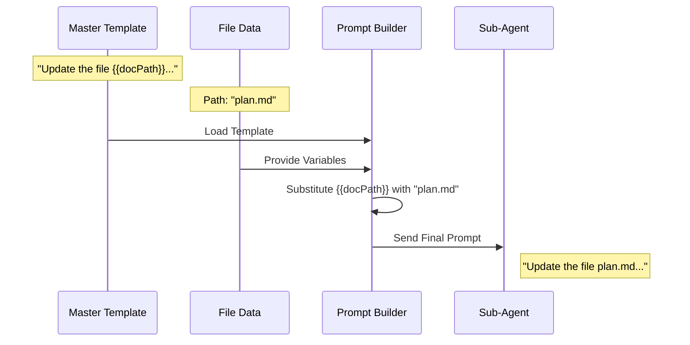

# Chapter 4: Dynamic Prompt Templating

Welcome back! 

In the previous chapter, [The Magic Docs Sub-Agent](03_the_magic_docs_sub_agent.md), we created a specialized "Scribe"—a Sub-Agent dedicated to updating documentation in the background.

Now we face a communication challenge. We have a Scribe, but **what exactly do we tell them to do?**

We can't hard-code a message like *"Update the API Login documentation"* because the system needs to handle *any* file—whether it's an API doc, a project plan, or meeting notes.

We need a way to generate specific instructions automatically. We need **Dynamic Prompt Templating**.

## The Concept: "Mad Libs" for AI

Do you remember the game "Mad Libs"? You have a story with blank spaces, and you fill in the blanks to create a unique narrative.

*   **The Form:** "Please go to the {{place}} and buy {{number}} {{object}}s."
*   **The Input:** place="Store", number="5", object="Apple".
*   **The Result:** "Please go to the Store and buy 5 Apples."

**Dynamic Prompt Templating** works exactly the same way.

We write one "Master Template" that explains the general rules of documentation. Then, right before we send the Scribe to work, we fill in the blanks with the specific details of the file being updated.

## The Variables

To make this work, we need to gather the "Ingredients" (data) to fill our blanks. 

Recall from [Magic Doc Identification](01_magic_doc_identification.md) that we extracted specific data when we first read the file. We use that data here.

The system uses four main variables:

1.  `{{docTitle}}`: The name found in the `# MAGIC DOC:` header.
2.  `{{docContents}}`: The actual text currently inside the file.
3.  `{{docPath}}`: The file location (e.g., `src/docs/api.md`).
4.  `{{customInstructions}}`: The specific rules (italics) the user wrote under the header.

## Visualizing the Flow

Here is how the system constructs the final instruction for the Sub-Agent:



## Internal Implementation

Let's look at the code that powers this logic. It is located in `prompts.ts`.

### 1. The Master Template

First, we define the standard instructions. This is a long string that teaches the AI how to be a good technical writer (e.g., "Be terse," "Fix typos," "Don't hallucinate").

To keep it simple, here is a shortened version showing where the "blanks" are:

```typescript
function getUpdatePromptTemplate(): string {
  return `
    Based on the conversation, update the Magic Doc file.
    
    The file is located at: {{docPath}}
    Current Title: {{docTitle}}
    
    Here is the content:
    {{docContents}}
    
    {{customInstructions}}
  `;
}
```
*Explanation:* The text inside `{{ }}` represents the placeholders. Everything else is standard text that is sent every time.

### 2. The Variable Substitution Logic

We need a function to actually perform the "Mad Libs" replacement. We use a simple Regular Expression to find the curly braces.

```typescript
function substituteVariables(template, variables) {
  // Find everything looking like {{word}}
  return template.replace(/\{\{(\w+)\}\}/g, (match, key) => {
    
    // If we have a value for 'word', use it. Otherwise keep {{word}}.
    return variables[key] || match;
    
  });
}
```
*Explanation:* 
*   `template.replace(...)`: Scans the text.
*   `key`: The word inside the braces (e.g., `docTitle`).
*   `variables[key]`: Look up the actual value (e.g., "Project Roadmap").

### 3. Handling Custom Instructions

This is a powerful feature. In [Chapter 1](01_magic_doc_identification.md), we allowed users to write instructions in italics, like `_Only update this on Tuesdays_`.

We need to format this nicely so the AI pays attention to it.

```typescript
// Inside buildMagicDocsUpdatePrompt...

// If the user wrote instructions, wrap them in a warning label
const formattedInstructions = instructions
  ? `IMPORTANT USER INSTRUCTIONS: "${instructions}"`
  : ''; 

// Prepare the list of variables
const variables = {
  docContents: currentFileContent,
  docPath: filePath,
  docTitle: extractedTitle,
  customInstructions: formattedInstructions,
};
```
*Explanation:* If the user provided instructions, we add a label to emphasize them. If not, we leave that variable empty so it disappears from the final prompt.

### 4. Building the Final Prompt

Finally, we combine everything in the main function `buildMagicDocsUpdatePrompt`.

```typescript
export async function buildMagicDocsUpdatePrompt(
  content, path, title, instructions
) {
  // 1. Get the template (we'll see how to load this next)
  const template = await loadMagicDocsPrompt();

  // 2. Prepare variables (as seen above)
  const variables = { 
    docContents: content, 
    docPath: path, 
    docTitle: title,
    customInstructions: instructions ? `Rules: ${instructions}` : '' 
  };

  // 3. Fill in the blanks
  return substituteVariables(template, variables);
}
```
*Explanation:* This function is the "factory" that outputs the final string. This string is what gets sent to the Sub-Agent as its "User Message."

## Advanced: User Customization

One of the coolest features of MagicDocs is that **you are not stuck with our template**.

The system checks if you have a custom file saved on your computer at `~/.claude/magic-docs/prompt.md`.

```typescript
async function loadMagicDocsPrompt() {
  try {
    // Try to read a user-defined file
    return await fs.readFile(customPromptPath, 'utf-8');
  } catch {
    // If not found, use the built-in default
    return getUpdatePromptTemplate();
  }
}
```
*Explanation:* This allows power users to completely change how the AI writes documentation. You could change the template to say "Write everything as a poem" or "Translate everything to French," and the system will respect it because it loads *your* file before filling in the blanks.

## Putting It All Together

Let's trace the data flow for a specific example:

1.  **Input File (`plan.md`):**
    ```markdown
    # MAGIC DOC: My Plan
    _Don't mark items done unless tested._
    - [ ] Build Login
    ```
2.  **Chapter 1 (Identification):** Extracts Title="My Plan", Instructions="Don't mark items done unless tested."
3.  **Chapter 2 (Update Hook):** Decides it's time to update.
4.  **Chapter 3 (Sub-Agent):** Wakes up.
5.  **Chapter 4 (This Chapter):**
    *   Loads Template: "Update {{docTitle}} following {{customInstructions}}..."
    *   Substitutes: "Update **My Plan** following **Don't mark items done unless tested**..."
    *   Result: A perfect, custom instruction for the AI.

## Conclusion

You have learned how **Dynamic Prompt Templating** turns generic logic into specific actions. By separating the "Template" (the form) from the "Variables" (the content), we created a system that is both consistent and flexible.

We now have an agent, we know when to run it, and we know what to tell it.

However, there is one final danger. When we send this prompt to the Sub-Agent, we also send the conversation history. What if the Sub-Agent gets confused by the history and thinks *it* is the Main Assistant? We need to ensure the Sub-Agent knows it is in a "clean room."

In the final chapter, we will discuss how to manage memory safely.

[Next Chapter: Context Isolation](05_context_isolation.md)

---

Generated by [Code IQ](https://github.com/adityasoni99/Code-IQ)