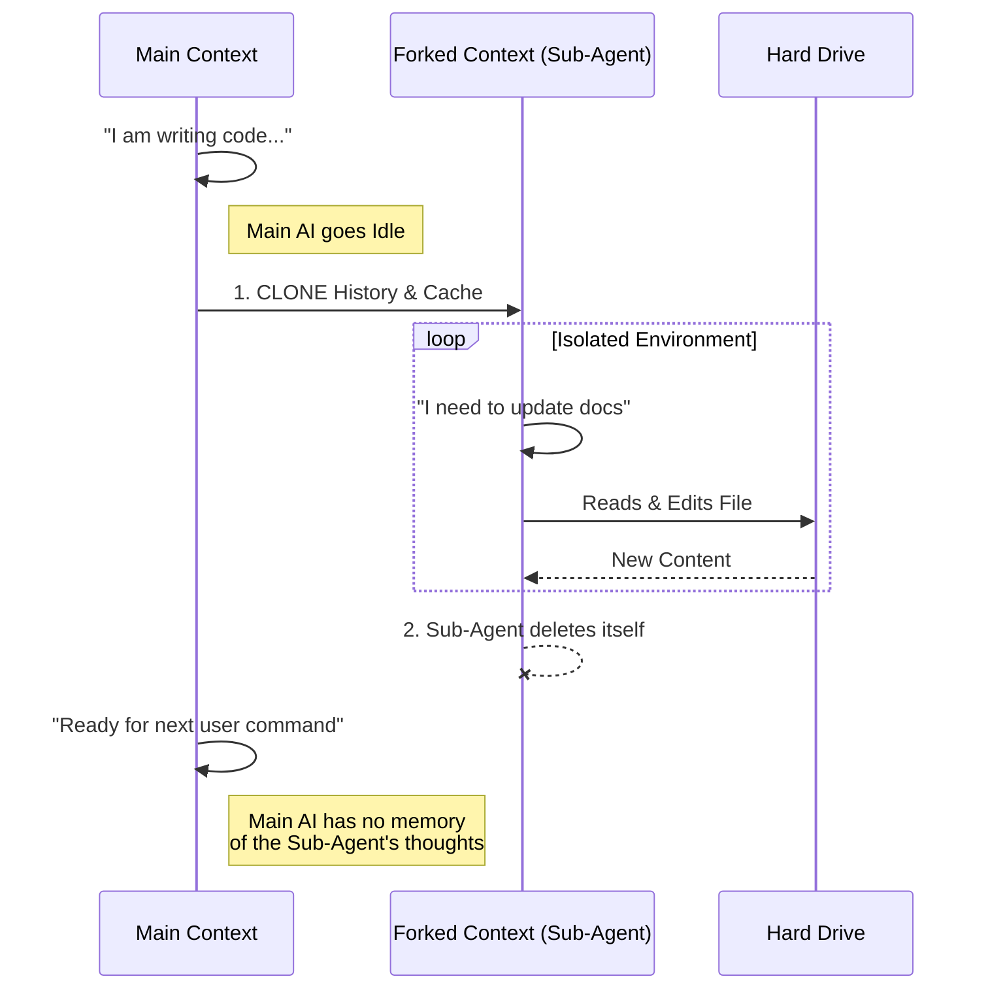

# Chapter 5: Context Isolation

Welcome to the final chapter of the **MagicDocs** tutorial!

In [Chapter 4: Dynamic Prompt Templating](04_dynamic_prompt_templating.md), we learned how to generate specific instructions for our Sub-Agent. We now have a fully functional system:
1.  We identify files.
2.  We wait for the right time.
3.  We wake up a Sub-Agent.
4.  We give it instructions.

However, there is one final, critical risk.

The Main AI and the Sub-Agent are running in the same application. If we aren't careful, the Sub-Agent's actions could "leak" into the Main AI's brain, confusing it or corrupting its memory.

In this chapter, we will learn about **Context Isolation**.

## The Problem: The "Shared Brain" Danger

Imagine you are writing an essay (Main Task). Suddenly, you pause to do a quick math problem on a scratchpad (Sub-Task).

If you write the math problem directly in the middle of your essay paragraphs, your essay becomes a mess. You need a separate piece of paper.

In AI terms, this "mess" happens in two places:
1.  **Conversation History:** The list of "User said / AI said" messages.
2.  **File Cache:** The AI's memory of what files look like.

If the Sub-Agent reads a file and updates the shared memory, the Main AI might hallucinate that it read the file too, or get confused about which file version is current.

## The Solution: Context Isolation

We solve this using a technique called **Forking**.

Think of the "Archivist" analogy:
*   **The Main Desk:** Where the original work happens.
*   **The Photocopy:** When the Archivist (Sub-Agent) needs to work, we don't give them the originals. We verify the documents, make a **photocopy**, and hand that over.

The Archivist takes the photocopy to a separate room. They can scribble notes, highlight text, or spill coffee on the photocopy. The original documents on the Main Desk remain pristine.

## Visualizing the Fork

Here is what happens when MagicDocs activates. Notice how the "Main Context" continues purely, while the "Forked Context" branches off and eventually disappears.



## Internal Implementation

Let's look at how we implement this safety mechanism in the code.

### 1. Cloning the File State

The system keeps a "Cache" of files it has read to save processing power. We need to clone this so the Sub-Agent gets its own private cache.

```typescript
import { cloneFileStateCache } from '../../utils/fileStateCache.js';

// Inside updateMagicDoc...
const clonedReadFileState = cloneFileStateCache(
  toolUseContext.readFileState
);
```
*Explanation:* This creates a perfect duplicate of the Main AI's knowledge about files. If the Sub-Agent modifies this list, the Main AI won't know.

### 2. Forcing a Fresh Read

There is a catch. If the Main AI read the documentation file 10 minutes ago, the cache is 10 minutes old. We want the Sub-Agent to see the file *exactly as it is right now*.

So, we delete the specific file from the *cloned* cache.

```typescript
// Delete the specific doc from the cloned cache
clonedReadFileState.delete(docInfo.path);
```
*Explanation:* By deleting the entry, we force the Sub-Agent to go to the hard drive and read the fresh file. Because we are modifying the *clone*, the Main AI still keeps its own cached version (until it decides to re-read it itself).

### 3. Creating the Isolated Context

Now we package this cloned state into a new "Context Object." This is the backpack of tools and memories we hand to the Sub-Agent.

```typescript
const clonedToolUseContext = {
  // Copy everything from the main context...
  ...toolUseContext,
  
  // ...but replace the cache with our clone
  readFileState: clonedReadFileState,
};
```

### 4. Running the Forked Agent

Finally, we run the agent. We learned about `runAgent` in [Chapter 3](03_the_magic_docs_sub_agent.md), but now we focus on the specific parameters that enforce isolation.

```typescript
await runAgent({
  agentDefinition: getMagicDocsAgent(),
  
  // GIVE: The Main AI's memories (so it understands context)
  forkContextMessages: messages,
  
  // GIVE: The Isolated Tool Kit (so it doesn't pollute cache)
  toolUseContext: clonedToolUseContext,
  
  // Result: The Sub-Agent runs in a bubble.
  isAsync: true
});
```
*Explanation:* 
*   `forkContextMessages`: We *read* from the main history, but we never *write* back to it.
*   `toolUseContext`: We use the cloned cache we created above.

## The Result: A Clean Experience

Because of **Context Isolation**, the user experience looks like this:

1.  **User:** "Add a login button."
2.  **Main AI:** "Okay, I added it." (Main AI goes idle).
3.  *(Background)*: Sub-Agent wakes up, clones context, reads `plan.md`, checks off "Login Button", updates file, and vanishes.
4.  **User:** "Great. What's next?"
5.  **Main AI:** "I am ready." (It doesn't say "I just updated the docs," because it didn't do it—the Sub-Agent did).

The documentation on the disk is updated, but the Main AI's conversation flow remains uninterrupted.

## Conclusion

Congratulations! You have completed the **MagicDocs** tutorial.

Let's review the full journey:

1.  **[Magic Doc Identification](01_magic_doc_identification.md):** We learned how to mark files with `# MAGIC DOC:`.
2.  **[Update Lifecycle Hooks](02_update_lifecycle_hooks.md):** We learned to wait for the "Idle" state.
3.  **[The Magic Docs Sub-Agent](03_the_magic_docs_sub_agent.md):** We created a specialized "Scribe" agent.
4.  **[Dynamic Prompt Templating](04_dynamic_prompt_templating.md):** We learned to generate instructions on the fly.
5.  **Context Isolation (This Chapter):** We learned to clone and fork memory to keep the system safe and clean.

You now understand the architecture of a sophisticated, self-maintaining documentation system. You can apply these principles—**Identification, Lifecycle Management, Specialization, Templating, and Isolation**—to build many other types of intelligent background agents.

Happy Coding!

---

Generated by [Code IQ](https://github.com/adityasoni99/Code-IQ)