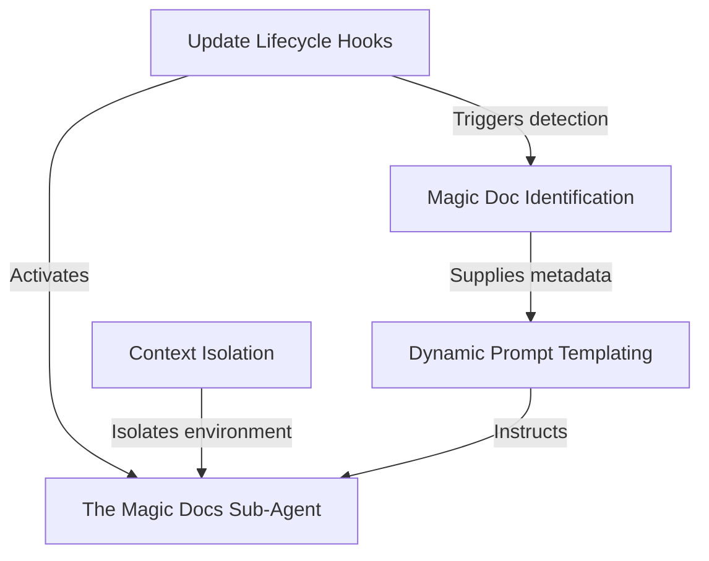

# Tutorial: MagicDocs

**MagicDocs** acts as an automated, background archivist for your software project. It passively watches for files marked with a special **header** and, during pauses in your conversation, activates a *silent* **sub-agent** to update them. This ensures your documentation stays in sync with the latest code insights without interrupting your workflow or polluting the main conversation history.

## Chapters

1. [Magic Doc Identification](01_magic_doc_identification.md)
2. [Update Lifecycle Hooks](02_update_lifecycle_hooks.md)
3. [The Magic Docs Sub-Agent](03_the_magic_docs_sub_agent.md)
4. [Dynamic Prompt Templating](04_dynamic_prompt_templating.md)
5. [Context Isolation](05_context_isolation.md)

---

Generated by [Code IQ](https://github.com/adityasoni99/Code-IQ)