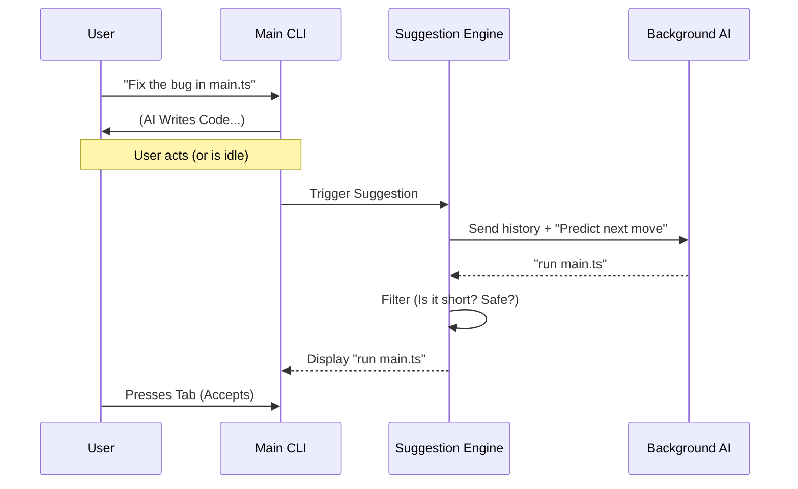

# Chapter 1: Prompt Suggestion Engine

Welcome to the first chapter of the **PromptSuggestion** project tutorial!

In this series, we will build a system that feels like magic: an AI interface that anticipates your next move before you even make it. We are starting with the foundation: the **PromptSuggestion Engine**.

### The Problem: "What do I do next?"

Imagine you are using a command-line interface (CLI) to code. You just asked the AI to "Write a test for the login function." The AI writes the code.

Now, you stare at the blinking cursor.
You *could* type: `npm test`
Or maybe: `git add .`

What if the CLI just whispered, *"run the tests"* in gray text, and all you had to do was press `Tab`?

### What is the Prompt Suggestion Engine?

The **Prompt Suggestion Engine** is an abstraction that acts like a highly intelligent autocomplete. It reads the conversation history, understands the context, and predicts the user's **intent**.

Think of it like a helpful colleague looking over your shoulder. They don't grab the keyboard (yet); they just quietly suggest, "You probably want to run that script now."

### Key Concepts

To make this work without being annoying or slow, we rely on three main concepts:

1.  **The Fork:** We can't block the main chat while thinking of a suggestion. We "fork" the conversation into a background process.
2.  **The Persona:** We tell the AI *not* to be a chatbot, but to be a predictor of user behavior.
3.  **The Filter:** AI can be chatty or wrong. We need strict rules to filter out bad suggestions (like "Hello!" or "I can help with that").

---

### How It Works: The Flow

Before we look at code, let's visualize the lifecycle of a single suggestion.



### Implementing the Engine

Let's look at the core logic in `promptSuggestion.ts`. We will break it down into beginner-friendly snippets.

#### 1. The Entry Point
The function `tryGenerateSuggestion` is the brain. It decides if it's worth trying to suggest something.

```typescript
// promptSuggestion.ts

export async function tryGenerateSuggestion(
  abortController, messages, getAppState, params
) {
  // 1. Safety Checks: If the user canceled or is typing, stop.
  if (abortController.signal.aborted) return null;

  // 2. Context Check: Need enough history to make a guess.
  const assistantTurnCount = count(messages, m => m.type === 'assistant');
  if (assistantTurnCount < 2) return null;

  // 3. Generate the raw text using the LLM
  const { suggestion } = await generateSuggestion(
    abortController, 'user_intent', params
  );
  
  // ... filtering comes next ...
}
```
**Explanation:**
We don't want to waste resources. If the conversation just started, or if the user is already doing something (the `abortController` handles this), we exit early.

#### 2. The Prompt (The "Persona")
How do we get the AI to output just a command and not a paragraph? We use a specialized system prompt.

```typescript
// promptSuggestion.ts

const SUGGESTION_PROMPT = `
[SUGGESTION MODE]
Your job is to predict what the USER would type.
THE TEST: Would they think "I was just about to type that"?

NEVER SUGGEST:
- "Looks good"
- Questions
- Multiple sentences

Reply with ONLY the suggestion.`
```
**Explanation:**
This string is sent to the LLM. It explicitly forbids "chatty" behavior. We want raw intent, like "run tests", not "I think you should run the tests now."

#### 3. Generating the Suggestion
This function sends the prompt to the background AI process. It uses a **Forked Agent**, which is a concept we will cover in depth in [Forked Agent Execution](03_forked_agent_execution.md).

```typescript
// promptSuggestion.ts

export async function generateSuggestion(abortController, promptId, params) {
  // Run the AI in a separate "thread" so we don't block the UI
  const result = await runForkedAgent({
    promptMessages: [createUserMessage({ content: SUGGESTION_PROMPT })],
    skipTranscript: true, // Don't save this to the visible chat history
    // ... other config
  });

  // Extract the text from the AI's response
  const suggestion = result.messages
    .find(m => m.type === 'assistant')
    ?.textBlock?.text.trim();

  return { suggestion };
}
```
**Explanation:**
We invoke `runForkedAgent`. Crucially, we use `skipTranscript: true`. This ensures the user never sees this internal "thinking" in their main chat window. It happens invisibly.

#### 4. The Filter (Quality Control)
The AI might still return something useless like "I cannot do that" or "Hello". We need a heuristic filter. We will discuss advanced filtering in [Heuristic Filtering & Suppression](06_heuristic_filtering___suppression.md), but here is the basic logic.

```typescript
// promptSuggestion.ts

export function shouldFilterSuggestion(suggestion) {
  const lower = suggestion.toLowerCase();

  // Rule 1: Too short or too long?
  if (suggestion.split(/\s+/).length > 12) return true;
  
  // Rule 2: Is it "Claude Voice"? (e.g., "Here is...")
  if (lower.startsWith("here is") || lower.startsWith("let me")) return true;

  // Rule 3: Is it an error?
  if (lower.includes("api error")) return true;

  return false; // It passed!
}
```
**Explanation:**
This function returns `true` if the suggestion is bad. It checks word count (users rarely type 20 words as a command) and checks for common AI phrases that don't represent user intent.

### Managing Lifecycle: Debouncing and Aborting

In a CLI, the user types fast. We don't want to start a slow AI process for every keystroke. We use an `AbortController`.

```typescript
// promptSuggestion.ts

let currentAbortController = null;

export async function executePromptSuggestion(context) {
  // 1. Cancel any previous suggestion that is still thinking
  if (currentAbortController) {
    currentAbortController.abort();
  }

  // 2. Create a new controller for this specific attempt
  currentAbortController = new AbortController();
  
  // 3. Try to generate...
  try {
    await tryGenerateSuggestion(currentAbortController, ...);
  } catch (err) {
    // Handle abort errors silently
  }
}
```
**Explanation:**
This ensures that `tryGenerateSuggestion` stops immediately if the user hits a key or a new suggestion request comes in. It prevents "ghost" suggestions appearing from 5 seconds ago.

### Use Case Example

Let's see the engine in action.

1.  **History:**
    *   **User:** "Install react-router"
    *   **Assistant:** "I have installed `react-router-dom`."

2.  **Engine Action:**
    *   Detects idle state.
    *   Calls `generateSuggestion`.
    *   LLM analyzes context: "User installed a library. Usually, they check `package.json` or start the server."
    *   LLM output: "npm start"

3.  **Result:**
    *   User sees: `npm start` (in gray).
    *   User presses `Tab`.
    *   CLI executes: `npm start`.

### Summary

The **Prompt Suggestion Engine** is a loop of:
1.  **Observing** the history.
2.  **Predicting** the next step using a background LLM.
3.  **Filtering** out bad noise.
4.  **Presenting** the result unobtrusively.

It lowers the cognitive load for the user, making the tool feel intuitive and fast.

### What's Next?

Suggesting text is great, but what if the AI could actually **verify** that the suggestion works before showing it to you? Or what if it could start running the command in the background?

That is called **Speculative Execution**, and we will learn how to build it in the next chapter.

[Next Chapter: Speculative Execution](02_speculative_execution.md)

---

Generated by [Code IQ](https://github.com/adityasoni99/Code-IQ)