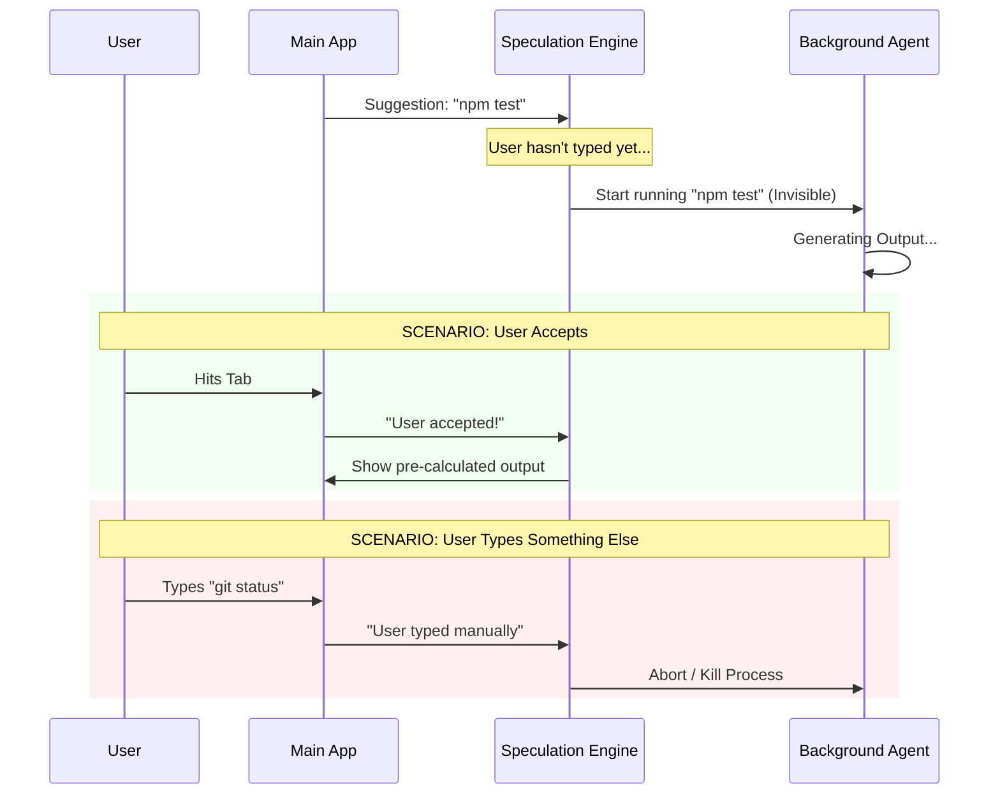

# Chapter 2: Speculative Execution

Welcome to Chapter 2! 

In the previous chapter, [Prompt Suggestion Engine](01_prompt_suggestion_engine.md), we built a system that whispers suggestions like "run the tests" or "fix the bug."

But there is a catch. If you accept the suggestion "run the tests," you still have to wait for the tests to actually run. In a fast-paced coding environment, those seconds add up.

What if the result was ready *before* you even accepted the suggestion? This is **Speculative Execution**.

### The Motivation: The "Chef" Analogy

Imagine a regular restaurant. You sit down, order the "Special," and the chef starts cooking. You wait 20 minutes.

Now imagine a **Speculative Chef**.
1.  As you walk in the door, the Chef thinks: *"This guy usually orders the Special."*
2.  The Chef starts cooking the Special **immediately**, before you even sit down.
3.  **Scenario A:** You order the Special. The Chef hands it to you instantly. Zero wait time.
4.  **Scenario B:** You order soup. The Chef tosses the pre-made Special in the trash (quietly) and makes the soup.

**Speculative Execution** does exactly this for your command line. It runs the suggested command in the background. If you accept it, the result appears instantly. If you ignore it, the background work is discarded.

### How It Works: High-Level Logic

This feature requires a delicate balance. We want speed, but we must be **safe**. We can't let the AI delete your production database on a "guess."

To achieve this, we rely on three safety pillars:
1.  **Isolation:** We run commands in a temporary environment (more on this in [Overlay Filesystem (Isolation)](04_overlay_filesystem__isolation_.md)).
2.  **Invisibility:** The user shouldn't see the logs unless they accept the suggestion.
3.  **Boundaries:** If the AI tries to do something dangerous (like a network call we can't undo), we pause execution immediately.

#### The Lifecycle



### Implementation Walkthrough

Let's look at `speculation.ts`. This file manages the "Shadow World" where commands run invisibly.

#### 1. Starting the Speculation
When the Suggestion Engine (Chapter 1) comes up with a text idea, we immediately call `startSpeculation`.

```typescript
// speculation.ts

export async function startSpeculation(suggestionText, context, setAppState) {
  // 1. Generate a unique ID for this shadow session
  const id = randomUUID().slice(0, 8);

  // 2. Create a temporary folder (Overlay) to isolate file writes
  const overlayPath = getOverlayPath(id);
  await mkdir(overlayPath, { recursive: true });

  // 3. Update the UI state so we know speculation is running
  setAppState(prev => ({
    ...prev,
    speculation: { status: 'active', id, startTime: Date.now(), ... }
  }));
  
  // 4. Actually run the agent...
}
```
**Explanation:**
We create a unique ID and a temporary folder. We update the application state so the system knows a background job is active.

#### 2. Running the Invisible Agent
We use `runForkedAgent` to execute the command. Crucially, we use the `skipTranscript` flag so these messages don't clutter the user's real chat history yet.

We will cover the specific mechanics of the agent in [Forked Agent Execution](03_forked_agent_execution.md), but here is how we invoke it:

```typescript
// speculation.ts

const result = await runForkedAgent({
  promptMessages: [createUserMessage({ content: suggestionText })],
  skipTranscript: true, // Keep it invisible!
  
  // The Guard: Check every tool the AI tries to use
  canUseTool: async (tool, input) => {
    // ... logic to allow or deny tools ...
  }
});
```
**Explanation:**
This starts the "Chef" cooking. The `canUseTool` callback is our safety guard. It checks every command the AI tries to run.

#### 3. The Safety Guard (Boundaries)
We cannot allow all actions. Reading files is usually fine. Writing files requires special handling (writing to the temporary overlay).

If the AI tries something we can't isolate, we stop. This concept is covered in detail in [Completion Boundaries](05_completion_boundaries.md), but here is the basic logic:

```typescript
// speculation.ts (Simplified)

canUseTool: async (tool, input) => {
  // 1. Is it a read-only tool? Safe.
  if (SAFE_READ_ONLY_TOOLS.has(tool.name)) {
    return { behavior: 'allow' };
  }

  // 2. Is it a write tool? Redirect to our temporary folder.
  if (WRITE_TOOLS.has(tool.name)) {
    // Redirect input.file_path to overlayPath/file_path
    return redirectToOverlay(input); 
  }

  // 3. Unknown/Dangerous tool? STOP.
  abortController.abort();
  return denySpeculation("Too dangerous to guess!");
}
```
**Explanation:**
We categorize tools. "Safe" tools run. "Write" tools are redirected to a fake file system so we don't mess up the user's actual code unless they accept. Dangerous tools cause the speculation to pause.

#### 4. Accepting the Suggestion
The magic moment! The user hits `Tab`. We need to take the work done in the "Shadow World" and make it real.

```typescript
// speculation.ts

export async function acceptSpeculation(state, setAppState) {
  // 1. Stop the background process (it's no longer "background")
  state.abort();

  // 2. Copy any files written in the overlay to the REAL folder
  await copyOverlayToMain(
     getOverlayPath(state.id), 
     state.writtenPathsRef.current
  );

  // 3. Return the messages (logs, outputs) to be displayed in the chat
  return { 
    messages: state.messagesRef.current, 
    timeSavedMs: Date.now() - state.startTime 
  };
}
```
**Explanation:**
This function "merges" the fork. It copies the temporary files to the real directory and returns the message history so the UI can display it as if it just happened instantly.

### Pipelining: The Next Level

Speculation doesn't have to stop at one step. If the AI finishes `npm install` in the background, it can immediately start guessing the *next* step (like `npm test`) while it waits for you.

```typescript
// speculation.ts (Concept)

// If the background task finishes successfully...
if (result.status === 'success') {
   // ...start speculating on the NEXT command immediately
   void generatePipelinedSuggestion(..., currentMessages);
}
```

This creates a chain of ready-to-go commands, making the user feel superpowered.

### Summary

**Speculative Execution** is about predicting the future and acting on it safely.

1.  We start a **Forked Agent** in the background.
2.  We **Isolate** file writes to a temporary folder.
3.  If the user **Accepts**, we merge the temporary files and show the result.
4.  If the user **Rejects**, we delete the temporary folder.

### What's Next?

We've mentioned "Forked Agent" several times. How do we actually split an AI conversation into two separate threads without confusing the Large Language Model?

That is the topic of our next chapter.

[Next Chapter: Forked Agent Execution](03_forked_agent_execution.md)

---

Generated by [Code IQ](https://github.com/adityasoni99/Code-IQ)