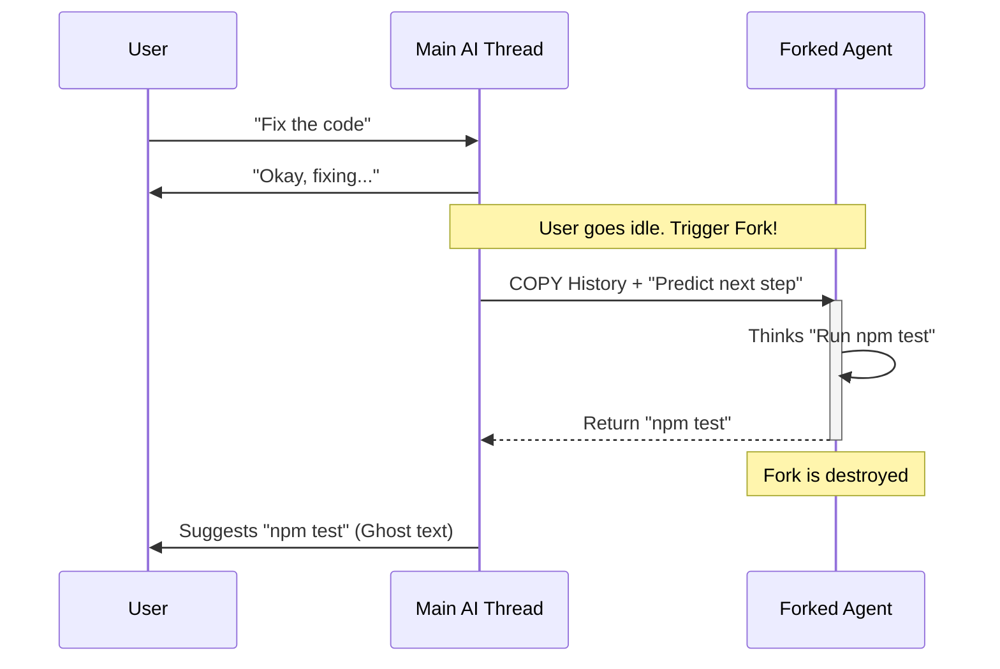

# Chapter 3: Forked Agent Execution

Welcome to Chapter 3!

In the previous chapter, [Speculative Execution](02_speculative_execution.md), we learned how to run commands in the background to save the user time. We compared it to a "Speculative Chef" cooking a meal before you even order it.

But this raises a technical problem. If the AI starts "cooking" in the background, won't that clutter up your conversation history? If the AI thinks, "I should run `npm test`," we don't want that thought to appear in your main chat window unless you actually ask for it.

To solve this, we use **Forked Agent Execution**.

### The Motivation: The "Parallel Universe"

Imagine you are having a conversation with the AI about fixing a bug.
**Main Thread:**
> **You:** "There is a bug in `login.ts`."
> **AI:** "I see. I will investigate."

Now, we want the AI to secretly think about what to do next.

If we just asked the main AI, "What is your next move?", the chat history would look like this:
> **You:** "There is a bug in `login.ts`."
> **AI:** "I see. I will investigate."
> **System (Hidden):** "What will you do next?"
> **AI:** "I will run the tests."

This messes up the history. The AI is now distracted by the system's question.

**The Solution: A Fork.**
We create a "Shadow Clone" of the AI. It possesses all the memories of the main conversation up to this exact second. We spin it off into a parallel universe, ask it a question, get the answer, and then **delete the universe**.

The main AI never knows it happened.

### Key Concepts

1.  **Shared History:** The fork starts with an exact copy of the `messages` array from the main chat. It knows everything the main AI knows.
2.  **Isolation:** Actions taken by the fork (like thinking or generating text) are **not** saved to the user's visible transcript.
3.  **Cache Piggybacking:** This is a performance trick. Since the Fork shares the same history as the Main AI, we can re-use the "cached" memory on the server. This makes the Fork extremely fast and cheap to start.

### The Flow: Visualizing the Fork

Let's see how the main thread and the fork interact.



### Implementing the Fork

The core of this feature is a utility function called `runForkedAgent`. Let's look at how to use it in `promptSuggestion.ts`.

#### 1. Preparing the Prompt
First, we need to decide what to ask the Fork. In our case, we want it to predict user intent.

```typescript
// promptSuggestion.ts

// We create a "User Message" that the user didn't actually type.
// This is the instruction for our Shadow Clone.
const promptMessage = createUserMessage({ 
  content: "Predict what the user will type next." 
});
```

#### 2. The Cache Safety Dance
To make the Fork fast, we must look *exactly* like the main thread to the API. If we change parameters (like the "Temperature" or "Model"), the API treats it as a new conversation and re-processes everything (slow!).

We helper functions to copy these settings.

```typescript
// promptSuggestion.ts

// Copy the exact settings from the main context
// This ensures we hit the API cache ("Cache Hit")
const cacheSafeParams = createCacheSafeParams(context);
```

#### 3. Running the Fork
Now we call the function. Notice the `skipTranscript: true` flag. This is the magic switch that keeps the main chat clean.

```typescript
// promptSuggestion.ts

const result = await runForkedAgent({
  // 1. Pass the prompt we created
  promptMessages: [promptMessage],
  
  // 2. Ensure we use the cached context
  cacheSafeParams, 
  
  // 3. IMPORTANT: Do not save this to the database/UI
  skipTranscript: true, 

  // 4. Tools? Ideally, we deny tools for simple text suggestions
  canUseTool: async () => ({ behavior: 'deny' })
});
```
**Explanation:**
When `skipTranscript` is true, the system runs the LLM query but bypasses the code that writes to `transcript.json` (the file that stores your chat history).

#### 4. Extracting the Result
The `result` object contains the messages the Fork generated. We just need to grab the text.

```typescript
// promptSuggestion.ts

// Find the first message where the assistant spoke
const assistantMsg = result.messages.find(m => m.type === 'assistant');

// Extract the text
const suggestion = assistantMsg?.textBlock?.text.trim();

console.log("The Fork suggests:", suggestion);
```

### Advanced: Forking with Tools (Speculation)

In [Speculative Execution](02_speculative_execution.md), we learned that the AI can also *run commands* in the background.

The `runForkedAgent` function handles this too. We just change the `canUseTool` permission.

```typescript
// speculation.ts

await runForkedAgent({
  promptMessages: [createUserMessage({ content: "npm test" })],
  skipTranscript: true,

  // Allow the Fork to use tools!
  canUseTool: async (tool, input) => {
    if (tool.name === 'Bash') {
      return { behavior: 'allow' };
    }
    return { behavior: 'deny' };
  }
});
```
**Explanation:**
Here, the Shadow Clone isn't just thinking; it's acting. It runs `Bash` commands. Because `skipTranscript` is true, the user doesn't see the command output... yet.

### Why "Cache Safe" Matters

You might wonder why we emphasized `createCacheSafeParams`.

LLM APIs often charge by the "token" (word).
1.  **Main Thread:** Sends 10,000 words of history. (Expensive)
2.  **Fork:** Sends the *same* 10,000 words + 1 question.

If the 10,000 words are identical to the byte, the API says, "I remember this!" and processes it instantly and cheaply (using the Context Cache).

If we change *anything*—even a small setting like `max_tokens`—the API treats it as new data, costing time and money. The `PromptSuggestion` engine is designed to be invisible and free-feeling, so hitting this cache is critical.

### Summary

**Forked Agent Execution** allows us to:
1.  Spin off a "Shadow Clone" of the AI.
2.  Ask it questions or run tasks in parallel.
3.  Keep the main conversation history clean (`skipTranscript: true`).
4.  Stay fast by reusing the main thread's API cache.

### What's Next?

We have a Forked Agent running in a parallel universe. It can run commands. But... what if it runs `rm -rf /`? Even if the *history* is isolated, the *file system* is shared! The Shadow Clone could accidentally delete your real files.

We need to protect the user's hard drive from our speculative ghosts.

[Next Chapter: Overlay Filesystem (Isolation)](04_overlay_filesystem__isolation_.md)

---

Generated by [Code IQ](https://github.com/adityasoni99/Code-IQ)