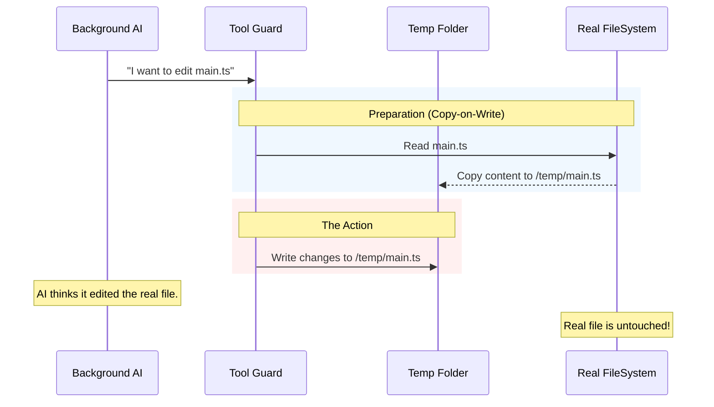

# Chapter 4: Overlay Filesystem (Isolation)

Welcome to Chapter 4!

In the previous chapter, [Forked Agent Execution](03_forked_agent_execution.md), we learned how to create a "Shadow Clone" of the AI to think in a parallel universe. This keeps your chat history clean.

However, a "Shadow Clone" can still do real damage. If the background AI decides to run `fs.writeFileSync('main.ts', 'garbage')`, it ruins your actual code! Even if the *chat* is hidden, the *file system* is shared.

We need a way to let the AI write files without actually changing anything until you say "Yes." We call this the **Overlay Filesystem**.

### The Motivation: The "Plastic Sheet" Analogy

Imagine your project code is a beautiful, expensive oil painting. You want the AI to suggest changes, but you don't want it to paint directly on the canvas in case it makes a mistake.

**The Solution:**
We place a clear **plastic sheet** (the Overlay) over your painting.
1.  The AI paints on the plastic sheet.
2.  To the AI, it looks like it's modifying the real painting.
3.  To you, the original painting is untouched.
4.  **If you like it:** We press the sheet down and transfer the paint (merge).
5.  **If you hate it:** We crumple up the sheet and throw it away (delete temp folder).

### Key Concepts

1.  **Redirected Writes:** When the AI tries to write a file, we secretly change the destination to a temporary folder.
2.  **Virtual Reads:** When the AI tries to read a file, we check the temporary folder first. If it's not there, we read the real file.
3.  **Copy-on-Write:** If the AI wants to *edit* an existing file, we copy the real file to the temporary folder first, then let the AI edit the copy.

---

### How It Works: The Flow

Let's visualize how the system intercepts the AI's attempt to edit a file.



### Implementing the Overlay

We implement this logic inside the `speculation.ts` file. It acts as a middleware between the AI and the hard drive.

#### 1. Creating the Sandbox
Every time we start a speculation, we create a unique, disposable directory.

```typescript
// speculation.ts

// 1. Generate a unique ID for this guess
const id = randomUUID().slice(0, 8);

// 2. Define where the "plastic sheet" lives
const overlayPath = join(tempDir, 'speculation', id);

// 3. Create the folder
await mkdir(overlayPath, { recursive: true });
```
**Explanation:**
This creates a folder like `/tmp/speculation/a1b2c3d4`. This is our sandbox. All "dangerous" writes will go here.

#### 2. Intercepting Writes (The Guard)
We use the `canUseTool` callback (introduced in Chapter 3) to intercept tool calls. If the AI uses a "Write" tool, we change the file path.

```typescript
// speculation.ts

// Inside runForkedAgent...
canUseTool: async (tool, input) => {
  if (isWriteTool(tool.name)) {
    // 1. Get the path the AI *wants* to write to
    const originalPath = input.file_path; 
    
    // 2. Calculate the path inside our temp folder
    const safePath = join(overlayPath, originalPath);

    // 3. Rewrite the input!
    input.file_path = safePath;
    
    // 4. Track that we touched this file
    writtenPaths.add(originalPath);
  }
  return { behavior: 'allow', updatedInput: input };
}
```
**Explanation:**
The AI says: "Write to `src/index.js`".
We secretly change it to: "Write to `/tmp/speculation/a1b2/src/index.js`".
The AI is happy because the write succeeds. We are happy because `src/index.js` is safe.

#### 3. Handling Reads (The Illusion)
If the AI writes a file, it expects to be able to read it back. We must ensure consistency.

```typescript
// speculation.ts

if (isReadTool(tool.name)) {
  const originalPath = input.file_path;

  // Have we written to this file in the overlay?
  if (writtenPaths.has(originalPath)) {
    // Yes! Read from the overlay to see the latest changes
    input.file_path = join(overlayPath, originalPath);
  } else {
    // No. Read from the real disk.
    // (Do nothing, let the tool run normally)
  }
}
```
**Explanation:**
This creates a seamless illusion. If the AI creates a new file in the sandbox, and then tries to `cat` it, we redirect the `cat` to the sandbox.

#### 4. Copy-on-Write Strategy
What if the AI wants to *append* to a file? It needs the original content first.

```typescript
// speculation.ts

if (isWriteTool(tool.name) && !writtenPaths.has(relPath)) {
  // The file is being touched for the first time in this session.
  
  // Copy the REAL file to the OVERLAY folder
  await copyFile(
    join(realCwd, relPath), 
    join(overlayPath, relPath)
  );

  writtenPaths.add(relPath);
}
```
**Explanation:**
Before we let the AI edit `main.ts` in the sandbox, we clone the real `main.ts` into the sandbox. The AI then edits the clone.

### The "Commit": Accepting the Suggestion

If the user presses `Tab` to accept the suggestion, we must make the changes real. We take the "plastic sheet" and merge it.

```typescript
// speculation.ts

async function copyOverlayToMain(overlayPath, writtenPaths, realCwd) {
  // Loop through every file the AI touched
  for (const file of writtenPaths) {
    const src = join(overlayPath, file);
    const dest = join(realCwd, file);

    // Move the file from temp to real
    await mkdir(dirname(dest), { recursive: true });
    await copyFile(src, dest);
  }
}
```
**Explanation:**
This is the moment of truth. We physically overwrite the user's files with the versions from the temporary folder. Because the user explicitly accepted the suggestion, this is safe.

### Cleaning Up

Whether the user accepts or rejects the suggestion, the temporary folder is no longer needed.

```typescript
// speculation.ts

function safeRemoveOverlay(overlayPath) {
  // Force delete the directory and everything in it
  rm(overlayPath, { recursive: true, force: true }, () => {});
}
```

### Safety: Preventing Escapes

A clever (or confused) AI might try to write to `../../secret.txt`. We must prevent it from leaving the sandbox.

```typescript
// speculation.ts

const rel = relative(cwd, input.file_path);

// Check if path starts with ".." (goes up a directory)
if (isAbsolute(rel) || rel.startsWith('..')) {
    return denySpeculation(
      "Write outside current working directory not allowed!"
    );
}
```
**Explanation:**
We strictly enforce that the AI can only modify files inside the current project folder. If it tries to go outside, we abort the speculation immediately.

### Summary

The **Overlay Filesystem** provides a safe sandbox for the AI.
1.  We create a temporary folder.
2.  We **intercept** all write commands and redirect them there.
3.  We **copy** real files to the temp folder as needed (Copy-on-Write).
4.  If the user accepts, we **merge** the changes back.

This allows us to run complex coding tasks in the background without risking the user's data.

### What's Next?

We have secured the file system. But what if the AI tries to run a command that never stops? Or tries to download the internet? Or tries to delete a database?

File isolation isn't enough. We need strict rules about *when to stop*.

[Next Chapter: Completion Boundaries](05_completion_boundaries.md)

---

Generated by [Code IQ](https://github.com/adityasoni99/Code-IQ)