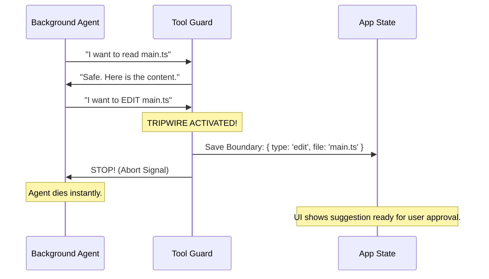

# Chapter 5: Completion Boundaries

Welcome to Chapter 5!

In the previous chapter, [Overlay Filesystem (Isolation)](04_overlay_filesystem__isolation_.md), we learned how to let the AI write to files safely by giving it a "plastic sheet" (a temporary folder) to paint on.

But protecting files isn't enough. What if the AI tries to:
*   Run a command that deletes a database?
*   Send your API keys to a random server?
*   Edit a file when your settings require you to "Approve" every edit manually?

We need a way to **freeze** the AI the moment it tries to do something that requires your permission. We call this a **Completion Boundary**.

### The Motivation: The "Self-Driving Car" Analogy

Imagine a self-driving car.
1.  **Prompt Suggestion:** The car guesses where you want to go.
2.  **Speculation:** It starts driving there automatically.
3.  **Isolation:** It stays in its lane.

**The Boundary:**
Suddenly, the car approaches a **security checkpoint**. The car cannot drive through it automatically. It **stops** immediately and waits for the driver (you) to show your ID card.

In our system:
*   **The Car** is the Background Agent.
*   **The Checkpoint** is a "Risky Action" (like a file edit or bash command).
*   **The Stop** is the Completion Boundary.

If the background agent hits a boundary, it pauses execution and says, *"I have done everything up to this point. I am waiting for you to press Accept to cross the checkpoint."*

### Key Concepts

1.  **The Tripwire:** We monitor every tool the AI tries to use.
2.  **Safe Tools (Green):** Tools like "Read File" or "Search" are safe. The AI can keep going.
3.  **Boundary Tools (Red/Yellow):** Tools like "Edit File" or "Run Bash" are tripwires. They trigger an immediate stop.
4.  **The Freeze:** When a tripwire is hit, we save the exact state (the command or edit it *wanted* to do) and abort the background process.

### The Flow: Hitting the Wall

Let's visualize the moment the AI hits a boundary.



### Implementing Boundaries

The logic for boundaries lives inside the `canUseTool` callback in `speculation.ts`. We check the tool name and decide whether to let it pass or stop it.

#### 1. Defining the Tripwires
We categorize tools into safe and unsafe.

```typescript
// speculation.ts

const SAFE_TOOLS = new Set(['Read', 'Grep', 'LSP']);
const BOUNDARY_TOOLS = new Set(['Edit', 'Write', 'Bash']);
```

#### 2. The Bash Boundary
Bash commands are dangerous. If the AI tries to run `rm -rf`, we must stop it. The AI doesn't actually run the command; it just *prepares* it.

```typescript
// speculation.ts

if (tool.name === 'Bash') {
  // 1. Save the command the AI WANTED to run
  setAppState(prev => ({
    boundary: { 
      type: 'bash', 
      command: input.command 
    }
  }));

  // 2. Pull the emergency brake
  abortController.abort();
  
  // 3. Tell the system why we stopped
  return denySpeculation("Stopped at Bash Boundary");
}
```
**Explanation:**
When the AI says "Run `npm test`", we record "`npm test`" as the boundary and kill the process. When the user eventually accepts the suggestion, the system sees the boundary and puts `npm test` into the user's terminal.

#### 3. The "Permission" Boundary (Edits)
Sometimes, whether an action is a boundary depends on the user's settings. If the user is in "Auto-Approve" mode, maybe we let the edit happen (into the Overlay). If they are in "Ask Me" mode, we must stop.

```typescript
// speculation.ts

if (tool.name === 'Edit') {
  // Check user settings
  const canAutoAccept = appState.mode === 'auto_approve';

  if (!canAutoAccept) {
    // STOP! User wants to approve edits manually.
    setAppState(prev => ({
      boundary: { type: 'edit', file: input.file_path }
    }));
    
    abortController.abort();
    return denySpeculation("Stopped: Edit requires permission");
  }
  
  // If we are here, we are allowed to continue (into the Overlay)
}
```
**Explanation:**
This makes the system respectful. It does as much work as it is allowed to do, then stops exactly where human oversight is required.

#### 4. Handling "Unknown" Tools
If the AI tries to use a tool we don't recognize (maybe a new plugin), we treat it as a boundary by default for safety.

```typescript
// speculation.ts

// Default fallback for unknown tools
setAppState(prev => ({
  boundary: { 
    type: 'denied_tool', 
    toolName: tool.name 
  }
}));

abortController.abort();
return denySpeculation("Unknown tool boundary");
```

### Resuming from a Boundary

When the user finally accepts the suggestion (presses `Tab`), we look at the saved boundary to decide what to do.

1.  **If Boundary was 'Bash':** The system types the command into the terminal for the user.
2.  **If Boundary was 'Edit':** The system presents the file diff UI so the user can review and click "Save".
3.  **If Boundary was 'Complete':** (No boundary hit) The system just shows the results because the work is already done.

### Summary

**Completion Boundaries** act as the "Dead Man's Switch" for the speculation engine.

1.  We classify tools as **Safe** or **Boundary**.
2.  We **monitor** every tool call in the background.
3.  If a Boundary tool is called, we **freeze** the state and **abort** the agent.
4.  This ensures the AI never performs irreversible or sensitive actions without the user implicitly accepting them by pressing `Tab`.

### What's Next?

We have a powerful engine now. It predicts, it runs in the background, it isolates files, and it stops at safety boundaries.

But sometimes, the AI is just... wrong. Or chatty. Or hallucinates. We need a way to filter out "junk" suggestions before they ever flicker onto the user's screen.

[Next Chapter: Heuristic Filtering & Suppression](06_heuristic_filtering___suppression.md)

---

Generated by [Code IQ](https://github.com/adityasoni99/Code-IQ)