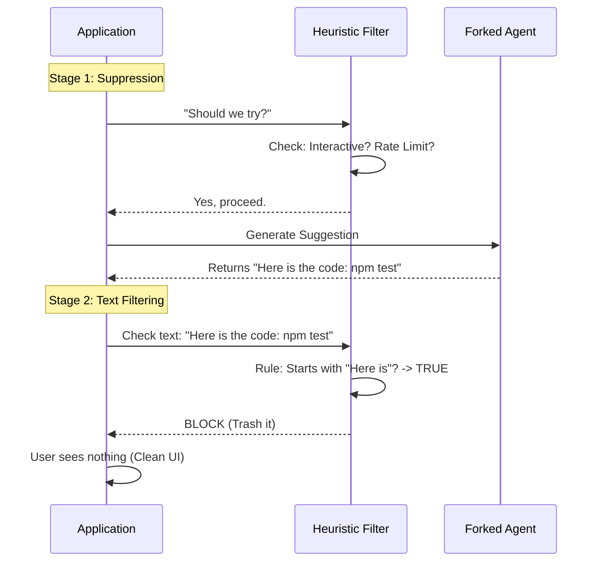

# Chapter 6: Heuristic Filtering & Suppression

Welcome to the final chapter of our tutorial series!

In the previous chapter, [Completion Boundaries](05_completion_boundaries.md), we built a safety system to stop the AI from performing dangerous actions (like deleting files) without your permission.

However, safety isn't just about preventing dangerous *actions*; it's also about preventing annoying *noise*.

The AI is a chatty entity. If we ask it to "predict the next command," it might reply with:
> *"I think you should run `npm test`. Would you like me to do that?"*

If we put that entire sentence into the user's command line, it would break their terminal. We want just:
> `npm test`

**Heuristic Filtering & Suppression** is the quality control layer. It acts like a spam filter for the AI's internal thoughts, ensuring only high-quality, executable commands reach the user's screen.

### The Problem: The "Chatty" Assistant

Imagine you are focused on writing code. You want a tool that quietly hands you the screwdriver when you need it.

Instead, the tool yells: **"HERE IS A SCREWDRIVER! IT IS A PHILLIPS HEAD! I HOPE THIS HELPS!"**

This breaks your flow. In **PromptSuggestion**, a "bad" suggestion isn't just one that is wrong; it is one that is formatted like a conversation.

We need to filter out:
1.  **Conversational filler:** "Here is the command..."
2.  **Hallucinated errors:** "API Error: Timeout" (The AI might read a log and repeat it).
3.  **Refusals:** "I cannot do that."
4.  **Meta-commentary:** "Silence."

### Key Concepts

1.  **Suppression:** Deciding *not* to generate a suggestion at all (e.g., if the user is not in an interactive terminal).
2.  **Filtering:** Letting the AI generate a suggestion, examining the text, and throwing it away if it looks like garbage.
3.  **Heuristics:** Simple "Rules of Thumb" (like "if it's longer than 12 words, it's not a command") used to judge quality fast.

---

### How It Works: The Flow

The filtering process happens in two stages: **Pre-Generation** (checking the environment) and **Post-Generation** (checking the text).



### Implementing Suppression (Stage 1)

Before we even wake up the AI, we check if we should bother. This saves money and computing power.

We check these conditions in `promptSuggestion.ts`.

#### 1. The Environment Check
We shouldn't offer suggestions if the user is running a script or if the AI is "busy" waiting for a different permission.

```typescript
// promptSuggestion.ts

export function getSuggestionSuppressReason(appState) {
  // 1. Is the feature turned off?
  if (!appState.promptSuggestionEnabled) return 'disabled';

  // 2. Is the AI currently waiting for the user to approve a file edit?
  if (appState.pendingWorkerRequest) return 'pending_permission';

  // 3. Are we out of API credits?
  if (currentLimits.status !== 'allowed') return 'rate_limit';

  return null; // No reason to suppress! Go ahead.
}
```
**Explanation:**
This function returns `null` if everything is good. If it returns a string (like `'rate_limit'`), we stop immediately. This prevents the system from annoying the user when it can't actually help.

### Implementing Text Filtering (Stage 2)

If we pass Stage 1, the AI generates a string. Now we must inspect it. The AI might output garbage even with a perfect prompt.

We use a series of **Heuristic Rules** defined in `shouldFilterSuggestion`.

#### 1. The "Too Long" Rule
Commands are usually short. If the AI outputs a paragraph, it's talking, not suggesting.

```typescript
// promptSuggestion.ts

// A simple heuristic: Users rarely type commands longer than 12 words.
const wordCount = suggestion.trim().split(/\s+/).length;

if (wordCount > 12) {
  return true; // Filter this out!
}
```

#### 2. The "Claude Voice" Rule
Large Language Models love to be polite. They often start sentences with "I think" or "Here is". We use **Regular Expressions (Regex)** to catch these patterns.

```typescript
// promptSuggestion.ts

// Common phrases AI uses when it forgets it's a CLI tool
const claudeVoiceRegex = /^(let me|i'll|i'm|i think|here's|you should)/i;

if (claudeVoiceRegex.test(suggestion)) {
  logSuggestionSuppressed('claude_voice', suggestion);
  return true; // Filter this out!
}
```
**Explanation:**
If the suggestion is "I think you should run git status", this regex matches "I think". We catch it and block it. The user sees nothing.

#### 3. The "Meta" Rule (Silence)
Sometimes, we tell the AI: *"If you don't know what to do, say nothing."*
However, the AI might literally output the word: `"Nothing"`.

```typescript
// promptSuggestion.ts

const lower = suggestion.toLowerCase();

// Did the AI literally say it has no suggestion?
if (lower === 'nothing found' || lower === 'silence') {
  return true; 
}
```

### The Filter Engine

To keep our code clean, we organize these rules into a list of checks. We loop through them, and if *any* rule says "Bad," we toss the suggestion.

```typescript
// promptSuggestion.ts

export function shouldFilterSuggestion(suggestion) {
  // Define our list of police officers
  const filters = [
    ['too_many_words', () => suggestion.split(' ').length > 12],
    ['claude_voice',   () => /^(here is|let me)/i.test(suggestion)],
    ['error_message',  () => suggestion.includes('api error')],
    ['evaluative',     () => /^(looks good|thanks)/i.test(suggestion)]
  ];

  // Run the gauntlet
  for (const [reason, check] of filters) {
    if (check()) {
      // Log why we killed it (for analytics)
      logSuggestionSuppressed(reason, suggestion);
      return true; // STOP!
    }
  }

  return false; // The suggestion is clean!
}
```
**Explanation:**
This design makes it easy to add new rules. If we notice the AI starting to say "Alakazam!" before every command, we just add a new `['magic_words', ...]` rule to the list.

### Putting It All Together

Here is how the main engine uses these filters. This logic resides in the `tryGenerateSuggestion` function.

```typescript
// promptSuggestion.ts

export async function tryGenerateSuggestion(...) {
  // STAGE 1: Suppression
  const suppressReason = getSuggestionSuppressReason(appState);
  if (suppressReason) return null;

  // Generate the text (using Forked Agent from Chapter 3)
  const { suggestion } = await generateSuggestion(...);

  // STAGE 2: Filtering
  if (shouldFilterSuggestion(suggestion)) {
    return null; // It was garbage, hide it.
  }

  // If we survived all that, show it to the user!
  return { suggestion };
}
```

### Why Analytics Matter

You might notice `logSuggestionSuppressed` in the code. We don't just delete bad suggestions; we record *why* they were bad.

If we see that 50% of suggestions are being filtered because of "too_many_words," that tells us we need to improve our System Prompt (Chapter 1) to tell the AI to be more concise.

### Conclusion

Congratulations! You have completed the **PromptSuggestion** tutorial series.

We have built a system that:
1.  **Anticipates** user intent using a [Prompt Suggestion Engine](01_prompt_suggestion_engine.md).
2.  **Runs ahead** to prepare results using [Speculative Execution](02_speculative_execution.md).
3.  **Thinks in parallel** using [Forked Agent Execution](03_forked_agent_execution.md).
4.  **Protects files** using an [Overlay Filesystem](04_overlay_filesystem__isolation_.md).
5.  **Respects safety** using [Completion Boundaries](05_completion_boundaries.md).
6.  **Filters noise** using **Heuristic Filtering** (this chapter).

By combining these abstractions, we create an AI interface that feels magical: it's fast, safe, helpful, and stays out of your way until you need it.

Happy coding!

---

Generated by [Code IQ](https://github.com/adityasoni99/Code-IQ)