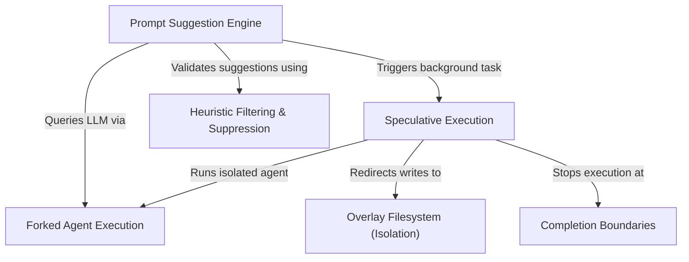

# Tutorial: PromptSuggestion

This project implements an intelligent **Prompt Suggestion Engine** that acts like an advanced autocomplete for user intent, predicting the next likely command. It utilizes *Speculative Execution* to pro-actively run these predictions in the background, allowing for instant results if accepted. To ensure safety and cleanliness, these background tasks operate within a **Forked Agent** using a temporary *Overlay Filesystem*, ensuring the main conversation and actual files remain untouched until the user explicitly commits to the suggestion.

## Chapters

1. [Prompt Suggestion Engine](01_prompt_suggestion_engine.md)
2. [Speculative Execution](02_speculative_execution.md)
3. [Forked Agent Execution](03_forked_agent_execution.md)
4. [Overlay Filesystem (Isolation)](04_overlay_filesystem__isolation_.md)
5. [Completion Boundaries](05_completion_boundaries.md)
6. [Heuristic Filtering & Suppression](06_heuristic_filtering___suppression.md)

---

Generated by [Code IQ](https://github.com/adityasoni99/Code-IQ)