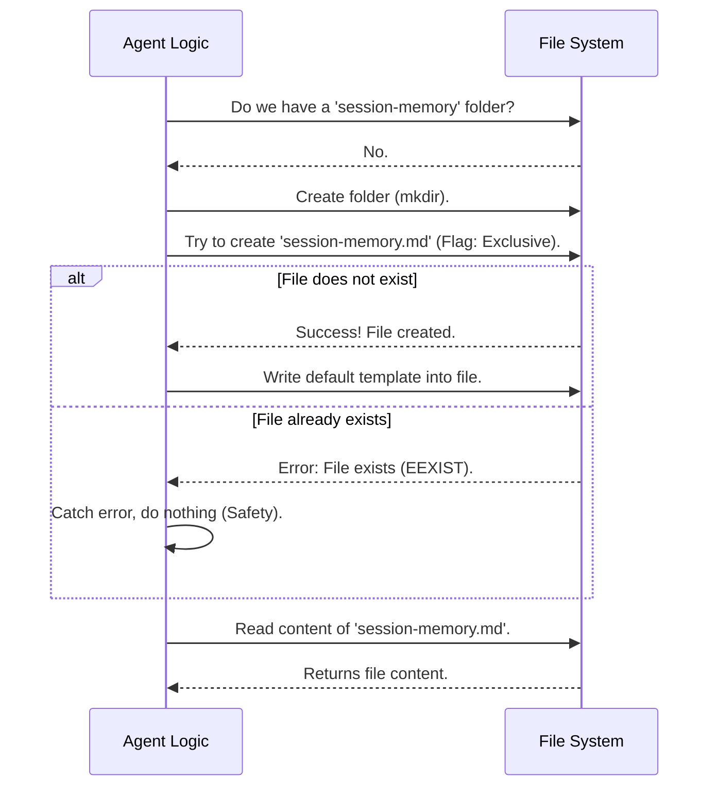

# Chapter 1: Memory File Lifecycle

Welcome to the first chapter of the **SessionMemory** project tutorial!

Before we can teach our AI to remember conversations, we need a physical place to store those memories. In this chapter, we will build the **Memory File Lifecycle**.

Think of this system as the **Librarian**. The Librarian's job is simple but critical: ensure the "History Book" exists on the shelf. If the book is missing, the Librarian buys a new one and puts it there. If the book exists, the Librarian opens it so we can read the pages.

### The Problem
When an AI agent starts a conversation, its "brain" (context window) is temporary. If the application crashes or restarts, that memory is gone. We need a persistent file on the hard drive—a markdown file called `session-memory.md`—to act as long-term storage.

### The Central Use Case
Imagine a user starts the application for the very first time.
1. The system looks for `session-memory.md`.
2. It realizes the file **does not exist**.
3. It creates the folder, creates the file, and pastes a blank template into it.
4. It reads the empty template back to the system, ready for the first note.

---

## Key Concepts

### 1. The Shelf (The Directory)
Before we can have a file, we need a folder. We can't just throw a book on the floor! We need to check if the directory exists, and if not, build it.

### 2. The Atomic Creation (The "wx" Flag)
This is a fancy term for a simple safety measure. When we try to create the memory file, we use a specific rule: **"Create this file ONLY if it doesn't exist yet."**

If two parts of the program try to create the file at the exact same time, this rule prevents them from overwriting each other.

### 3. Graceful Recovery
Sometimes, the file is already there (e.g., from a previous session). If we try to create it and fail, the system shouldn't crash. It should say, "Oh, the book is already on the shelf? Great! I'll just open it."

---

## High-Level Flow

Here is what happens when the Librarian (our Lifecycle logic) wakes up.



---

## Implementation Details

Let's look at how we implement this in `sessionMemory.ts`. We will break down the `setupSessionMemoryFile` function.

### Step 1: Preparing the Directory
First, we get access to the file system and ensure the directory exists.

```typescript
// Inside setupSessionMemoryFile
const fs = getFsImplementation()
const sessionMemoryDir = getSessionMemoryDir()

// Try to make the directory. 
// mode: 0o700 means only the owner can read/write/execute.
await fs.mkdir(sessionMemoryDir, { mode: 0o700 })
```
* **Explanation:** We ask for the standard file system tools. We define where the memory should live, and `mkdir` creates that folder.

### Step 2: Safe File Creation
Now we try to create the file. We use the flag `'wx'`. 
* `w`: Write.
* `x`: Exclusive (fail if path exists).

```typescript
const memoryPath = getSessionMemoryPath()

try {
  // Create file ONLY if it doesn't exist
  await writeFile(memoryPath, '', {
    encoding: 'utf-8',
    mode: 0o600, // Read/Write for owner only
    flag: 'wx',  // <--- The magic safety flag
  })
```
* **Explanation:** We attempt to write an empty string to the file path. If the file exists, this specific line will throw an error immediately.

### Step 3: Writing the Template
If the previous step succeeded (no error occurred), it means we just created a brand new file. We should fill it with a template.

```typescript
  // If we are here, the file is brand new!
  const template = await loadSessionMemoryTemplate()
  
  await writeFile(memoryPath, template, {
    encoding: 'utf-8',
    mode: 0o600,
  })
} // End of try block
```
* **Explanation:** We load a default header (like `# Session Memory`) and write it to our new file.

### Step 4: Handling "File Exists" Errors
If Step 2 failed because the file was already there, we catch the error.

```typescript
catch (e: unknown) {
  const code = getErrnoCode(e)
  
  // If the error is "EEXIST", that's actually good news!
  // It means our memory is safe on disk.
  if (code !== 'EEXIST') {
    throw e // If it's a different error (like permission denied), crash.
  }
}
```
* **Explanation:** We check the error code. `EEXIST` means "Error: Exist". We ignore this specific error because our goal (ensuring the file exists) has been met.

### Step 5: Reading the Content
Finally, whether we just created the file or found an existing one, we read it so the agent knows what is currently stored.

```typescript
// Clear any old cache so we get fresh data
toolUseContext.readFileState.delete(memoryPath)

// Use the FileReadTool to safely read the content
const result = await FileReadTool.call(
  { file_path: memoryPath },
  toolUseContext,
)
// Result now contains the text of our memory file!
```
* **Explanation:** We use the `FileReadTool` (a helper that mimics how the AI reads files) to pull the text content into a variable called `currentMemory`.

---

## Conclusion

Congratulations! You have built the foundation of the memory system. 
1. We have a **Directory**.
2. We have a **File** (created safely with a template).
3. We have the **Content** loaded into our application.

The Librarian has done their job. The book is open and ready. But... **when** do we write in it? We can't just write after every single word the user types; that would be inefficient.

In the next chapter, we will learn how to "hook" into the conversation flow to decide when it's time to update our memory.

[Next Chapter: Post-Sampling Extraction Hook](02_post_sampling_extraction_hook.md)

---

Generated by [Code IQ](https://github.com/adityasoni99/Code-IQ)