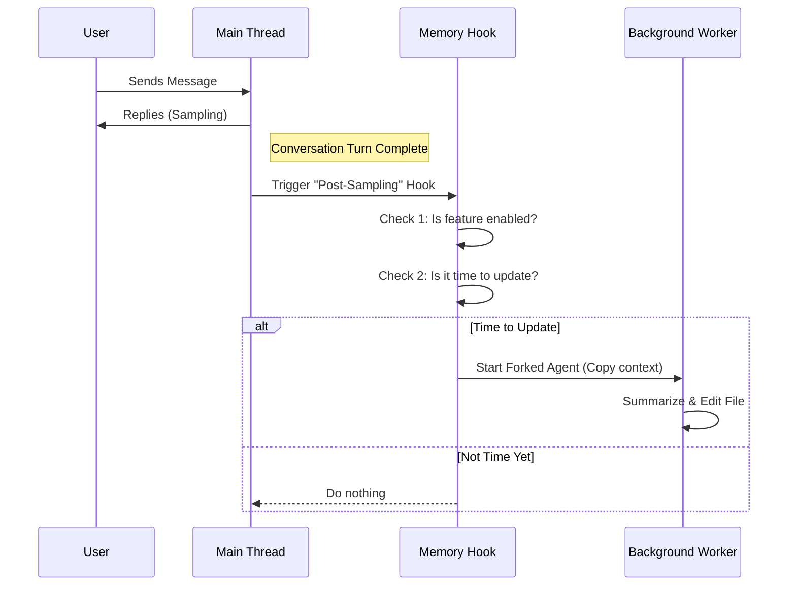

# Chapter 2: Post-Sampling Extraction Hook

Welcome back! In the previous chapter, [Memory File Lifecycle](01_memory_file_lifecycle.md), we built the "History Book" (the file) and the "Librarian" (the system to create it).

But right now, our Librarian is just standing there holding an empty book. We need a system that automatically decides **when** to write in it. We can't pause the conversation every time the user says "Hello" just to update our notes—that would make the AI feel slow and clunky.

In this chapter, we will build the **Post-Sampling Extraction Hook**.

### The Central Use Case

Imagine the user and the AI are deep in conversation.
1. The AI finishes generating a long, complex response (this process is called "sampling").
2. The user starts reading the response.
3. **Silently, in the background**, the system wakes up.
4. It asks, "Has enough happened to justify updating the memory?"
5. If yes, it spawns a separate worker to read the conversation and update the `session-memory.md` file without slowing down the user.

---

## The Analogy: The Court Stenographer

Think of your main AI agent as a **Lawyer** arguing a case. They are busy talking, listening, and thinking. They cannot stop to write detailed official records.

The **Post-Sampling Extraction Hook** is the **Court Stenographer**.
* They sit quietly in the corner.
* They wait for the Lawyer to finish speaking (Post-Sampling).
* When there is a pause, they quickly type up the official record (Extraction).
* The Lawyer doesn't stop working while the Stenographer types.

---

## Key Concepts

### 1. The "Hook"
In programming, a "hook" is a spot in the code where we can hang a custom function to run automatically. "Post-Sampling" means "After the model has finished generating text."

### 2. The Main Thread vs. Background
We want the user to keep chatting. If we ran the memory update on the **Main Thread**, the user would see a loading spinner while the AI summarizes the chat. That's bad UX.

Instead, we use this hook to trigger a background process. The Main Thread handles the user; the background handles the memory.

### 3. The Gatekeeper
The hook runs after *every* message. That's too often! We need a series of checks (Gatekeepers) to say "No, not yet" or "Yes, do it now."

---

## High-Level Flow

Here is how the Stenographer decides when to work.



---

## Implementation Details

The implementation lives in `sessionMemory.ts`. It acts as the controller that ties everything together.

### Step 1: Registering the Hook

First, we need to tell the application to run our code after every message. We do this during initialization.

```typescript
// Inside initSessionMemory()

// 1. Check if the overall feature is allowed (e.g., config settings)
const autoCompactEnabled = isAutoCompactEnabled()
if (!autoCompactEnabled) {
  return
}

// 2. Register our function 'extractSessionMemory' to run after sampling
registerPostSamplingHook(extractSessionMemory)
```
* **Explanation:** We check a global setting. If allowed, we use `registerPostSamplingHook`. Now, whenever the AI finishes talking, `extractSessionMemory` will be called.

### Step 2: The Hook Controller

Now let's look at `extractSessionMemory`. This is the brain of the operation. It runs sequentially (one at a time) to prevent race conditions.

```typescript
const extractSessionMemory = sequential(async function (
  context: REPLHookContext,
): Promise<void> {
  const { messages, toolUseContext, querySource } = context

  // Safety Check: Only run on the main conversation thread.
  // We don't want background workers triggering *more* background workers!
  if (querySource !== 'repl_main_thread') {
    return
  }
```
* **Explanation:** We get the context (the conversation history). We immediately check `querySource`. If this hook was triggered by a sub-agent (a background worker), we ignore it. We only care about the main user conversation.

### Step 3: The Logic Gate

Next, we check if we should actually perform an update.

```typescript
  // Check if feature flags allow this
  if (!isSessionMemoryGateEnabled()) {
    return
  }

  // Check if we have enough new tokens/messages to justify an update
  if (!shouldExtractMemory(messages)) {
    return
  }
```
* **Explanation:** `shouldExtractMemory` is a crucial function involving token counting and thresholds. We will detail exactly how this math works in [Chapter 3: Update Threshold Logic](03_update_threshold_logic.md). For now, just know it returns `true` if it's time to write.

### Step 4: Preparing the Environment

If the gates open, it's time to work. We need to prepare the file system, reusing the logic we built in [Chapter 1: Memory File Lifecycle](01_memory_file_lifecycle.md).

```typescript
  markExtractionStarted()

  // Create a sub-context so we don't mess up the main thread's data
  const setupContext = createSubagentContext(toolUseContext)

  // Ensure the file exists and get current content
  // (Recall: setupSessionMemoryFile is from Chapter 1)
  const { memoryPath, currentMemory } =
    await setupSessionMemoryFile(setupContext)
```
* **Explanation:** We mark the start of the process (for analytics). We create an isolated context. Then we call `setupSessionMemoryFile` to ensure the "book" is on the shelf and read its current pages.

### Step 5: Dispatching the Worker

Finally, we dispatch the task to a **Forked Agent**. This is a special type of AI instance that runs in isolation.

```typescript
  // Construct the prompt telling the AI what to do
  const userPrompt = await buildSessionMemoryUpdatePrompt(
    currentMemory,
    memoryPath,
  )

  // Run the background worker
  await runForkedAgent({
    promptMessages: [createUserMessage({ content: userPrompt })],
    // We pass cacheSafeParams to share context efficiently
    cacheSafeParams: createCacheSafeParams(context),
    // We only allow the tool that edits the memory file
    canUseTool: createMemoryFileCanUseTool(memoryPath),
  })
```
* **Explanation:**
    1. We build a specific prompt ("Here is the conversation, update the notes...").
    2. We call `runForkedAgent`. This runs the AI summarization logic.
    3. We restrict the tools: this worker is allowed to *only* edit the memory file. It cannot send emails or delete other files.

We will dive deep into how this worker operates in [Chapter 4: Isolated Forked Agent](04_isolated_forked_agent.md).

---

## Conclusion

We have successfully built the **Controller**. 

1. It waits for the conversation to pause (**Post-Sampling Hook**).
2. It checks if it's the right time to act (**Gatekeeper**).
3. It prepares the file system (**Lifecycle**).
4. It hires a temporary worker to do the writing (**Forked Agent**).

However, we glossed over a very specific detail in Step 3: `shouldExtractMemory`. How exactly do we decide if "enough" has happened? If we update too often, we waste money. If we update too rarely, the AI forgets things.

In the next chapter, we will solve this balancing act.

[Next Chapter: Update Threshold Logic](03_update_threshold_logic.md)

---

Generated by [Code IQ](https://github.com/adityasoni99/Code-IQ)