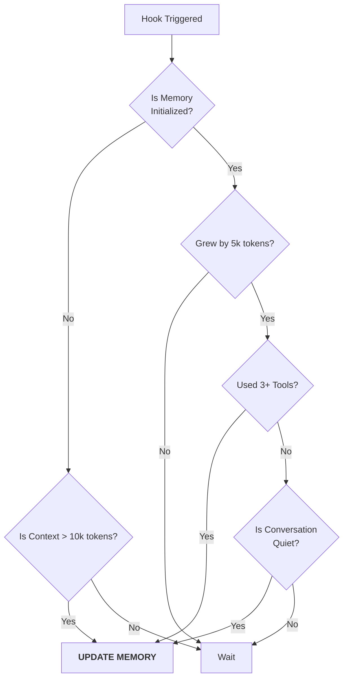

# Chapter 3: Update Threshold Logic

Welcome back! In the previous chapter, [Post-Sampling Extraction Hook](02_post_sampling_extraction_hook.md), we created the "Court Stenographer" (the hook) that wakes up after every message to see if it needs to work.

However, we left one major question unanswered: **How does the Stenographer decide when to type?**

If the AI summarizes the conversation after every single message ("User said hi", "I said hi back"), it wastes electricity, costs money, and creates a messy, repetitive memory file. We need a set of rules—a **Threshold Logic**—to determine when enough "significant" things have happened to justify an update.

In this chapter, we will build the brain of our Stenographer.

### The Central Use Case

Imagine a user is coding with the AI.
1. **Scenario A:** The user says "Cool," and the AI replies "Thanks."
    * **Decision:** **Do Not Update.** This is trivial chatter.
2. **Scenario B:** The user pastes a 500-line error log, and the AI analyzes it using 3 different tools.
    * **Decision:** **Update Immediately.** A lot of information just flowed through the system, and important actions were taken. We need to save this before we forget.

---

## Key Concepts

To make this decision, we look at three specific metrics (counters).

### 1. Token Count (The "Word Count")
A "token" is roughly part of a word. LLMs charge by the token. We track how much the conversation has grown.
* **Logic:** "Has the conversation grown by at least 5,000 tokens since the last time I wrote notes?"

### 2. Tool Usage (The "Action Count")
When an AI uses a tool (like reading a file or running a terminal command), it usually means it's doing "real work."
* **Logic:** "Have I used at least 3 tools since the last update?"

### 3. The "Quiet Moment" (Safety Check)
If the AI is in the middle of a complex chain of thoughts (using a tool right now), we shouldn't interrupt it to write notes. We prefer to update when the AI has finished a thought and is waiting for the user.

---

## High-Level Flow

Here is the decision tree our logic follows.



**The Golden Rule:** We **always** require the token threshold (growth) to be met. Once that is met, we look for either high tool usage OR a quiet moment to perform the update.

---

## Implementation Details

The logic lives in `sessionMemory.ts` and `sessionMemoryUtils.ts`. Let's break down the `shouldExtractMemory` function.

### Step 1: The Initialization Check
When a session starts, we don't want to create a memory file for a conversation that might only be 2 messages long. We wait for a "bulk" of context (e.g., 10,000 tokens) before we create the first entry.

```typescript
// Inside shouldExtractMemory()
const currentTokenCount = tokenCountWithEstimation(messages)

// If we haven't started memory yet...
if (!isSessionMemoryInitialized()) {
  // Check if we hit the "Big Bang" threshold (e.g., 10k tokens)
  if (!hasMetInitializationThreshold(currentTokenCount)) {
    return false // Not yet!
  }
  markSessionMemoryInitialized()
}
```
* **Explanation:** We count the total tokens in the chat. If it's small, we do nothing. If it's big, we mark the system as "Initialized" and proceed.

### Step 2: The Growth Check
Once initialized, we switch to "Incremental Mode." We track how much the conversation has grown since the *last* time we updated.

```typescript
// In sessionMemoryUtils.ts
export function hasMetUpdateThreshold(currentTokenCount: number): boolean {
  // Calculate growth: Current Size - Size At Last Update
  const tokensSinceLastExtraction = 
    currentTokenCount - tokensAtLastExtraction

  // e.g., Return true if we grew by 5,000 tokens
  return tokensSinceLastExtraction >= config.minimumTokensBetweenUpdate
}
```
* **Explanation:** We store `tokensAtLastExtraction` every time we write to the file. This function simply checks the difference.

### Step 3: The Tool Count
We also count how many times the AI used a tool (like `FileRead` or `RunCommand`) since the last update.

```typescript
// Count tools used since the last specific message ID we remembered
const toolCallsSinceLastUpdate = countToolCallsSince(
  messages,
  lastMemoryMessageUuid,
)

// Check against our config (e.g., 3 tools)
const hasMetToolCallThreshold =
  toolCallsSinceLastUpdate >= getToolCallsBetweenUpdates()
```
* **Explanation:** Actions speak louder than words. A short conversation with 20 file edits is more important to remember than a long conversation about the weather.

### Step 4: The Final Decision Matrix
Now we combine these factors. This is the most critical logic in the system.

```typescript
// Check if the AI just finished using a tool in the very last message
const hasToolCallsInLastTurn = hasToolCallsInLastAssistantTurn(messages)

// THE DECISION LOGIC
const shouldExtract =
  // Case A: Lots of tokens AND lots of tool usage (Update immediately!)
  (hasMetTokenThreshold && hasMetToolCallThreshold) ||
  
  // Case B: Lots of tokens AND it's a "quiet" moment (Good time to write)
  (hasMetTokenThreshold && !hasToolCallsInLastTurn)
```

**Let's analyze this logic:**
1. **`hasMetTokenThreshold` is mandatory.** If the conversation hasn't grown enough (e.g., only 100 new tokens), we **never** update, regardless of tool usage. This prevents spamming updates.
2. **If tokens are sufficient**, we update if:
    * We have done a lot of work (Tools > 3).
    * OR, we are in a quiet moment (No tools in the last turn).

### Step 5: Recording Success
If `shouldExtract` is true, we need to prepare for the next cycle.

```typescript
if (shouldExtract) {
  // Save the ID of the last message so we know where to start counting next time
  const lastMessage = messages[messages.length - 1]
  if (lastMessage?.uuid) {
    lastMemoryMessageUuid = lastMessage.uuid
  }
  return true
}

return false
```

---

## Conclusion

You have successfully implemented the **Update Threshold Logic**.

Our system is now efficient.
1. **It ignores trivial chat** (Init Threshold).
2. **It waits for significant growth** (Token Threshold).
3. **It respects busy work** (Tool Threshold & Safety Check).

Now the "Court Stenographer" knows *when* to type. But wait—typing a summary is hard work! If the main AI stops to read the whole history and summarize it, the user will see a loading spinner. That's bad user experience.

We need a way to do this work **in the background** without blocking the user.

In the next chapter, we will learn how to spawn a "Clone" of our AI to do the heavy lifting.

[Next Chapter: Isolated Forked Agent](04_isolated_forked_agent.md)

---

Generated by [Code IQ](https://github.com/adityasoni99/Code-IQ)