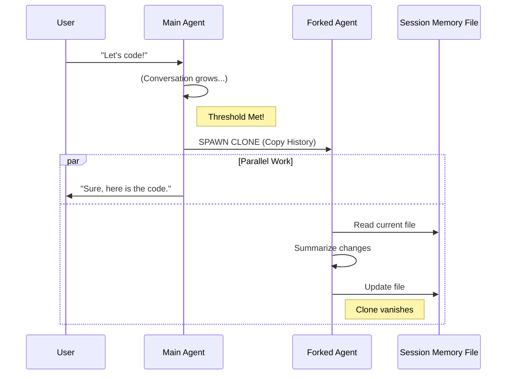

# Chapter 4: Isolated Forked Agent

Welcome back! In the previous chapter, [Update Threshold Logic](03_update_threshold_logic.md), we taught our system **when** to update the memory. We decided that when the conversation grows large enough, it's time to take notes.

But here is the problem: **Who writes the notes?**

If your main AI agent stops talking to the user to say, *"Hold on, I need to read our whole history and summarize it into a markdown file,"* two bad things happen:
1. **Pollution:** The conversation history gets filled with the AI talking to itself about administrative tasks.
2. **Confusion:** The AI might get confused between the user's actual question and its own internal summary task.

In this chapter, we will build the **Isolated Forked Agent**.

### The Central Use Case

Imagine the user asks: "Help me debug this Python script."
1. The AI helps and the conversation gets long.
2. The **Threshold Logic** (from Chapter 3) says: "Time to update memory!"
3. Instead of the main AI doing it, the system creates a **Clone**.
4. The Clone takes the history into a soundproof room, writes the summary into `session-memory.md`, and then disappears.
5. The Main AI continues helping the user, completely unaware that the Clone even existed. The conversation history remains clean.

---

## Key Concepts

### 1. The Fork (Cloning)
In software terms, a "fork" is a split. Imagine a timeline of events. At point B, we split the timeline. 
* **Timeline 1 (Main):** Continues talking to the user.
* **Timeline 2 (Fork):** Takes a detour to do background work.

### 2. Context Isolation (The Soundproof Room)
The Forked Agent receives a copy of the conversation history *up to that moment*. However, anything the Forked Agent says or thinks **never** goes back to the Main Agent. This prevents "Context Pollution."

### 3. Tool Restriction (The Handcuffs)
We trust our Main Agent to do anything (run code, edit files). But the Forked Agent is a temporary worker. We don't want it accidentally deleting user files while trying to summarize. We restrict its tools so it can **only** edit the memory file.

---

## High-Level Flow

Here is how the main thread spawns the worker and keeps going.



---

## Implementation Details

The magic happens in `sessionMemory.ts`. Let's look at how we configure and launch this "Clone."

### Step 1: Creating a Safe Space (Subagent Context)
Before we spawn the agent, we create a new context. This ensures that any file caching done by the clone doesn't mess up the main agent's cache.

```typescript
// Inside extractSessionMemory

// Create isolated context based on the current tool usage
// This is like giving the intern their own desk.
const setupContext = createSubagentContext(toolUseContext)
```
* **Explanation:** `createSubagentContext` creates a shallow copy of the state. It allows the subagent to read the same files, but if it changes its internal tracking of them, the main agent isn't affected.

### Step 2: Defining the "Handcuffs" (Tool Restrictions)
This is a critical safety step. We create a special rule: **"You can only use the FileEditTool, and ONLY on this specific file path."**

```typescript
// Define the rule
const safetyRule = createMemoryFileCanUseTool(memoryPath)

// How the rule works (simplified logic):
// 1. Is the tool 'file_edit'?
// 2. Is the file_path 'session-memory.md'?
// 3. If yes to both -> Allow.
// 4. Otherwise -> Deny.
```
* **Explanation:** We pass this rule to the agent. If the AI tries to be "clever" and delete your `package.json`, this rule blocks it immediately.

### Step 3: Launching the Agent (`runForkedAgent`)
Now we call the function that actually runs the AI model in the background.

```typescript
await runForkedAgent({
  // 1. Give it the instruction (The Prompt)
  promptMessages: [createUserMessage({ content: userPrompt })],
  
  // 2. Share the history efficiently
  cacheSafeParams: createCacheSafeParams(context),
  
  // 3. Apply the handcuffs
  canUseTool: safetyRule,
  
  // 4. Label it for debugging
  forkLabel: 'session_memory',
})
```
* **Explanation:**
    * `promptMessages`: The specific instruction we generated (we'll cover this in the next chapter).
    * `cacheSafeParams`: This passes the massive conversation history to the LLM without re-processing everything (saving money/time).
    * `canUseTool`: Our safety rule.

---

## Under the Hood: `runForkedAgent`

What actually happens inside `runForkedAgent`? It's a wrapper around the LLM's "Chat Loop."

1. **Snapshot:** It takes the list of messages `[A, B, C]` from the main thread.
2. **Append:** It adds the new prompt: `[A, B, C, "Summarize this"]`.
3. **Execution:** It sends this list to the AI Model.
4. **Action:** The AI replies `I will edit the file` (Tool Call).
5. **Tool Execution:** The system runs the tool (updating `session-memory.md`).
6. **Termination:** Once the tool is done and the AI says "I'm finished," the function returns.
7. **Discard:** The list `[A, B, C, "Summarize this", "I'm finished"]` is thrown away. The Main Thread still only has `[A, B, C]`.

---

## The "Handcuffs" Implementation

Let's look specifically at the `createMemoryFileCanUseTool` function in `sessionMemory.ts`. This is a great example of defensive coding.

```typescript
export function createMemoryFileCanUseTool(memoryPath: string): CanUseToolFn {
  // Return a function that checks every tool call
  return async (tool: Tool, input: unknown) => {
    
    // Check 1: Is it the Edit Tool?
    const isEditTool = tool.name === FILE_EDIT_TOOL_NAME
    
    // Check 2: Does the input target our memory file?
    // (We cast input to check 'file_path' safely)
    const isCorrectFile = input.file_path === memoryPath

    if (isEditTool && isCorrectFile) {
      return { behavior: 'allow' }
    }
```
* **Explanation:** We return a validation function. This function runs *before* any tool is actually executed.

```typescript
    // If checks failed, block the action!
    return {
      behavior: 'deny',
      message: `only editing ${memoryPath} is allowed`,
    }
  }
}
```
* **Explanation:** If the agent tries to edit anything else, it gets a "Permission Denied" error.

---

## Conclusion

We have created the perfect employee: the **Isolated Forked Agent**.
1. It shows up when called.
2. It knows everything that happened (Context).
3. It does exactly one job (Summarize).
4. It can't break anything (Restrictions).
5. It leaves without a trace (Isolation).

But what exactly do we tell this agent to do? If we just say "Summarize," it might write a poem or a novel. We need a very specific set of instructions to ensure the memory file is useful.

In the next chapter, we will learn how to write the **System Prompt** that guides this agent.

[Next Chapter: Prompt Construction & Templating](05_prompt_construction___templating.md)

---

Generated by [Code IQ](https://github.com/adityasoni99/Code-IQ)