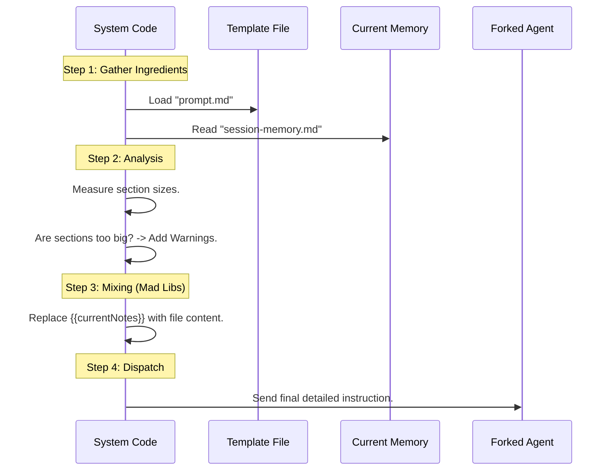

# Chapter 5: Prompt Construction & Templating

Welcome back! In the previous chapter, [Isolated Forked Agent](04_isolated_forked_agent.md), we hired a "Clone" (a background worker) to handle the note-taking process so the main AI wouldn't get distracted.

However, we left the Clone with a bit of a problem. We put them in a room with the memory file, but we didn't tell them *exactly* what to do. If we just tell an AI "Summarize this," it might write a poem, a haiku, or a 10-page essay.

We need strict rules. In this chapter, we will build the **Prompt Construction & Templating** system.

### The Central Use Case

Imagine the user and AI just finished a long debugging session involving `server.ts` and `auth.ts`.
*   **Without Templating:** The AI writes: *"We fixed the login bug today. It was hard."* (This is useless for future context).
*   **With Templating:** We force the AI to fill out a specific form:
    *   **Task:** Fix 401 Error in Login.
    *   **Files:** `server.ts`, `auth.ts`.
    *   **Errors:** `TokenExpiredError`.
    *   **Worklog:** Updated token refresh logic.

We are essentially handing the AI a **Pre-Printed Form** and saying, "Fill in the blanks, and do not write outside the boxes."

---

## Key Concepts

### 1. The Template (The Form)
The Template is a text file that defines the skeleton of our memory. It contains **Headers** (like `# Current State`) and **Instructions** (italic text telling the AI what goes there). The AI is allowed to add text *under* the headers, but it must never delete the headers themselves.

### 2. Variable Substitution (Mad Libs)
We need to insert dynamic data into our instructions. We use a syntax like `{{currentNotes}}`. Before sending the instructions to the AI, the code finds these placeholders and swaps them for the actual text. It’s exactly like playing "Mad Libs."

### 3. Section Budgeting (The Word Limit)
To prevent the memory file from becoming infinite, we track the size of each section. If the "History" section gets too big, we inject a specific instruction telling the AI: *"Warning: The History section is over the limit. Summarize it aggressively."*

---

## High-Level Flow

Here is how we build the instructions for our background worker.



---

## Implementation Details

All of this logic lives in `prompts.ts`. Let's walk through how we build this strict set of instructions.

### Step 1: The Template Structure
First, we define what our memory file should look like. This is a string constant (or loaded from a file). Notice the `#` Headers and the `_Italic_` instructions.

```typescript
export const DEFAULT_SESSION_MEMORY_TEMPLATE = `
# Current State
_What is actively being worked on? Pending tasks._

# Files and Functions
_What are the important files?_

# Errors & Corrections
_Errors encountered and how they were fixed._
`
```
*   **Explanation:** This is the "Form." The AI sees this and understands that it should organize its thoughts into these specific buckets.

### Step 2: Variable Substitution (Mad Libs)
We need a way to inject data into our prompt string. We use a simple helper function.

```typescript
function substituteVariables(
  template: string,
  variables: Record<string, string>,
): string {
  // Replace anything looking like {{key}} with variables[key]
  return template.replace(/\{\{(\w+)\}\}/g, (match, key) =>
    variables.hasOwnProperty(key) ? variables[key] : match
  )
}
```
*   **Explanation:**
    *   Input Template: `"Please edit {{filename}}."`
    *   Variables: `{ filename: "session-memory.md" }`
    *   Output: `"Please edit session-memory.md."`

### Step 3: Analyzing Section Sizes
Before we ask the AI to update the notes, we check if the current notes are getting too fat. We split the file by Headers (`# `) and count the tokens in each part.

```typescript
function analyzeSectionSizes(content: string): Record<string, number> {
  const sections: Record<string, number> = {}
  const lines = content.split('\n')
  
  // Loop through lines to find Headers (# ) and sum up their content length
  // (Simplified for this tutorial)
  // Result: { "# Current State": 500, "# Errors": 2500 }
  
  return sections
}
```
*   **Explanation:** We map out the file. If `# Errors` has 2,500 tokens, we know it's too big (our limit is usually 2,000).

### Step 4: Generating Warnings
If we find a section is too big, we don't just hope the AI notices. We explicitly tell it to fix it.

```typescript
function generateSectionReminders(sectionSizes: any, totalTokens: number): string {
  // Find sections larger than MAX_SECTION_LENGTH
  const oversized = Object.entries(sectionSizes)
    .filter(([_, size]) => size > MAX_SECTION_LENGTH)

  if (oversized.length > 0) {
    return `\nIMPORTANT: The following sections exceed the limit and MUST be condensed:\n` +
           oversized.map(([name]) => `- ${name}`).join('\n')
  }
  return ''
}
```
*   **Explanation:** If the "Errors" section is huge, this function generates a text string: *"IMPORTANT: The # Errors section exceeds the limit and MUST be condensed."* This text is added to the prompt.

### Step 5: Putting It All Together
Finally, `buildSessionMemoryUpdatePrompt` combines everything into the final message sent to the Isolated Agent.

```typescript
export async function buildSessionMemoryUpdatePrompt(
  currentNotes: string,
  notesPath: string,
): Promise<string> {
  // 1. Load the instruction text
  const promptTemplate = await loadSessionMemoryPrompt()

  // 2. Check for budget issues
  const sectionSizes = analyzeSectionSizes(currentNotes)
  const warnings = generateSectionReminders(sectionSizes, 0)

  // 3. Fill in the blanks (Mad Libs)
  const finalPrompt = substituteVariables(promptTemplate, {
    currentNotes: currentNotes,
    notesPath: notesPath,
  })

  // 4. Append warnings if needed
  return finalPrompt + warnings
}
```
*   **Explanation:**
    1.  We get the master instructions.
    2.  We calculate if we need to yell at the AI about file size.
    3.  We inject the current file content so the AI knows what to edit.
    4.  We attach the warnings at the end.

---

## The System Prompt

What does the `loadSessionMemoryPrompt()` actually return? It returns a very bossy set of instructions. Here is a simplified version of the "Rulebook":

```text
Your ONLY task is to use the Edit tool to update the notes file.

CRITICAL RULES:
- The file must maintain its exact structure.
- NEVER modify or delete section headers.
- NEVER modify the italic instructions.
- ONLY update the content below the italics.
- Keep each section under 2000 tokens.

Here is the current file content:
<current_notes_content>
{{currentNotes}}
</current_notes_content>
```

This ensures that our background worker acts more like a database manager and less like a creative writer.

---

## Conclusion

We have successfully engineered the instructions for our worker.
1.  We defined a **Template** (the form).
2.  We used **Variable Substitution** to make instructions dynamic.
3.  We added **Size Analysis** to keep the memory from exploding in size.

Now, our Isolated Agent knows *exactly* what to do. It reads the specific rules, sees the current file, and submits a precise update.

But there is one final danger. What if the user talks *really* fast? What if a second update triggers while the first one is still writing to the file? If two agents try to edit `session-memory.md` at the same time, the file could get corrupted.

In the final chapter, we will learn how to manage these traffic jams.

[Next Chapter: Shared State & Concurrency Control](06_shared_state___concurrency_control.md)

---

Generated by [Code IQ](https://github.com/adityasoni99/Code-IQ)