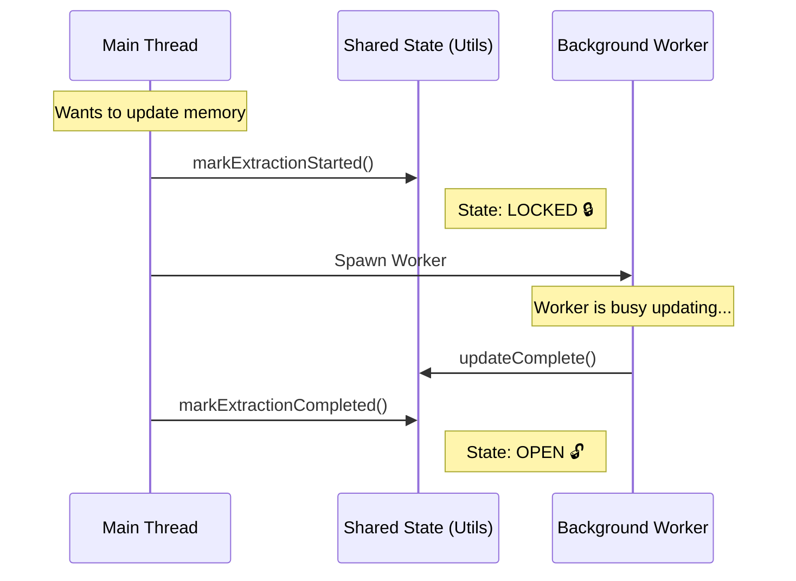

# Chapter 6: Shared State & Concurrency Control

Welcome to the final chapter of the **SessionMemory** project tutorial!

In the previous chapter, [Prompt Construction & Templating](05_prompt_construction___templating.md), we taught our AI how to format its notes using strict templates. We now have a system that can read, decide when to update, spawn a worker, and write structured summaries.

However, there is one final, invisible danger lurking in our system: **Speed.**

What happens if the user sends two messages very quickly? Or what if a background process tries to update the memory at the exact same moment the main agent is trying to read it?

If two processes try to edit `session-memory.md` at the same time, they might overwrite each other's work. We need a "Traffic Cop" to manage the flow. In this chapter, we will build **Shared State & Concurrency Control**.

### The Central Use Case

Imagine a busy intersection:
1.  **Process A** wants to update the memory file.
2.  **Process B** wants to read the memory file.
3.  If they go at the same time, they crash (corruption or lost data).

We need a system that does this:
1.  Process A yells: "I am updating the file! Everyone wait!"
2.  Process A updates the file.
3.  Process B waits patiently.
4.  Process A yells: "I am done!"
5.  Process B proceeds.

---

## Key Concepts

### 1. Shared State (The Dashboard)
Usually, variables live inside specific functions and die when the function ends. **Shared State** refers to variables that live outside functions, sitting in a central module. They act as a "Dashboard" that any part of the program can look at to see the current status of the system.

### 2. Concurrency Control (The Lock)
Concurrency means "things happening at the same time." Control means "preventing chaos." We use a **Lock** mechanism. When one process starts working, it "locks" the dashboard. Anyone else who checks the dashboard sees the lock and knows they must wait.

### 3. Avoiding Circular Dependencies
In programming, if File A imports File B, and File B imports File A, the computer gets confused (a "circular dependency").
*   `sessionMemory.ts` (Main Logic) needs `runAgent`.
*   If we put our state variables in `sessionMemory.ts`, other files might get stuck in a loop trying to access them.
*   **Solution:** We put the state in a neutral third file: `sessionMemoryUtils.ts`. Everyone can talk to the neutral third party without creating a circle.

---

## High-Level Flow

Here is how our Traffic Cop manages the intersection.



If another process tries to run while the State is **LOCKED**, it sees the lock and pauses.

---

## Implementation Details

The implementation lives in `sessionMemoryUtils.ts`. This file acts as the "Central Truth" for our memory system.

### Step 1: The Global Variables
These variables sit at the top of the file, outside of any function. They hold the state for the entire application lifetime.

```typescript
// Inside sessionMemoryUtils.ts

// 1. The Configuration (Thresholds, limits)
let sessionMemoryConfig = { ...DEFAULT_SESSION_MEMORY_CONFIG }

// 2. The Lock (Timestamp of when work started)
let extractionStartedAt: number | undefined

// 3. The Last Checkpoint (How big was the file last time?)
let tokensAtLastExtraction = 0
```
*   **Explanation:** `extractionStartedAt` is our lock. If it is `undefined`, the door is open. If it is a number (a timestamp), the door is locked.

### Step 2: The Locking Mechanism
We need simple functions to turn the lock on and off.

```typescript
/**
 * Turn the Lock ON
 */
export function markExtractionStarted(): void {
  extractionStartedAt = Date.now()
}

/**
 * Turn the Lock OFF
 */
export function markExtractionCompleted(): void {
  extractionStartedAt = undefined
}
```
*   **Explanation:** When the extraction hook (from Chapter 2) decides to run, it calls `markExtractionStarted`. When the worker finishes, it calls `markExtractionCompleted`.

### Step 3: The "Wait" Logic (The Traffic Light)
This is the most important function. If the lock is on, we must make the program wait.

```typescript
export async function waitForSessionMemoryExtraction(): Promise<void> {
  const startTime = Date.now()

  // Loop while the lock is active
  while (extractionStartedAt) {
    
    // Check for "Stale" locks (Broken process?)
    const timeElapsed = Date.now() - extractionStartedAt
    if (timeElapsed > 60000) return // If > 1 min, ignore lock

    // Wait 1 second before checking again
    await sleep(1000)
  }
}
```
*   **Explanation:**
    1.  **The Loop:** As long as `extractionStartedAt` has a value, we stay in this loop.
    2.  **Safety Valve:** What if the worker crashes and never unlocks the door? We check if the lock is older than 60 seconds. If so, we assume the worker died and we proceed anyway.
    3.  **Sleep:** We pause for 1 second (`sleep(1000)`) to avoid overloading the CPU.

### Step 4: Tracking Context Growth
In [Chapter 3: Update Threshold Logic](03_update_threshold_logic.md), we talked about checking if the conversation grew by 5,000 tokens. To do that, we need to remember the *previous* size.

```typescript
/**
 * Save the size of the conversation after an update
 */
export function recordExtractionTokenCount(currentTokenCount: number): void {
  tokensAtLastExtraction = currentTokenCount
}

/**
 * Calculate growth
 */
export function hasMetUpdateThreshold(currentTokenCount: number): boolean {
  const growth = currentTokenCount - tokensAtLastExtraction
  return growth >= sessionMemoryConfig.minimumTokensBetweenUpdate
}
```
*   **Explanation:** `tokensAtLastExtraction` is the benchmark. We update it here in the shared state so the logic in Chapter 3 can access it cleanly.

---

## Under the Hood: The "Stale Lock" Problem

Why did we add that 60-second check in Step 3?

Imagine this scenario:
1.  The system locks the file.
2.  The background worker starts.
3.  **The computer loses power or the process crashes.**
4.  The system restarts.

If we stored the lock in a permanent database, the system would wake up, see the lock, and wait forever.

Since our variables are in-memory (RAM), restarting the application resets them. However, if just the *worker* crashes but the *main application* keeps running, the variable `extractionStartedAt` would stay set forever. The 60-second timeout ensures that a crashed worker doesn't freeze the memory system permanently.

---

## Conclusion

Congratulations! You have completed the **SessionMemory** tutorial series.

Let's recap the journey:
1.  **[Memory File Lifecycle](01_memory_file_lifecycle.md):** We built the "Librarian" to create the file and folder.
2.  **[Post-Sampling Extraction Hook](02_post_sampling_extraction_hook.md):** We built the "Stenographer" to watch the conversation.
3.  **[Update Threshold Logic](03_update_threshold_logic.md):** We gave the Stenographer a brain to decide *when* to take notes.
4.  **[Isolated Forked Agent](04_isolated_forked_agent.md):** We hired a "Clone" to do the work in the background without disturbing the user.
5.  **[Prompt Construction & Templating](05_prompt_construction___templating.md):** We gave the Clone a strict form to fill out.
6.  **Shared State (This Chapter):** We built a "Traffic Cop" to prevent crashes and manage data safety.

You now have a fully functional, self-updating, persistent memory system for an AI Agent. The AI can now remember context over long periods, survive restarts, and keep its notes organized—all automatically!

Thank you for following along with the SessionMemory project. Happy coding!

---

Generated by [Code IQ](https://github.com/adityasoni99/Code-IQ)