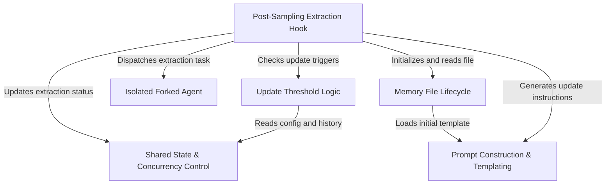

# Tutorial: SessionMemory

The **Session Memory** project implements an automatic, background note-taking system for AI conversations. It unobtrusively monitors the chat and, when specific activity thresholds are met, launches an *isolated forked agent* to summarize key information into a structured markdown file. This ensures the system maintains long-term context about tasks, files, and decisions without cluttering the main conversation flow or pausing the user's workflow.

## Chapters

1. [Memory File Lifecycle](01_memory_file_lifecycle.md)
2. [Post-Sampling Extraction Hook](02_post_sampling_extraction_hook.md)
3. [Update Threshold Logic](03_update_threshold_logic.md)
4. [Isolated Forked Agent](04_isolated_forked_agent.md)
5. [Prompt Construction & Templating](05_prompt_construction___templating.md)
6. [Shared State & Concurrency Control](06_shared_state___concurrency_control.md)

---

Generated by [Code IQ](https://github.com/adityasoni99/Code-IQ)